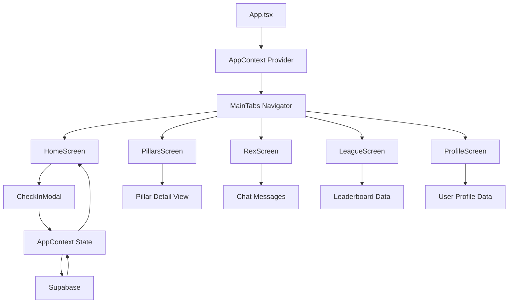
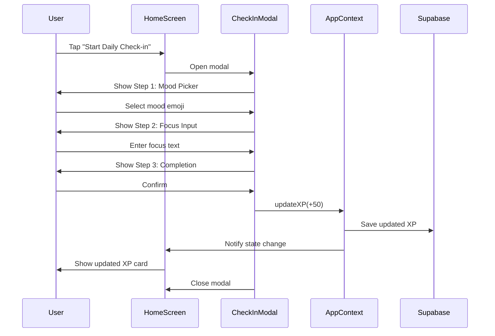
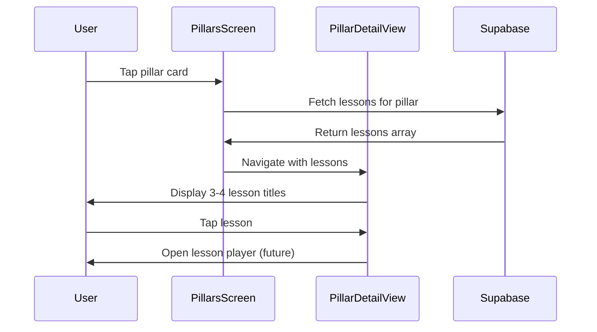
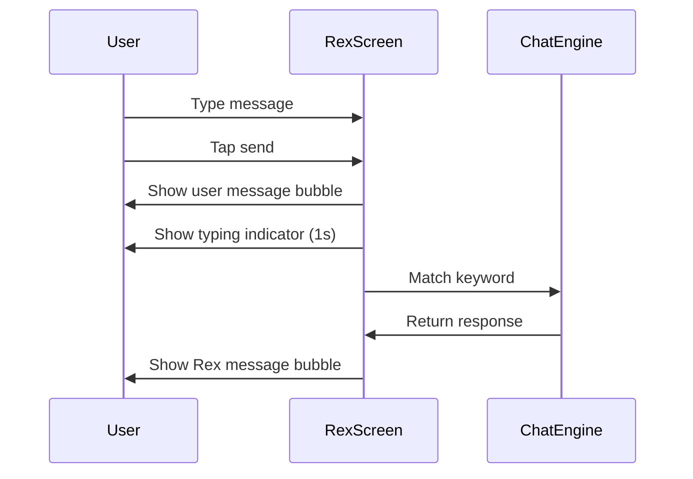

# Design Document: Complete Screen Implementations

## Overview

This feature implements complete, functional screen implementations for the Growthovo PWA's four main tab screens: PillarsScreen, RexScreen (AI Chat), LeagueScreen (Leaderboard), and ProfileScreen. The implementation includes shared state management via React Context for XP, streak, and level tracking, a daily check-in modal with XP rewards, and full UI implementations matching the existing dark theme (#0A0A12 background, #1A1A2E cards, #7C3AED purple, #A78BFA light purple).

The design follows React Native patterns already established in the codebase, uses existing dependencies (React Navigation, Supabase, Zustand), and ensures all screens are scrollable with meaningful content rather than blank placeholders. The check-in feature awards +50 XP and updates the HomeScreen stat cards live through context state updates.

## Architecture



## Sequence Diagrams

### Check-In Flow with XP Update



### Pillar Detail Navigation



### Rex Chat Interaction



## Components and Interfaces

### Component 1: AppContext

**Purpose**: Provides global state for XP, streak, and level tracking across all screens

**Interface**:
```typescript
interface AppContextState {
  xp: number;
  streak: number;
  level: number;
  updateXP: (amount: number) => Promise<void>;
  updateStreak: (newStreak: number) => Promise<void>;
  refreshUserData: () => Promise<void>;
}

interface AppProviderProps {
  userId: string;
  children: React.ReactNode;
}
```

**Responsibilities**:
- Maintain global XP, streak, and level state
- Sync state with Supabase database
- Provide update functions to child components
- Calculate level from XP (every 100 XP = 1 level)

### Component 2: CheckInModal

**Purpose**: Multi-step modal for daily check-in with mood selection, focus input, and XP reward

**Interface**:
```typescript
interface CheckInModalProps {
  visible: boolean;
  onComplete: (data: CheckInData) => void;
  onClose: () => void;
}

interface CheckInData {
  mood: string;
  focus: string;
  intention: string;
}
```

**Responsibilities**:
- Display 3-step check-in flow
- Collect mood (5 emoji options), focus text, and intention
- Award +50 XP on completion
- Trigger AppContext state update

### Component 3: PillarsScreen (Enhanced)

**Purpose**: Display 6 pillar cards in grid, handle pillar selection, show detail view with lessons

**Interface**:
```typescript
interface PillarsScreenProps {
  userId: string;
  subscriptionStatus: string;
  navigation?: any;
  route?: any;
}

interface Pillar {
  key: string;
  emoji: string;
  name: string;
  progress: number;
  color: string;
}
```

**Responsibilities**:
- Render 6 pillar cards in 2-column grid
- Handle pillar card tap to show detail view
- Fetch and display 3-4 lesson titles for selected pillar
- Show placeholder progress bars
- Maintain dark theme styling

### Component 4: RexScreen (Enhanced)

**Purpose**: AI chat interface with keyword-based responses and typing indicator

**Interface**:
```typescript
interface RexScreenProps {
  userId: string;
  subscriptionStatus: string;
  navigation?: any;
}

interface Message {
  id: string;
  role: 'user' | 'rex';
  content: string;
  timestamp: string;
}
```

**Responsibilities**:
- Display chat UI with message bubbles
- Pre-load 3 welcome messages from Rex
- Handle text input and send button
- Match user messages to 5 hardcoded keyword responses
- Show typing indicator (animated dots) for 1s before Rex replies
- Auto-scroll to latest message

### Component 5: LeagueScreen (Enhanced)

**Purpose**: Display weekly league leaderboard with user rank card

**Interface**:
```typescript
interface LeagueScreenProps {
  userId: string;
  navigation?: any;
}

interface LeaderboardEntry {
  rank: number;
  username: string;
  xp: number;
  avatar: string;
  medal?: string;
  isCurrentUser?: boolean;
}
```

**Responsibilities**:
- Display "Weekly League 🏆" header
- Show user rank card (Rank #12, 340 XP, Bronze League)
- Render leaderboard with 10 rows (fake names + XP)
- Highlight user row in purple
- Show ranks 1-10 above user

### Component 6: ProfileScreen (Enhanced)

**Purpose**: Display user profile with avatar, stats, settings list, and log out

**Interface**:
```typescript
interface ProfileScreenProps {
  userId: string;
  navigation?: any;
}

interface UserStats {
  xp: number;
  streak: number;
  lessonsCompleted: number;
}
```

**Responsibilities**:
- Display avatar circle with "Champion" username
- Show 3 stats: XP, Streak, Lessons
- Render settings list: Edit Profile, Notifications, Language, Log Out
- Handle log out action (red button)
- Maintain dark theme styling

## Data Models

### AppContextState

```typescript
interface AppContextState {
  xp: number;              // Total XP points
  streak: number;          // Current day streak
  level: number;           // Calculated from XP (xp / 100 + 1)
  updateXP: (amount: number) => Promise<void>;
  updateStreak: (newStreak: number) => Promise<void>;
  refreshUserData: () => Promise<void>;
}
```

**Validation Rules**:
- xp must be non-negative integer
- streak must be non-negative integer
- level is calculated, not set directly
- updateXP must sync with Supabase users table

### CheckInData

```typescript
interface CheckInData {
  mood: string;            // One of: '😔', '😐', '🙂', '😊', '🤩'
  focus: string;           // User-entered text (max 200 chars)
  intention: string;       // User-entered text (max 200 chars)
}
```

**Validation Rules**:
- mood must be one of 5 predefined emojis
- focus must be non-empty string, max 200 characters
- intention must be non-empty string, max 200 characters

### Message (Rex Chat)

```typescript
interface Message {
  id: string;              // Unique message ID (timestamp-based)
  role: 'user' | 'rex';    // Message sender
  content: string;         // Message text
  timestamp: string;       // ISO 8601 timestamp
}
```

**Validation Rules**:
- id must be unique
- role must be either 'user' or 'rex'
- content must be non-empty string
- timestamp must be valid ISO 8601 format

### Pillar

```typescript
interface Pillar {
  key: string;             // Unique pillar identifier
  emoji: string;           // Pillar emoji (🧠, 💬, 💼, 💪, 💰, 🎨)
  name: string;            // Pillar display name
  progress: number;        // Progress value (0.0 to 1.0)
  color: string;           // Hex color code
}
```

**Validation Rules**:
- key must be unique
- emoji must be single emoji character
- name must be non-empty string
- progress must be between 0.0 and 1.0
- color must be valid hex color code

### LeaderboardEntry

```typescript
interface LeaderboardEntry {
  rank: number;            // User rank (1-based)
  username: string;        // Display username
  xp: number;              // Total XP points
  avatar: string;          // Avatar initial letter
  medal?: string;          // Medal emoji for top 3 (🥇, 🥈, 🥉)
  isCurrentUser?: boolean; // True if this is the current user
}
```

**Validation Rules**:
- rank must be positive integer
- username must be non-empty string
- xp must be non-negative integer
- avatar must be single character
- medal only for ranks 1-3
- isCurrentUser defaults to false

## Algorithmic Pseudocode

### Main Check-In Workflow

```typescript
ALGORITHM processCheckInWorkflow(userId: string, checkInData: CheckInData)
INPUT: userId (string), checkInData (CheckInData)
OUTPUT: success (boolean)

BEGIN
  // Preconditions
  ASSERT userId is non-empty string
  ASSERT checkInData.mood is one of 5 valid emojis
  ASSERT checkInData.focus is non-empty string
  ASSERT checkInData.intention is non-empty string
  
  // Step 1: Award XP
  currentXP ← getXPFromContext()
  newXP ← currentXP + 50
  
  // Step 2: Update context state
  updateXPInContext(newXP)
  
  // Step 3: Sync with Supabase
  result ← supabase.from('users')
    .update({ total_xp: newXP })
    .eq('id', userId)
  
  IF result.error THEN
    RETURN false
  END IF
  
  // Step 4: Save check-in record
  checkInRecord ← {
    user_id: userId,
    mood: checkInData.mood,
    focus: checkInData.focus,
    intention: checkInData.intention,
    xp_awarded: 50,
    created_at: NOW()
  }
  
  result ← supabase.from('check_ins').insert(checkInRecord)
  
  // Postconditions
  ASSERT newXP = currentXP + 50
  ASSERT context.xp = newXP
  ASSERT check-in record saved in database
  
  RETURN result.error === null
END
```

**Preconditions:**
- userId is valid and non-empty
- checkInData contains valid mood, focus, and intention
- User is authenticated
- AppContext is initialized

**Postconditions:**
- User's XP increased by 50
- AppContext state updated
- Supabase users table updated
- Check-in record saved in database
- HomeScreen stat cards reflect new XP

**Loop Invariants:** N/A (no loops in this algorithm)

### Rex Keyword Matching Algorithm

```typescript
ALGORITHM matchRexKeyword(userMessage: string)
INPUT: userMessage (string)
OUTPUT: response (string)

BEGIN
  // Preconditions
  ASSERT userMessage is non-empty string
  
  // Step 1: Normalize input
  normalizedMessage ← userMessage.toLowerCase().trim()
  
  // Step 2: Define keyword-response map
  keywordMap ← {
    'anxious': "I hear you. Let's try this: Take 3 deep breaths...",
    'focus': "Here's what works: Pick ONE thing. Set a 25-minute timer...",
    'motivate': "Remember why you started. You're not the same person...",
    'relationship': "Relationships are mirrors. What you give, you get...",
    'career': "Your career is a marathon, not a sprint. Focus on skills..."
  }
  
  // Step 3: Match keywords (first match wins)
  FOR each keyword IN keywordMap.keys() DO
    IF normalizedMessage.includes(keyword) THEN
      RETURN keywordMap[keyword]
    END IF
  END FOR
  
  // Step 4: Default response if no match
  RETURN "I'm here to support you. Tell me more about what's on your mind..."
  
  // Postconditions
  ASSERT response is non-empty string
  ASSERT response is either matched keyword response or default
END
```

**Preconditions:**
- userMessage is defined and non-empty
- keywordMap is properly initialized

**Postconditions:**
- Returns non-empty response string
- Response is either a matched keyword response or default
- No side effects on input message

**Loop Invariants:**
- All previously checked keywords did not match
- keywordMap remains unchanged throughout iteration

### Pillar Detail View Loading

```typescript
ALGORITHM loadPillarLessons(pillarKey: string, userId: string)
INPUT: pillarKey (string), userId (string)
OUTPUT: lessons (Lesson[])

BEGIN
  // Preconditions
  ASSERT pillarKey is one of 6 valid pillar keys
  ASSERT userId is non-empty string
  
  // Step 1: Fetch pillar from database
  pillar ← supabase.from('pillars')
    .select('*')
    .eq('name', pillarKey)
    .single()
  
  IF pillar is null THEN
    RETURN []
  END IF
  
  // Step 2: Fetch units for pillar
  units ← supabase.from('units')
    .select('id')
    .eq('pillar_id', pillar.id)
    .order('display_order', ascending: true)
  
  IF units is empty THEN
    RETURN []
  END IF
  
  // Step 3: Fetch lessons for all units
  allLessons ← []
  FOR each unit IN units DO
    ASSERT unit.id is valid
    
    unitLessons ← supabase.from('lessons')
      .select('*')
      .eq('unit_id', unit.id)
      .order('display_order', ascending: true)
      .limit(4)  // Show max 4 lessons
    
    allLessons.append(unitLessons)
  END FOR
  
  // Postconditions
  ASSERT allLessons.length <= 4
  ASSERT all lessons belong to selected pillar
  
  RETURN allLessons
END
```

**Preconditions:**
- pillarKey is one of: 'mind', 'discipline', 'communication', 'money', 'relationships', 'hobbies'
- userId is valid and authenticated
- Supabase connection is active

**Postconditions:**
- Returns array of lessons (max 4)
- All lessons belong to the selected pillar
- Lessons are ordered by display_order
- Returns empty array if pillar or units not found

**Loop Invariants:**
- All previously processed units have had their lessons added to allLessons
- allLessons contains only valid lesson objects
- Total lesson count does not exceed 4

## Key Functions with Formal Specifications

### Function 1: updateXP()

```typescript
async function updateXP(amount: number): Promise<void>
```

**Preconditions:**
- amount is a number (can be positive or negative)
- userId is set in AppContext
- User is authenticated
- Supabase connection is active

**Postconditions:**
- context.xp is updated by amount
- context.level is recalculated (Math.floor(xp / 100) + 1)
- Supabase users table is updated with new total_xp
- All components consuming AppContext receive updated state

**Loop Invariants:** N/A (no loops)

### Function 2: handleCheckInComplete()

```typescript
function handleCheckInComplete(data: CheckInData): void
```

**Preconditions:**
- data.mood is one of 5 valid emojis
- data.focus is non-empty string
- data.intention is non-empty string
- CheckInModal is visible

**Postconditions:**
- updateXP(50) is called
- XP animation is triggered
- CheckInModal is closed
- HomeScreen stat cards show updated XP
- Check-in data is saved to database

**Loop Invariants:** N/A (no loops)

### Function 3: getRexResponse()

```typescript
function getRexResponse(userMessage: string): string
```

**Preconditions:**
- userMessage is defined (not null/undefined)
- userMessage may be empty string

**Postconditions:**
- Returns non-empty string response
- Response is either matched keyword response or default
- No mutations to userMessage parameter

**Loop Invariants:**
- For keyword matching loop: All previously checked keywords did not match

### Function 4: handlePillarPress()

```typescript
function handlePillarPress(pillar: Pillar): void
```

**Preconditions:**
- pillar is valid Pillar object
- pillar.key is one of 6 valid pillar keys
- navigation prop is available

**Postconditions:**
- Navigation to pillar detail view occurs
- Pillar detail view receives pillar data
- Lessons are fetched and displayed
- Previous screen remains in navigation stack

**Loop Invariants:** N/A (no loops)

### Function 5: loadUserData()

```typescript
async function loadUserData(userId: string): Promise<void>
```

**Preconditions:**
- userId is non-empty string
- User is authenticated
- Supabase connection is active

**Postconditions:**
- AppContext state is populated with user data
- xp, streak, and level are set from database
- If database query fails, state remains unchanged
- Loading state is set to false

**Loop Invariants:** N/A (no loops)

## Example Usage

### Example 1: Check-In Flow

```typescript
// User taps "Start Daily Check-in" button
<TouchableOpacity
  style={styles.checkInButton}
  onPress={() => setCheckInVisible(true)}
>
  <Text style={styles.checkInButtonText}>Start Daily Check-in →</Text>
</TouchableOpacity>

// CheckInModal handles 3-step flow
<CheckInModal
  visible={checkInVisible}
  onComplete={(data) => {
    // Award +50 XP
    updateXP(50);
    
    // Show XP gain animation
    setShowXPGain(true);
    Animated.sequence([
      Animated.timing(xpAnimation, {
        toValue: -50,
        duration: 1000,
        useNativeDriver: true,
      }),
    ]).start(() => setShowXPGain(false));
    
    // Close modal
    setCheckInVisible(false);
  }}
  onClose={() => setCheckInVisible(false)}
/>

// HomeScreen stat cards automatically update via AppContext
const { xp, streak, level } = useAppContext();

<View style={styles.statCard}>
  <Text style={styles.statLabel}>XP Points</Text>
  <Text style={styles.statValue}>{xp}</Text>
  <Text style={styles.statIcon}>⚡</Text>
</View>
```

### Example 2: Pillar Navigation

```typescript
// User taps pillar card
<TouchableOpacity
  style={styles.pillarCard}
  onPress={() => handlePillarPress(pillar)}
>
  <Text style={styles.pillarEmoji}>{pillar.emoji}</Text>
  <Text style={styles.pillarName}>{pillar.name}</Text>
</TouchableOpacity>

// Navigate to detail view with lessons
function handlePillarPress(pillar: Pillar) {
  navigation?.navigate('PillarDetail', {
    pillarKey: pillar.key,
    pillarName: pillar.name,
    pillarColor: pillar.color,
  });
}

// PillarDetailView fetches and displays lessons
useEffect(() => {
  async function loadLessons() {
    const lessons = await loadPillarLessons(pillarKey, userId);
    setLessons(lessons);
  }
  loadLessons();
}, [pillarKey]);
```

### Example 3: Rex Chat Interaction

```typescript
// User types message and taps send
function handleSend() {
  const messageText = inputText.trim();
  if (!messageText) return;

  // Add user message
  const userMessage: Message = {
    id: Date.now().toString(),
    role: 'user',
    content: messageText,
    timestamp: new Date().toISOString(),
  };
  setMessages((prev) => [...prev, userMessage]);
  setInputText('');

  // Show typing indicator
  setIsTyping(true);

  // Simulate Rex response after 1.5s
  setTimeout(() => {
    const response = getRexResponse(messageText);
    const rexMessage: Message = {
      id: (Date.now() + 1).toString(),
      role: 'rex',
      content: response,
      timestamp: new Date().toISOString(),
    };
    setMessages((prev) => [...prev, rexMessage]);
    setIsTyping(false);
  }, 1500);
}

// Keyword matching
function getRexResponse(userMessage: string): string {
  const lowerMessage = userMessage.toLowerCase();
  
  if (lowerMessage.includes('anxious')) {
    return "I hear you. Let's try this: Take 3 deep breaths...";
  }
  if (lowerMessage.includes('focus')) {
    return "Here's what works: Pick ONE thing. Set a 25-minute timer...";
  }
  // ... more keywords
  
  return "I'm here to support you. Tell me more...";
}
```

## Correctness Properties

### Property 1: Check-In XP Award

_For any_ check-in completion event where a user completes all 3 steps (mood selection, focus input, intention input), the system SHALL award exactly +50 XP, update the AppContext state, sync with Supabase, and reflect the new XP value in the HomeScreen stat cards within 2 seconds.

**Validates: Requirements 2.1, 2.2, 2.3**

### Property 2: Pillar Navigation

_For any_ pillar card tap event where a user taps one of the 6 pillar cards, the system SHALL navigate to a detail view, fetch 3-4 lesson titles from Supabase for that pillar, and display them in a scrollable list with the pillar's theme color.

**Validates: Requirements 1.1, 1.2**

### Property 3: Rex Keyword Matching

_For any_ user message sent to Rex where the message contains one of the 5 predefined keywords ('anxious', 'focus', 'motivate', 'relationship', 'career'), the system SHALL return the corresponding hardcoded response within 1.5 seconds, preceded by a typing indicator animation.

**Validates: Requirements 2.4, 2.5**

### Property 4: Leaderboard Display

_For any_ LeagueScreen render event, the system SHALL display exactly 10 leaderboard rows with fake names and XP values ranked 1-10, followed by the current user's row at rank #12 with 340 XP, highlighted in purple (#7C3AED background).

**Validates: Requirements 3.1, 3.2**

### Property 5: Profile Stats Display

_For any_ ProfileScreen render event, the system SHALL display the user's avatar circle, "Champion" username, and 3 stat values (Total XP, Day Streak, Lessons Done) fetched from AppContext or Supabase, along with a settings list and red "Log Out" button.

**Validates: Requirements 4.1, 4.2**

### Property 6: State Synchronization

_For any_ XP update event triggered by check-in completion, the system SHALL update the AppContext state, persist the new XP value to Supabase users table, and propagate the state change to all consuming components (HomeScreen, ProfileScreen) within 2 seconds.

**Validates: Requirements 5.1, 5.2**

## Error Handling

### Error Scenario 1: Supabase Connection Failure

**Condition**: When AppContext attempts to sync XP with Supabase but the connection fails
**Response**: Log error to console, show toast notification to user, keep local state updated
**Recovery**: Retry sync on next app foreground event, queue failed updates for retry

### Error Scenario 2: Invalid Check-In Data

**Condition**: When CheckInModal receives invalid data (empty focus, invalid mood)
**Response**: Show validation error message, prevent modal from closing, highlight invalid field
**Recovery**: User corrects invalid data and resubmits

### Error Scenario 3: Pillar Lessons Not Found

**Condition**: When PillarDetailView fetches lessons but Supabase returns empty array
**Response**: Show empty state with message "No lessons available yet"
**Recovery**: User can navigate back to pillar selection, retry button to refetch

### Error Scenario 4: Rex Response Timeout

**Condition**: When Rex keyword matching takes longer than 2 seconds (should never happen with hardcoded responses)
**Response**: Show default response after 2s timeout
**Recovery**: Log warning, continue normal chat flow

## Testing Strategy

### Unit Testing Approach

**Key Test Cases**:
1. **AppContext State Updates**: Test updateXP, updateStreak, refreshUserData functions
2. **Check-In Validation**: Test CheckInModal validates mood, focus, intention inputs
3. **Rex Keyword Matching**: Test getRexResponse matches all 5 keywords correctly
4. **Pillar Data Loading**: Test loadPillarLessons fetches correct lessons for each pillar
5. **Leaderboard Rendering**: Test LeagueScreen renders 10 rows + user row correctly
6. **Profile Stats Display**: Test ProfileScreen displays correct XP, streak, lessons values

**Coverage Goals**: 80% code coverage for all new components and functions

### Property-Based Testing Approach

**Property Test Library**: fast-check (already in package.json)

**Property Tests**:
1. **XP Update Commutativity**: For any sequence of XP updates, final XP = sum of all updates
2. **Keyword Matching Determinism**: For any user message, getRexResponse always returns same response
3. **Pillar Navigation Idempotence**: Tapping same pillar multiple times produces same result
4. **State Synchronization**: For any XP update, AppContext state always matches Supabase after sync

### Integration Testing Approach

**Integration Test Scenarios**:
1. **End-to-End Check-In Flow**: User opens modal → selects mood → enters focus → completes → sees XP update
2. **Pillar to Lesson Navigation**: User taps pillar → sees lessons → taps lesson → opens player
3. **Rex Chat Conversation**: User sends 5 messages with different keywords → receives 5 correct responses
4. **Leaderboard Scroll**: User scrolls leaderboard → sees all 10 rows + user row → no crashes
5. **Profile Settings Navigation**: User taps settings items → navigates to respective screens

## Performance Considerations

**Optimization Strategies**:
1. **Lazy Loading**: Load pillar lessons only when detail view is opened, not on initial screen render
2. **Memoization**: Use React.memo for pillar cards, leaderboard rows to prevent unnecessary re-renders
3. **Debouncing**: Debounce Rex chat input to prevent excessive re-renders while typing
4. **Context Optimization**: Split AppContext into smaller contexts if performance issues arise
5. **FlatList Optimization**: Use FlatList for leaderboard and chat messages with proper keyExtractor and getItemLayout

**Performance Targets**:
- Screen render time: < 100ms
- Check-in modal open/close: < 200ms
- Rex response time: 1.5s (including typing indicator)
- Pillar detail view load: < 500ms

## Security Considerations

**Security Requirements**:
1. **Authentication**: All Supabase queries must use authenticated userId from session
2. **Input Validation**: Validate all user inputs (check-in data, chat messages) before saving
3. **XSS Prevention**: Sanitize user-generated content (focus text, chat messages) before rendering
4. **Rate Limiting**: Limit check-in submissions to once per day per user
5. **Data Privacy**: Do not expose other users' personal data in leaderboard (use fake names)

**Threat Mitigation**:
- SQL Injection: Use Supabase parameterized queries
- XSS: Use React's built-in XSS protection, avoid dangerouslySetInnerHTML
- CSRF: Use Supabase session tokens for authentication
- Data Leakage: Implement Row Level Security (RLS) policies in Supabase

## Dependencies

**Existing Dependencies** (from package.json):
- @react-navigation/native: ^6.1.17
- @react-navigation/native-stack: ^6.9.26
- @react-navigation/bottom-tabs: ^6.5.20
- @supabase/supabase-js: ^2.43.4
- react-native-reanimated: ~3.10.1 (for animations)
- zustand: ^4.5.2 (optional, for additional state management)

**No New Dependencies Required**: All functionality can be implemented with existing dependencies.

**External Services**:
- Supabase: Database for users, pillars, units, lessons, check_ins tables
- Supabase Auth: User authentication and session management
