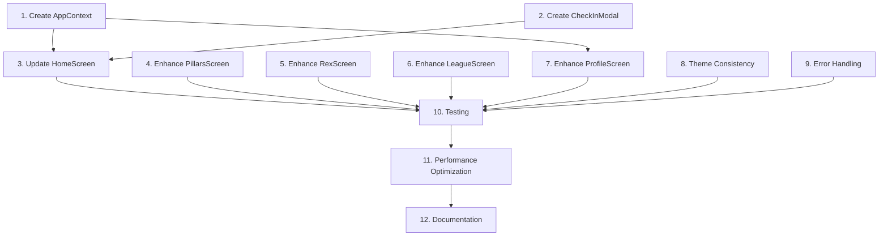

# Tasks: Complete Screen Implementations

## Overview

This task list implements complete, functional screen implementations for the Growthovo PWA's four main tab screens (PillarsScreen, RexScreen, LeagueScreen, ProfileScreen), shared state management via AppContext, and a daily check-in modal with XP rewards.

## Task List

- [x] 1. Create AppContext for Shared State Management
  - [x] 1.1 Create AppContext.tsx with state interface (xp, streak, level)
  - [x] 1.2 Implement updateXP function with Supabase sync
  - [x] 1.3 Implement updateStreak function with Supabase sync
  - [x] 1.4 Implement refreshUserData function to fetch from Supabase
  - [x] 1.5 Implement level calculation logic (Math.floor(xp / 100) + 1)
  - [x] 1.6 Wrap MainTabs in AppProvider in App.tsx
  - [x] 1.7 Add error handling for Supabase connection failures

- [x] 2. Create CheckInModal Component
  - [x] 2.1 Create CheckInModal.tsx with 3-step flow
  - [x] 2.2 Implement Step 1: Mood picker with 5 emoji options (😔 😐 🙂 😊 🤩)
  - [x] 2.3 Implement Step 2: Focus text input with "What's your focus today?" prompt
  - [x] 2.4 Implement Step 3: Completion screen with success message
  - [x] 2.5 Add validation for mood selection and focus text
  - [x] 2.6 Implement onComplete callback to award +50 XP
  - [x] 2.7 Add modal open/close animations
  - [x] 2.8 Save check-in data to Supabase check_ins table

- [x] 3. Update HomeScreen to Use AppContext
  - [x] 3.1 Import and use AppContext in SimpleHomeScreen.tsx
  - [x] 3.2 Replace local xp, streak, level state with AppContext values
  - [x] 3.3 Update stat cards to read from AppContext
  - [x] 3.4 Implement handleCheckInComplete to call AppContext.updateXP(50)
  - [x] 3.5 Add XP gain animation (+50 XP floating text)
  - [x] 3.6 Verify stat cards update live after check-in

- [x] 4. Enhance PillarsScreen with Detail View
  - [x] 4.1 Update PillarsScreen.tsx to display 6 pillar cards in 2-column grid
  - [x] 4.2 Add pillar data: Mental (🧠), Relations (💬), Career (💼), Fitness (💪), Finance (💰), Hobbies (🎨)
  - [x] 4.3 Implement handlePillarPress to show detail view
  - [x] 4.4 Create PillarDetailView component (modal or inline)
  - [x] 4.5 Implement loadPillarLessons function to fetch from Supabase
  - [x] 4.6 Display 3-4 lesson titles in scrollable list
  - [x] 4.7 Add empty state "No lessons available yet" if no lessons
  - [x] 4.8 Style detail view with pillar's theme color
  - [x] 4.9 Add loading indicator while fetching lessons

- [x] 5. Enhance RexScreen with Keyword Responses
  - [x] 5.1 Update RexScreen.tsx to pre-load 3 welcome messages
  - [x] 5.2 Implement getRexResponse function with 5 keyword matches
  - [x] 5.3 Add keyword responses: anxious, focus, motivate, relationship, career
  - [x] 5.4 Implement typing indicator component (animated dots)
  - [x] 5.5 Add 1.5s delay before Rex replies (1s typing indicator + 0.5s)
  - [x] 5.6 Implement auto-scroll to latest message
  - [x] 5.7 Style user messages in purple bubbles (#7C3AED)
  - [x] 5.8 Style Rex messages in dark purple bubbles (rgba(124,58,237,0.2))
  - [x] 5.9 Add Rex avatar to Rex messages

- [x] 6. Enhance LeagueScreen with Leaderboard
  - [x] 6.1 Update SimpleLeagueScreen.tsx with "Weekly League 🏆" header
  - [x] 6.2 Add countdown badge showing time remaining
  - [x] 6.3 Create user rank card component (Rank #12, 340 XP, Bronze League)
  - [x] 6.4 Add progress bar showing "160 XP to rank up"
  - [x] 6.5 Create leaderboard with 10 fake entries (ranks 1-10)
  - [x] 6.6 Add medals for top 3: 🥇 🥈 🥉
  - [x] 6.7 Add current user row at rank #12 with purple highlight
  - [x] 6.8 Create "Your Squad" section with 3 members
  - [x] 6.9 Add online/offline status indicators for squad members
  - [x] 6.10 Add "Invite a Friend →" button with dashed purple border

- [x] 7. Enhance ProfileScreen with Stats and Settings
  - [x] 7.1 Update SimpleProfileScreen.tsx to use AppContext for xp and streak
  - [x] 7.2 Display avatar circle with "C" on purple background
  - [x] 7.3 Display "Champion" username
  - [x] 7.4 Create stats row with 3 stats: Total XP, Day Streak, Lessons Done
  - [x] 7.5 Create settings list with 6 items (Edit Profile, Notifications, Language, Privacy, Help, Rate)
  - [x] 7.6 Add icons to each setting item
  - [x] 7.7 Add "Log Out" button with red styling
  - [x] 7.8 Implement log out confirmation alert
  - [x] 7.9 Add legal footer with app version
  - [x] 7.10 Add achievement badges section (5 badges, some locked)

- [x] 8. Theme Consistency and Styling
  - [x] 8.1 Verify all screens use dark theme colors (#0A0A12, #1A1A2E, #7C3AED, #A78BFA)
  - [x] 8.2 Ensure all screens are wrapped in SafeAreaView
  - [x] 8.3 Add proper padding and spacing to all screens
  - [x] 8.4 Verify all interactive elements have press feedback
  - [x] 8.5 Ensure all text uses typography constants from theme
  - [x] 8.6 Add border colors and border radius consistently

- [x] 9. Error Handling and Loading States
  - [x] 9.1 Add error handling for Supabase queries in AppContext
  - [x] 9.2 Add loading indicators for PillarDetailView lesson fetching
  - [x] 9.3 Add error messages for failed check-in submissions
  - [x] 9.4 Add retry logic for failed Supabase updates
  - [x] 9.5 Add empty states for all screens (no data scenarios)

- [x] 10. Testing and Validation
  - [x] 10.1 Test check-in flow: open modal → select mood → enter focus → complete → see XP update
  - [x] 10.2 Test pillar navigation: tap card → see lessons → tap lesson (future)
  - [x] 10.3 Test Rex chat: send 5 messages with keywords → verify correct responses
  - [x] 10.4 Test leaderboard: scroll → see all rows → verify user row highlighted
  - [x] 10.5 Test profile: verify stats display → tap settings → tap log out → confirm alert
  - [x] 10.6 Test AppContext: verify XP updates propagate to all consuming components
  - [x] 10.7 Test theme consistency across all screens
  - [x] 10.8 Test error scenarios: Supabase failures, invalid inputs, empty states

- [x] 11. Performance Optimization
  - [x] 11.1 Add React.memo to pillar cards to prevent unnecessary re-renders
  - [x] 11.2 Add React.memo to leaderboard rows
  - [x] 11.3 Optimize FlatList in RexScreen with proper keyExtractor
  - [x] 11.4 Optimize FlatList in LeagueScreen with proper keyExtractor
  - [x] 11.5 Add debouncing to Rex chat input if needed
  - [x] 11.6 Verify screen render times are < 100ms

- [x] 12. Documentation and Code Quality
  - [x] 12.1 Add JSDoc comments to AppContext functions
  - [x] 12.2 Add JSDoc comments to CheckInModal component
  - [x] 12.3 Add TypeScript interfaces for all props and state
  - [x] 12.4 Remove any 'any' types (except navigation props)
  - [x] 12.5 Add inline comments for complex logic
  - [x] 12.6 Update README with new feature documentation

## Task Dependencies

## Estimated Effort

- Task 1 (AppContext): 3-4 hours
- Task 2 (CheckInModal): 4-5 hours
- Task 3 (Update HomeScreen): 2-3 hours
- Task 4 (Enhance PillarsScreen): 5-6 hours
- Task 5 (Enhance RexScreen): 4-5 hours
- Task 6 (Enhance LeagueScreen): 4-5 hours
- Task 7 (Enhance ProfileScreen): 4-5 hours
- Task 8 (Theme Consistency): 2-3 hours
- Task 9 (Error Handling): 3-4 hours
- Task 10 (Testing): 4-5 hours
- Task 11 (Performance): 2-3 hours
- Task 12 (Documentation): 2-3 hours

**Total Estimated Effort**: 39-51 hours

## Priority

**High Priority** (Must Have):
- Task 1: AppContext (foundation for all other tasks)
- Task 2: CheckInModal (core feature)
- Task 3: Update HomeScreen (core feature)
- Task 4: Enhance PillarsScreen (core feature)
- Task 5: Enhance RexScreen (core feature)
- Task 6: Enhance LeagueScreen (core feature)
- Task 7: Enhance ProfileScreen (core feature)

**Medium Priority** (Should Have):
- Task 8: Theme Consistency (quality)
- Task 9: Error Handling (robustness)
- Task 10: Testing (quality assurance)

**Low Priority** (Nice to Have):
- Task 11: Performance Optimization (polish)
- Task 12: Documentation (maintainability)

## Notes

- All screens should be fully functional, not blank placeholders
- Use existing dependencies only (no new npm packages)
- Match existing dark theme exactly
- All screens must be scrollable with content
- Check-in feature must update HomeScreen stat cards live
- Rex responses are hardcoded (no real AI integration)
- Leaderboard uses fake data (no real Supabase queries for other users)
- Pillar detail view shows lesson titles only (no lesson player yet)
