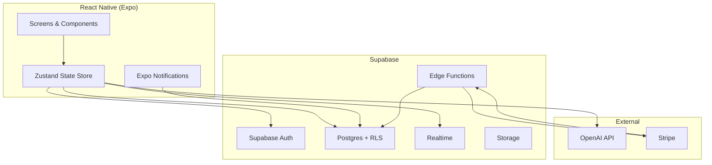

# Design Document: Growthovo App

## Overview

Growthovo is a React Native (Expo) mobile application delivering Duolingo-style life-skills education to teenagers and people in their late 20s. The app is structured around six skill Pillars, each containing 5 Units of 8 Lessons. Lessons are 5-card swipeable modules followed by a real-world daily Challenge. Gamification mechanics (Streaks, Hearts, XP, Leagues, Squads) drive daily retention. An AI coach called Rex, powered by OpenAI, provides personalised feedback. Stripe handles subscriptions with a 3-day free trial. All backend services run on Supabase (Auth, Postgres, Realtime, Edge Functions, Storage).

---

## Architecture



The client is a React Native Expo app. All state management uses Zustand with Supabase as the source of truth. Realtime subscriptions power live leaderboards and friend streaks. OpenAI calls are made from the client (with the API key stored server-side via a Supabase Edge Function proxy to avoid client-side key exposure). Stripe webhooks are handled by a Supabase Edge Function.

---

## Components and Interfaces

### Navigation Structure

```
Root Navigator (Stack)
├── Auth Stack
│   ├── SignInScreen
│   ├── SignUpScreen
│   └── OnboardingScreen
└── Main Tab Navigator
    ├── HomeScreen
    ├── PillarsMapScreen
    ├── LeagueScreen
    ├── SquadScreen
    └── ProfileScreen
        └── SettingsScreen (Stack push)

Modal Stack (overlays)
├── LessonPlayerScreen
├── ChallengeScreen
├── CheckInScreen
├── PaywallScreen
└── LevelUpScreen
```

### Core Screen Components

**HomeScreen**
- `StreakBadge` — displays current streak count and Rex weakened state
- `HeartBar` — displays remaining hearts (5 max for free tier)
- `XPProgressBar` — current XP toward next level
- `DailyLessonCard` — tappable card launching today's lesson
- `LeagueSnapshot` — mini leaderboard showing user's position
- `RexGreeting` — AI-generated morning message

**LessonPlayerScreen**
- `SwipeableCardDeck` — horizontal swipe gesture handler
- `LessonCard` (5 variants: Concept, Example, Mistake, Science, Challenge)
- `ProgressDots` — card position indicator
- `LessonCompleteOverlay` — XP animation + Rex reaction

**PillarsMapScreen**
- `PillarPath` — scrollable vertical path per pillar
- `UnitNode` — unit header with progress ring
- `LessonNode` — individual lesson bubble (completed/current/locked states)
- `PillarTabBar` — horizontal tab switching between pillars

**ProfileScreen**
- `SpiderChart` — SVG radar chart across 6 pillars (react-native-svg)
- `PillarLevelBadge` — level badge per pillar
- `StreakHistory` — calendar heatmap
- `ShareableCard` — exportable profile snapshot
- `AvatarUploader` — Supabase Storage integration

**LeagueScreen**
- `LeagueLeaderboard` — real-time ranked list
- `PromotionZone` / `RelegationZone` — highlighted top/bottom 5
- `WeeklyXPCounter` — countdown to week reset

**SquadScreen**
- `SquadLeaderboard` — real-time 5-member ranked list
- `MemberCard` — streak + weekly XP per member
- `SharedChallengeLog` — recent challenge completions

**CheckInScreen**
- `ChallengeRecap` — today's challenge text
- `CompletionToggle` — yes/no binary input
- `RexFeedback` — AI-generated response card
- `TomorrowPreview` — next lesson teaser

**PaywallScreen**
- `PlanCard` (monthly / annual)
- `TrialBadge` — "3 days free, no card needed"
- `StripeCheckoutButton` — opens Stripe Checkout web view

### Service Layer (TypeScript modules)

```typescript
// src/services/
supabaseClient.ts       // Supabase JS client singleton
authService.ts          // sign in, sign up, sign out, session refresh
lessonService.ts        // fetch lessons, mark complete, unlock next
progressService.ts      // XP transactions, level calculation
streakService.ts        // streak increment, freeze consumption, reset
heartService.ts         // heart deduction, daily refill
leagueService.ts        // league assignment, weekly reset, rankings
squadService.ts         // squad CRUD, member management
challengeService.ts     // challenge fetch, check-in submission
rexService.ts           // OpenAI proxy calls via Edge Function
notificationService.ts  // Expo push token registration, schedule
subscriptionService.ts  // Stripe Checkout, portal link, status sync
```

---

## Data Models

### Supabase Postgres Schema

```sql
-- Users (extends Supabase auth.users)
CREATE TABLE users (
  id UUID PRIMARY KEY REFERENCES auth.users(id),
  username TEXT UNIQUE NOT NULL,
  avatar_url TEXT,
  daily_goal_minutes INT DEFAULT 10,
  onboarding_complete BOOLEAN DEFAULT FALSE,
  stripe_customer_id TEXT,
  subscription_status TEXT DEFAULT 'free', -- 'free' | 'trialing' | 'active' | 'canceled'
  subscription_plan TEXT,                  -- 'monthly' | 'annual' | NULL
  trial_end_date TIMESTAMPTZ,
  created_at TIMESTAMPTZ DEFAULT NOW()
);

-- Pillars (seeded, not user-generated)
CREATE TABLE pillars (
  id UUID PRIMARY KEY DEFAULT gen_random_uuid(),
  name TEXT NOT NULL,         -- 'Mind' | 'Discipline' | etc.
  colour TEXT NOT NULL,       -- hex colour
  icon TEXT NOT NULL,         -- emoji
  display_order INT NOT NULL
);

-- Units
CREATE TABLE units (
  id UUID PRIMARY KEY DEFAULT gen_random_uuid(),
  pillar_id UUID REFERENCES pillars(id),
  title TEXT NOT NULL,
  display_order INT NOT NULL
);

-- Lessons
CREATE TABLE lessons (
  id UUID PRIMARY KEY DEFAULT gen_random_uuid(),
  unit_id UUID REFERENCES units(id),
  title TEXT NOT NULL,
  display_order INT NOT NULL,
  card_concept TEXT NOT NULL,       -- max 60 words
  card_example TEXT NOT NULL,
  card_mistake TEXT NOT NULL,
  card_science TEXT NOT NULL,
  card_challenge TEXT NOT NULL
);

-- UserProgress
CREATE TABLE user_progress (
  id UUID PRIMARY KEY DEFAULT gen_random_uuid(),
  user_id UUID REFERENCES users(id),
  lesson_id UUID REFERENCES lessons(id),
  completed_at TIMESTAMPTZ,
  xp_earned INT DEFAULT 0,
  UNIQUE(user_id, lesson_id)
);

-- Streaks
CREATE TABLE streaks (
  id UUID PRIMARY KEY DEFAULT gen_random_uuid(),
  user_id UUID REFERENCES users(id) UNIQUE,
  current_streak INT DEFAULT 0,
  longest_streak INT DEFAULT 0,
  last_activity_date DATE,
  freeze_count INT DEFAULT 0,
  updated_at TIMESTAMPTZ DEFAULT NOW()
);

-- Hearts
CREATE TABLE hearts (
  id UUID PRIMARY KEY DEFAULT gen_random_uuid(),
  user_id UUID REFERENCES users(id) UNIQUE,
  count INT DEFAULT 5,
  last_refill_date DATE DEFAULT CURRENT_DATE
);

-- XP_Transactions
CREATE TABLE xp_transactions (
  id UUID PRIMARY KEY DEFAULT gen_random_uuid(),
  user_id UUID REFERENCES users(id),
  amount INT NOT NULL,
  source TEXT NOT NULL,  -- 'lesson' | 'challenge' | 'checkin' | 'streak_milestone' | 'level_up'
  reference_id UUID,     -- lesson_id or challenge_id
  created_at TIMESTAMPTZ DEFAULT NOW()
);

-- Leagues
CREATE TABLE leagues (
  id UUID PRIMARY KEY DEFAULT gen_random_uuid(),
  tier INT NOT NULL DEFAULT 1,
  week_start DATE NOT NULL,
  week_end DATE NOT NULL
);

-- LeagueMembers
CREATE TABLE league_members (
  id UUID PRIMARY KEY DEFAULT gen_random_uuid(),
  league_id UUID REFERENCES leagues(id),
  user_id UUID REFERENCES users(id),
  weekly_xp INT DEFAULT 0,
  rank INT,
  UNIQUE(league_id, user_id)
);

-- Squads
CREATE TABLE squads (
  id UUID PRIMARY KEY DEFAULT gen_random_uuid(),
  name TEXT NOT NULL,
  pillar_id UUID REFERENCES pillars(id),
  invite_code TEXT UNIQUE NOT NULL,
  created_at TIMESTAMPTZ DEFAULT NOW()
);

-- SquadMembers
CREATE TABLE squad_members (
  id UUID PRIMARY KEY DEFAULT gen_random_uuid(),
  squad_id UUID REFERENCES squads(id),
  user_id UUID REFERENCES users(id),
  joined_at TIMESTAMPTZ DEFAULT NOW(),
  UNIQUE(squad_id, user_id)
);

-- Challenges (one per lesson, derived from card_challenge)
CREATE TABLE challenges (
  id UUID PRIMARY KEY DEFAULT gen_random_uuid(),
  lesson_id UUID REFERENCES lessons(id) UNIQUE,
  description TEXT NOT NULL
);

-- ChallengeCompletions
CREATE TABLE challenge_completions (
  id UUID PRIMARY KEY DEFAULT gen_random_uuid(),
  user_id UUID REFERENCES users(id),
  challenge_id UUID REFERENCES challenges(id),
  completed BOOLEAN NOT NULL,
  proof_photo_url TEXT,
  rex_response TEXT,
  completed_at TIMESTAMPTZ DEFAULT NOW(),
  UNIQUE(user_id, challenge_id, DATE(completed_at))
);

-- Notifications
CREATE TABLE notifications (
  id UUID PRIMARY KEY DEFAULT gen_random_uuid(),
  user_id UUID REFERENCES users(id),
  type TEXT NOT NULL,   -- 'morning' | 'afternoon' | 'evening' | 'danger_window'
  scheduled_time TIME NOT NULL,
  enabled BOOLEAN DEFAULT TRUE
);

-- Subscriptions (mirrors Stripe state)
CREATE TABLE subscriptions (
  id UUID PRIMARY KEY DEFAULT gen_random_uuid(),
  user_id UUID REFERENCES users(id) UNIQUE,
  stripe_subscription_id TEXT UNIQUE,
  stripe_customer_id TEXT,
  status TEXT NOT NULL,
  plan TEXT,
  trial_end TIMESTAMPTZ,
  current_period_end TIMESTAMPTZ,
  updated_at TIMESTAMPTZ DEFAULT NOW()
);

-- Friends
CREATE TABLE friends (
  id UUID PRIMARY KEY DEFAULT gen_random_uuid(),
  user_id UUID REFERENCES users(id),
  friend_id UUID REFERENCES users(id),
  created_at TIMESTAMPTZ DEFAULT NOW(),
  UNIQUE(user_id, friend_id)
);

-- Rex conversation history
CREATE TABLE rex_messages (
  id UUID PRIMARY KEY DEFAULT gen_random_uuid(),
  user_id UUID REFERENCES users(id),
  role TEXT NOT NULL,    -- 'user' | 'assistant'
  content TEXT NOT NULL,
  created_at TIMESTAMPTZ DEFAULT NOW()
);
```

### TypeScript Types

```typescript
type SubscriptionStatus = 'free' | 'trialing' | 'active' | 'canceled';
type XPSource = 'lesson' | 'challenge' | 'checkin' | 'streak_milestone' | 'level_up';
type NotificationType = 'morning' | 'afternoon' | 'evening' | 'danger_window';

interface UserProfile {
  id: string;
  username: string;
  avatarUrl?: string;
  dailyGoalMinutes: 5 | 10 | 15;
  onboardingComplete: boolean;
  subscriptionStatus: SubscriptionStatus;
  subscriptionPlan?: 'monthly' | 'annual';
  trialEndDate?: Date;
}

interface LessonCards {
  concept: string;   // max 60 words
  example: string;
  mistake: string;
  science: string;
  challenge: string;
}

interface StreakState {
  currentStreak: number;
  longestStreak: number;
  lastActivityDate: string; // ISO date
  freezeCount: number;
}

interface LeagueMember {
  userId: string;
  username: string;
  avatarUrl?: string;
  weeklyXp: number;
  rank: number;
}
```

---

## Correctness Properties

A property is a characteristic or behavior that should hold true across all valid executions of a system — essentially, a formal statement about what the system should do. Properties serve as the bridge between human-readable specifications and machine-verifiable correctness guarantees.

### Property 1: Streak increment is idempotent within a day

*For any* User, completing multiple Lessons or Check-ins on the same calendar day, the Streak counter SHALL increment by exactly 1 for that day regardless of how many activities are completed.

**Validates: Requirements 5.1**

---

### Property 2: Streak freeze consumption preserves streak

*For any* User with at least one Streak Freeze who misses a calendar day, after the freeze is consumed the Streak counter SHALL equal the value it had before the missed day.

**Validates: Requirements 5.3, 9.3**

---

### Property 3: Heart deduction never goes below zero

*For any* User, after any number of Heart deduction events, the Heart count SHALL never be less than 0.

**Validates: Requirements 6.2, 6.3**

---

### Property 4: Daily heart refill is idempotent

*For any* User, calling the heart refill operation multiple times on the same calendar day SHALL result in a Heart count of exactly 5 (not exceeding 5 per refill cycle).

**Validates: Requirements 6.1, 6.4**

---

### Property 5: XP transactions are append-only and sum correctly

*For any* User, the sum of all XP_Transaction amounts for that User SHALL equal the User's total XP displayed in the app.

**Validates: Requirements 7.1, 7.2, 7.3, 7.5**

---

### Property 6: Lesson unlock is monotonic

*For any* User, once a Lesson is marked as completed it SHALL remain completed and the next Lesson SHALL remain unlocked — completing a Lesson SHALL never re-lock a previously unlocked Lesson.

**Validates: Requirements 4.8, 4.9**

---

### Property 7: League ranking is a total order

*For any* League, the ranking of members by weekly XP SHALL be a total order — no two members SHALL share the same rank, and the member with the highest weekly XP SHALL have rank 1.

**Validates: Requirements 8.2**

---

### Property 8: Check-in is submitted at most once per day

*For any* User, submitting a Check-in on a given calendar day SHALL be idempotent — a second submission on the same day SHALL be rejected and SHALL NOT award additional XP.

**Validates: Requirements 10.6**

---

### Property 9: Subscription status sync round-trip

*For any* Stripe webhook event (subscription created, updated, deleted), processing the event through the Edge Function SHALL result in the Supabase subscriptions table reflecting the same status as the Stripe subscription object.

**Validates: Requirements 17.7, 17.8**

---

### Property 10: Free tier pillar access is exactly one

*For any* User with subscription_status = 'free', the set of accessible Pillars SHALL have cardinality exactly 1.

**Validates: Requirements 3.2**

---

### Property 11: Squad size invariant

*For any* Squad, the number of SquadMembers SHALL never exceed 5.

**Validates: Requirements 12.1**

---

### Property 12: Streak freeze inventory cap

*For any* User, the freeze_count in the streaks table SHALL never exceed 5.

**Validates: Requirements 9.4**

---

## Error Handling

### Authentication Errors
- Invalid credentials → display user-friendly message, no stack trace exposed
- Network failure during auth → retry with exponential backoff (max 3 attempts), then show offline banner
- Session expiry → auto-refresh via Supabase Auth; if refresh fails, redirect to sign-in

### Lesson / Content Errors
- Missing lesson content → display skeleton loader, retry fetch; if persistent, show "content unavailable" card
- Swipe gesture conflict → debounce card transitions to prevent double-advance

### Heart / Streak Errors
- Concurrent heart deduction (race condition) → use Supabase RPC with row-level locking
- Streak date calculation across timezones → always use user's local midnight, stored as UTC offset in profile

### OpenAI / Rex Errors
- OpenAI API timeout (>10s) → display fallback Rex message from a local pool of pre-written responses
- OpenAI rate limit → queue request, retry after 1 second, max 3 retries
- Content policy violation → log and display generic encouragement message

### Stripe / Subscription Errors
- Webhook signature verification failure → return 400, log event, do not process
- Duplicate webhook delivery → idempotency key on subscription update; check existing status before writing
- Payment failure → Stripe handles retry logic; webhook updates status to 'past_due', app shows paywall

### Notification Errors
- Push token registration failure → log silently, app functions without notifications
- Notification delivery failure → log to Notifications table with error status, do not crash

### Network / Offline
- No internet connection → display offline banner, allow read-only access to cached lesson content
- Supabase connection drop → Realtime auto-reconnects; show stale data indicator on leaderboards

---

## Testing Strategy

### Dual Testing Approach

Both unit tests and property-based tests are required. They are complementary:
- Unit tests catch concrete bugs in specific scenarios and edge cases
- Property-based tests verify universal correctness across all valid inputs

### Property-Based Testing

**Library**: `fast-check` (TypeScript/JavaScript PBT library)

Each correctness property defined above MUST be implemented as a single property-based test using `fast-check`. Each test MUST run a minimum of 100 iterations.

Tag format for each test:
```
// Feature: growthovo-app, Property {N}: {property_text}
```

**Property test files**:
- `src/__tests__/properties/streak.property.test.ts` — Properties 1, 2, 12
- `src/__tests__/properties/hearts.property.test.ts` — Properties 3, 4
- `src/__tests__/properties/xp.property.test.ts` — Property 5
- `src/__tests__/properties/lessons.property.test.ts` — Property 6
- `src/__tests__/properties/league.property.test.ts` — Property 7
- `src/__tests__/properties/checkin.property.test.ts` — Property 8
- `src/__tests__/properties/subscription.property.test.ts` — Property 9
- `src/__tests__/properties/access.property.test.ts` — Property 10
- `src/__tests__/properties/squad.property.test.ts` — Property 11

### Unit Testing

**Library**: Jest + React Native Testing Library

Unit test coverage targets:
- `authService` — sign in, sign up, sign out, session refresh
- `streakService` — increment, freeze consumption, reset, milestone detection
- `heartService` — deduction, refill, premium bypass
- `lessonService` — fetch, complete, unlock next
- `progressService` — XP calculation, level-up detection
- `leagueService` — ranking sort, promotion/relegation logic
- `rexService` — fallback message selection, prompt construction
- `subscriptionService` — status mapping from Stripe webhook payloads
- All screen components — render tests, interaction tests

### Integration Testing

- Supabase Edge Function for Stripe webhook: test with Stripe CLI event fixtures
- Supabase RLS policies: test that users cannot read/write other users' data
- Realtime subscriptions: test that league and squad updates propagate

### Testing Configuration

```typescript
// jest.config.js
module.exports = {
  preset: 'jest-expo',
  setupFilesAfterFramework: ['@testing-library/jest-native/extend-expect'],
  testPathPattern: ['**/__tests__/**/*.test.ts?(x)'],
};
```

Property test minimum iterations:
```typescript
fc.assert(fc.property(...), { numRuns: 100 });
```
