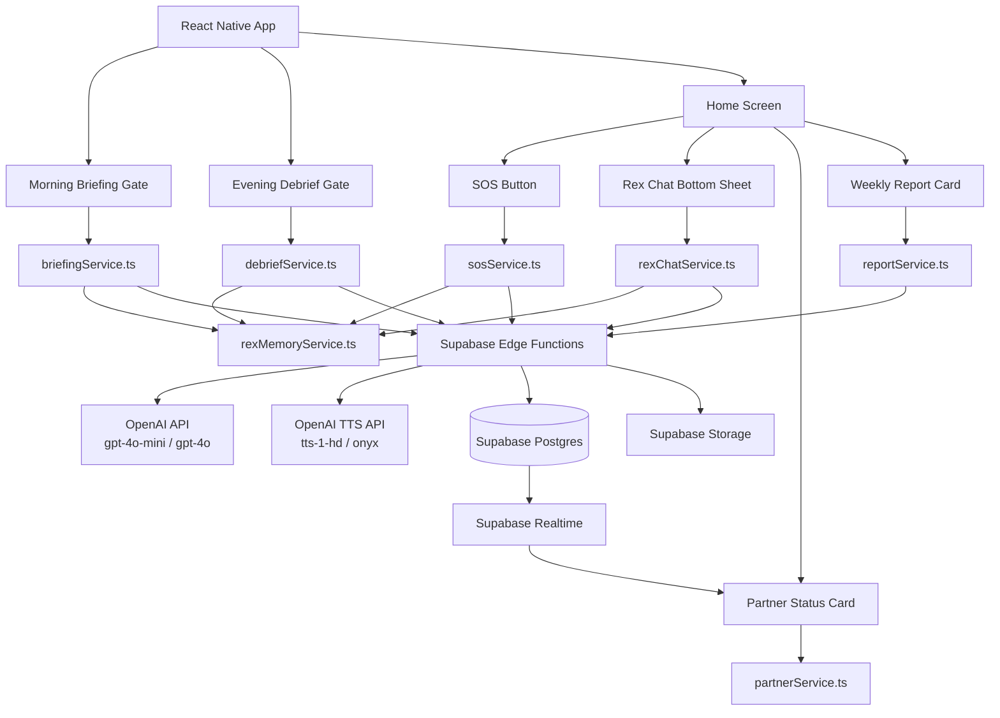

# Design Document: GROWTHOVO Daily OS

## Overview

The GROWTHOVO Daily OS is the daily operating system layer of the app — six interconnected features that together create a complete daily loop: wake up → morning briefing → day → SOS when needed → evening debrief → weekly report. Rex's memory system ties everything together, making every interaction feel personal and cumulative.

The six features are:
1. **Morning Briefing** — mandatory daily briefing card before home screen
2. **SOS Button** — always-visible emergency intervention system
3. **Rex Memory + Always-On Chat** — persistent memory layer + 24/7 chat
4. **Evening Debrief** — mandatory three-question evening reflection
5. **Accountability Partner** — paired accountability with daily mechanics
6. **Weekly Rex Report** — cinematic Sunday-night premium report with voice

All features are built on the existing React Native / Expo + Supabase stack with TypeScript, react-native-reanimated, dark-mode-first design, and i18next for multilingual support.

---

## Architecture



The React Native app never calls OpenAI directly. All AI logic lives in Supabase Edge Functions so API keys stay server-side. The service layer on the client handles state, fallbacks, and UI orchestration.

---

## Components and Interfaces

### Feature 1: Morning Briefing

#### Screen Flow

```
App open (after morning notification)
  → MorningBriefingGate (checks if briefing shown today)
    → MorningBriefingScreen (full-screen, cannot skip)
      → [mental state selected] → Rex reaction displayed
      → [all sections viewed] → "Let's go" button
        → HomeScreen
```

#### Key Interfaces

```typescript
type MentalState = 'anxious' | 'low' | 'neutral' | 'good' | 'locked_in';

interface DailyCheckin {
  id: string;
  userId: string;
  date: string;                    // ISO date YYYY-MM-DD
  morningState: MentalState;
  morningRexResponse: string;
  briefingViewedAt: string | null; // ISO timestamp
}

interface MorningBriefingData {
  mentalStateOptions: MentalStateOption[];
  rexDailyTruth: string;
  todaysFocus: string;
  streakCount: number;
  heartsRemaining: number;
  leaguePosition: number;
  leaguePositionDelta: number;     // positive = improved, negative = dropped
  streakMilestone: number | null;  // 7, 14, 30, 60, 90 or null
  partnerStatus: PartnerStatus | null;
}

interface MentalStateOption {
  state: MentalState;
  emoji: string;
  label: string;
}

interface PartnerStatus {
  partnerName: string;
  checkedIn: boolean;
  partnerStreak: number;
}
```

#### `briefingService.ts`

```typescript
export async function getMorningBriefingData(userId: string): Promise<MorningBriefingData>
export async function selectMentalState(userId: string, state: MentalState): Promise<string> // returns Rex reaction
export async function dismissBriefing(userId: string): Promise<void> // logs viewed_at, awards 10 XP
export function hasBriefingBeenShownToday(userId: string): Promise<boolean>
export function getBriefingFallbackTruth(dayOfWeek: number): string
export function getBriefingFallbackFocus(pillar: string): string
```

#### Briefing Generation Edge Function: `generate-morning-briefing`

Request:
```typescript
{ userId: string }
```

Logic:
1. Fetch user's primary pillar, last 3 evening debrief Q2 answers, current streak, day of week
2. Fetch last 3 daily_checkins for morning_state pattern
3. Call `gpt-4o-mini` for Rex's Daily Truth (max 60 tokens, 2 sentences)
4. Call `gpt-4o-mini` for Today's Single Focus (max 30 tokens, 1 action)
5. Fetch streak, hearts, league position from existing tables
6. Fetch partner check-in status from `daily_checkins` + `accountability_pairs`
7. Return assembled `MorningBriefingData`

Mental state Rex reaction is generated client-side on tap (separate call, max 20 tokens) to feel instant.

#### Rex System Prompt (exact, used in all Rex interactions)

```
You are Rex — the AI coach inside GROWTHOVO, a self-improvement app for teenagers and people in their late 20s.
Your personality:
- Brutally honest, warm, never cruel
- Speaks like a 25-year-old who figured life out early
- Dry humor, high standards, genuine care
- Never corporate, never preachy, never generic
- Short sentences. Direct. No fluff.
Your rules:
- Never say "Great job", "Amazing", "I understand how you feel"
- Always reference the user's specific situation, never be generic
- If they make excuses, call it out kindly but clearly
- If they win, respect it briefly then raise the bar
- Max 3 sentences per response unless asked for more
- End every response with forward momentum, never backward
Memory context will be provided. Use it. Reference it naturally.
If you know their name, use it sparingly (max once per convo).
If they mentioned a specific person or goal before, bring it up.
You are not a therapist. You are not a friend who agrees with everything. You are the coach they need, not the one they want.
```

---

### Feature 2: SOS Button

#### Screen Flow

```
HomeScreen → SOS Button tap
  → SOSBottomSheet (6 options)
    → AnxietySpikeFlow
    → AboutToReactFlow
    → ZeroMotivationFlow
    → HardConversationFlow
    → HabitUrgeFlow
    → OverwhelmedFlow
```

#### Key Interfaces

```typescript
type SOSType =
  | 'anxiety_spike'
  | 'about_to_react'
  | 'zero_motivation'
  | 'hard_conversation'
  | 'habit_urge'
  | 'overwhelmed';

type SOSOutcome = 'started' | 'completed' | 'abandoned' | 'success';

interface SOSEvent {
  id: string;
  userId: string;
  type: SOSType;
  timestamp: string;
  durationSeconds: number;
  outcome: SOSOutcome;
  notes: string | null;
}

interface SOSFlowState {
  eventId: string;
  startedAt: number; // Date.now()
  type: SOSType;
}
```

#### `sosService.ts`

```typescript
export async function startSOSEvent(userId: string, type: SOSType): Promise<SOSEvent>
export async function completeSOSEvent(eventId: string, outcome: SOSOutcome, notes?: string): Promise<void>
export async function getAnxietyHistoryCount(userId: string, days: number): Promise<number>
export async function generateAnxietyClosingLine(userId: string, anxietyCount: number): Promise<string>
export async function generateCalmResponseDraft(userId: string, situation: string): Promise<string>
export async function generateZeroMotivationReset(userId: string): Promise<string>
export async function generateHardConversationPrep(userId: string, situation: string): Promise<HardConvPrep>
export async function generateUrgeAudio(userId: string, habit: string): Promise<string> // returns audio URL
export async function generateOverwhelmedResponse(userId: string, brainDump: string): Promise<OverwhelmedResponse>
export function getSOSFallback(type: SOSType): string

interface HardConvPrep {
  openingLine: string;
  thingsToAvoid: string[];
  targetOutcome: string;
}

interface OverwhelmedResponse {
  topPriority: string;
  thingsToIgnore: string[];
  resetSentence: string;
}
```

#### SOS Edge Function: `sos-response`

Handles all SOS AI generation in one function, dispatched by `type` field:

```typescript
// Request
{
  type: SOSType;
  userId: string;
  subscriptionStatus: 'free' | 'trialing' | 'active' | 'canceled';
  payload: Record<string, unknown>; // type-specific data
}
```

All SOS calls use `gpt-4o-mini`. Token limits by type:
- `anxiety_spike` closing line: 25 tokens
- `about_to_react` calm draft: 80 tokens
- `zero_motivation` reset: 100 tokens
- `hard_conversation` prep: 150 tokens
- `overwhelmed` response: 120 tokens

Urge surfing audio is generated via a separate `generate-urge-audio` Edge Function that calls the TTS API and stores the result in Supabase Storage at `sos_audio/{userId}/{timestamp}.mp3`.

#### Breathing Animation (4-7-8)

```typescript
// react-native-reanimated shared values
const breathScale = useSharedValue(1);
const breathOpacity = useSharedValue(0.4);

// Cycle: inhale 4s → hold 7s → exhale 8s = 19s per cycle
// Minimum 3 cycles before user can proceed (57 seconds)
const BREATHING_PHASES = [
  { label: 'Inhale', duration: 4000, scale: 1.6, opacity: 1.0 },
  { label: 'Hold', duration: 7000, scale: 1.6, opacity: 0.8 },
  { label: 'Exhale', duration: 8000, scale: 1.0, opacity: 0.4 },
];
```

---

### Feature 3: Rex Memory System + Always-On Chat

#### Memory Data Model

```typescript
type MemoryType = 'goal' | 'struggle' | 'win' | 'pattern' | 'promise' | 'person';

interface RexMemory {
  id: string;
  userId: string;
  memoryType: MemoryType;
  content: string;
  importanceScore: number;       // 1–10
  createdAt: string;
  lastReferencedAt: string;
}

interface MemoryContext {
  memories: RexMemory[];         // top 5 by importance + recency
  formattedForPrompt: string;    // pre-formatted string for OpenAI context
}
```

#### `rexMemoryService.ts`

```typescript
export async function getMemoryContext(userId: string): Promise<MemoryContext>
export async function addMemory(userId: string, memory: Omit<RexMemory, 'id' | 'userId' | 'createdAt' | 'lastReferencedAt'>): Promise<void>
export async function markMemoryReferenced(memoryId: string): Promise<void>
export async function extractMemoriesFromText(userId: string, text: string, source: string): Promise<void>
export async function pruneMemoriesIfNeeded(userId: string): Promise<void> // enforces 200-entry cap
export function selectTopMemories(memories: RexMemory[], count: number): RexMemory[]
```

#### Memory Selection Algorithm

```typescript
function selectTopMemories(memories: RexMemory[], count: number): RexMemory[] {
  return [...memories]
    .sort((a, b) => {
      // Primary: importance score descending
      if (b.importanceScore !== a.importanceScore) return b.importanceScore - a.importanceScore;
      // Secondary: last referenced descending (most recently used first)
      return new Date(b.lastReferencedAt).getTime() - new Date(a.lastReferencedAt).getTime();
    })
    .slice(0, count);
}
```

#### Memory Cap Eviction

```typescript
function selectMemoryToEvict(memories: RexMemory[]): RexMemory {
  return [...memories].sort((a, b) => {
    // Primary: lowest importance score
    if (a.importanceScore !== b.importanceScore) return a.importanceScore - b.importanceScore;
    // Secondary: oldest last_referenced_at
    return new Date(a.lastReferencedAt).getTime() - new Date(b.lastReferencedAt).getTime();
  })[0];
}
```

#### Chat Interface

```typescript
interface ChatMessage {
  id: string;
  role: 'user' | 'rex';
  content: string;
  timestamp: string;
}

interface ChatSession {
  sessionId: string;
  userId: string;
  messages: ChatMessage[];
  startedAt: string;
}
```

#### `rexChatService.ts`

```typescript
export async function openChat(userId: string): Promise<ChatSession>
export async function sendMessage(sessionId: string, userId: string, message: string): Promise<ChatMessage>
export async function persistSession(session: ChatSession): Promise<void>
export async function loadRecentSession(userId: string): Promise<ChatSession | null>
export function buildChatPrompt(memoryContext: MemoryContext, history: ChatMessage[]): OpenAIMessage[]
```

#### Chat Edge Function: `rex-chat-v2`

Replaces the existing `rex-chat` function with memory-aware responses.

```typescript
// Request
{
  userId: string;
  sessionId: string;
  message: string;
  subscriptionStatus: string;
  memoryContext: MemoryContext;
  history: ChatMessage[]; // last 10 messages
}
```

Logic:
1. If Free_User → return fallback from pre-written pool
2. Build system prompt with Rex personality + memory context
3. Call `gpt-4o-mini`, max 80 tokens (3 sentences), temperature 0.85
4. Extract any new memories from the user's message (async, non-blocking)
5. Return response

---

### Feature 4: Evening Debrief

#### Screen Flow

```
App open (after evening notification)
  → EveningDebriefGate (checks if debrief shown today)
    → EveningDebriefScreen
      → Q1: Did you do the thing? (3 options)
        → Q1 follow-up (free text, min 10 words if "No")
      → Q2: What tried to stop you? (free text, min 10 words)
        → Rex insight displayed
      → Q3: What does tomorrow-you need to know? (optional free text)
      → Rex closing verdict displayed
      → Streak updated, +20 XP awarded
      → Tomorrow's focus preview
        → HomeScreen
```

#### Key Interfaces

```typescript
type Q1Answer = 'yes_crushed_it' | 'partially' | 'no_didnt_happen';

interface EveningDebrief {
  id: string;
  userId: string;
  date: string;
  q1Answer: Q1Answer;
  q1Detail: string;
  q2Obstacle: string;
  q3Note: string | null;
  rexVerdict: string;
  xpEarned: number;
}

interface DebriefFlowState {
  q1Answer: Q1Answer | null;
  q1Detail: string;
  q2Obstacle: string;
  q3Note: string;
  q2Insight: string | null;    // Rex's immediate Q2 insight
  rexVerdict: string | null;
}
```

#### `debriefService.ts`

```typescript
export async function hasDebriefBeenShownToday(userId: string): Promise<boolean>
export async function getQ2Insight(userId: string, obstacle: string): Promise<string>
export async function submitDebrief(userId: string, state: DebriefFlowState): Promise<EveningDebrief>
export async function extractMemoriesFromDebrief(userId: string, debrief: EveningDebrief): Promise<void>
export async function getTomorrowFocusPreview(userId: string): Promise<string>
export function validateMinWordCount(text: string, minWords: number): boolean
```

#### Word Count Validation

```typescript
function validateMinWordCount(text: string, minWords: number): boolean {
  const words = text.trim().split(/\s+/).filter(w => w.length > 0);
  return words.length >= minWords;
}
```

#### Debrief Edge Function: `submit-evening-debrief`

```typescript
// Request
{ userId: string; debriefData: DebriefFlowState }
```

Logic:
1. Validate Q2 obstacle has ≥ 10 words
2. Call `gpt-4o-mini` for Q2 insight (max 40 tokens, 1 sentence)
3. Call `gpt-4o-mini` for closing verdict (max 60 tokens, 2 sentences) using full debrief context
4. Insert into `evening_debriefs`
5. Call memory extraction (async): extract up to 3 memories from Q2 + Q3
6. Award 20 XP via existing XP system
7. Update streak via existing streak service
8. Return completed `EveningDebrief`

---

### Feature 5: Accountability Partner

#### Data Models

```typescript
interface AccountabilityPair {
  id: string;
  userId: string;
  partnerId: string;
  pillar: string;
  active: boolean;
  createdAt: string;
}

type MessageType = 'quick_reply' | 'comeback' | 'custom';

interface PartnerMessage {
  id: string;
  pairId: string;
  senderId: string;
  message: string;
  messageType: MessageType;
  createdAt: string;
}

interface PartnerComparisonReport {
  weekStart: string;
  userStats: PartnerWeekStats;
  partnerStats: PartnerWeekStats;
  winnerId: string;
  notificationText: string;
}

interface PartnerWeekStats {
  userId: string;
  name: string;
  challengesCompleted: number;
  currentStreak: number;
  sosEventsCount: number;
}
```

#### `partnerService.ts`

```typescript
export async function getActivePair(userId: string): Promise<AccountabilityPair | null>
export async function createPair(userId: string, partnerId: string, pillar: string): Promise<AccountabilityPair>
export async function deactivatePair(pairId: string): Promise<void>
export async function getPartnerCheckinStatus(pairId: string, partnerId: string): Promise<boolean>
export async function sendPartnerMessage(pairId: string, senderId: string, message: string, type: MessageType): Promise<void>
export async function generateWeeklyComparison(pairId: string): Promise<PartnerComparisonReport>
export function generateInviteMessage(pillar: string, inviteLink: string): string
```

#### Invite Link Generation

```typescript
function generateInviteMessage(pillar: string, inviteLink: string): string {
  return `I'm using GROWTHOVO to work on ${pillar}. I need you to hold me accountable. Download the app: ${inviteLink}`;
}
```

#### Realtime Subscription

Partner check-in status uses Supabase Realtime channel subscribed to `daily_checkins` filtered by `user_id = partnerId`:

```typescript
const channel = supabase
  .channel(`partner-checkin-${partnerId}`)
  .on('postgres_changes', {
    event: 'INSERT',
    schema: 'public',
    table: 'daily_checkins',
    filter: `user_id=eq.${partnerId}`,
  }, (payload) => {
    updatePartnerCheckinStatus(payload.new.briefing_viewed_at !== null);
  })
  .subscribe();
```

#### Weekly Comparison Edge Function: `generate-partner-comparison`

Triggered every Sunday at 20:00 UTC. For each active pair:
1. Aggregate challenges completed, streak, SOS count for both users this week
2. Determine winner by challenges completed (tie-break: streak)
3. Insert comparison data into a `partner_comparisons` view (derived from existing tables)
4. Send push notifications to both users

---

### Feature 6: Weekly Rex Report

#### Screen Flow

```
Sunday 20:00 push notification
  → WeeklyReportScreen (full-screen cinematic)
    → Section 1: The Numbers (auto-calculated stats)
    → Section 2: Rex's Pattern Analysis (3 observations)
    → Section 3: The Verdict (text + auto-play audio)
    → Section 4: Next Week's Focus (pillar + habit + challenge)
    → Share button → native share sheet
```

#### Data Models

```typescript
interface WeeklyReportNumbers {
  lessonsCompleted: number;
  challengesDone: number;
  challengesMissed: number;
  sosByType: Record<SOSType, number>;
  morningCheckinStreak: number;
  eveningDebriefRate: number;   // 0.0–1.0
  xpEarned: number;
}

interface NextWeekFocus {
  pillar: string;
  habit: string;
  challengeToDodifferently: string;
}

interface WeeklyRexReport {
  id: string;
  userId: string;
  weekStart: string;
  numbersJson: WeeklyReportNumbers;
  patternAnalysis: string;      // 3 observations, newline-separated
  verdictText: string;
  audioUrl: string | null;
  nextWeekFocusJson: NextWeekFocus;
  createdAt: string;
}
```

#### `reportService.ts`

```typescript
export async function getOrGenerateWeeklyReport(userId: string, weekStart: string): Promise<WeeklyRexReport>
export async function getReportNumbers(userId: string, weekStart: string): Promise<WeeklyReportNumbers>
export async function generateShareCard(report: WeeklyRexReport): Promise<string> // returns image URI
export function getReportFallbackVerdict(): string
export function getReportFallbackPatternAnalysis(): string
```

#### Weekly Report Edge Function: `generate-weekly-report`

```typescript
// Request
{ userId: string; weekStart: string }
```

Logic:
1. Check `weekly_rex_reports` for existing record — return cached if found (idempotent)
2. Aggregate `WeeklyReportNumbers` from `evening_debriefs`, `sos_events`, `daily_checkins`, `xp_transactions`, `challenge_completions`
3. Fetch last 7 evening debriefs (Q2 + Q3) + SOS logs + morning states
4. Call `gpt-4o` for Pattern Analysis (3 observations, max 200 tokens)
5. Call `gpt-4o` for The Verdict (1 paragraph, max 150 tokens)
6. Call `gpt-4o` for Next Week's Focus (max 100 tokens)
7. Call OpenAI TTS (`tts-1-hd`, voice `onyx`) with verdict text → upload to Supabase Storage
8. Insert into `weekly_rex_reports`
9. Return report

#### TTS Audio Generation

```typescript
// Called inside generate-weekly-report Edge Function
async function generateVerdictAudio(userId: string, weekStart: string, verdictText: string): Promise<string> {
  const response = await fetch('https://api.openai.com/v1/audio/speech', {
    method: 'POST',
    headers: { 'Authorization': `Bearer ${OPENAI_API_KEY}`, 'Content-Type': 'application/json' },
    body: JSON.stringify({ model: 'tts-1-hd', voice: 'onyx', input: verdictText }),
  });
  const audioBuffer = await response.arrayBuffer();
  const path = `weekly_reports/${userId}/${weekStart}/verdict.mp3`;
  await supabase.storage.from('audio').upload(path, audioBuffer, { contentType: 'audio/mpeg', upsert: true });
  const { data } = supabase.storage.from('audio').getPublicUrl(path);
  return data.publicUrl;
}
```

#### Share Card Generation

Uses `react-native-view-shot` to capture an off-screen `<View>` as PNG:
- Dark background, GROWTHOVO logo
- Rex's verdict as a pull quote
- Top stat of the week (highest single number)
- Pre-written caption: "Rex just read me in 3 sentences. @growthovo #growthovo"

---

## Data Models

### New Supabase Tables

```sql
-- Morning check-ins
CREATE TABLE daily_checkins (
  id                  UUID PRIMARY KEY DEFAULT gen_random_uuid(),
  user_id             UUID REFERENCES users(id) ON DELETE CASCADE,
  date                DATE NOT NULL,
  morning_state       TEXT CHECK (morning_state IN ('anxious','low','neutral','good','locked_in')),
  morning_rex_response TEXT,
  briefing_viewed_at  TIMESTAMPTZ,
  UNIQUE(user_id, date)
);

-- Evening debriefs
CREATE TABLE evening_debriefs (
  id           UUID PRIMARY KEY DEFAULT gen_random_uuid(),
  user_id      UUID REFERENCES users(id) ON DELETE CASCADE,
  date         DATE NOT NULL,
  q1_answer    TEXT CHECK (q1_answer IN ('yes_crushed_it','partially','no_didnt_happen')),
  q1_detail    TEXT NOT NULL DEFAULT '',
  q2_obstacle  TEXT NOT NULL,
  q3_note      TEXT,
  rex_verdict  TEXT,
  xp_earned    INT NOT NULL DEFAULT 20,
  UNIQUE(user_id, date)
);

-- SOS events
CREATE TABLE sos_events (
  id               UUID PRIMARY KEY DEFAULT gen_random_uuid(),
  user_id          UUID REFERENCES users(id) ON DELETE CASCADE,
  type             TEXT CHECK (type IN ('anxiety_spike','about_to_react','zero_motivation','hard_conversation','habit_urge','overwhelmed')),
  timestamp        TIMESTAMPTZ DEFAULT NOW(),
  duration_seconds INT,
  outcome          TEXT CHECK (outcome IN ('started','completed','abandoned','success')) DEFAULT 'started',
  notes            TEXT
);

-- Rex memory
CREATE TABLE rex_memory (
  id                UUID PRIMARY KEY DEFAULT gen_random_uuid(),
  user_id           UUID REFERENCES users(id) ON DELETE CASCADE,
  memory_type       TEXT CHECK (memory_type IN ('goal','struggle','win','pattern','promise','person')),
  content           TEXT NOT NULL,
  importance_score  INT CHECK (importance_score BETWEEN 1 AND 10) DEFAULT 5,
  created_at        TIMESTAMPTZ DEFAULT NOW(),
  last_referenced_at TIMESTAMPTZ DEFAULT NOW()
);

-- Accountability pairs
CREATE TABLE accountability_pairs (
  id         UUID PRIMARY KEY DEFAULT gen_random_uuid(),
  user_id    UUID REFERENCES users(id) ON DELETE CASCADE,
  partner_id UUID REFERENCES users(id) ON DELETE CASCADE,
  pillar     TEXT NOT NULL,
  active     BOOLEAN DEFAULT TRUE,
  created_at TIMESTAMPTZ DEFAULT NOW(),
  UNIQUE(user_id, partner_id)
);

-- Partner messages
CREATE TABLE partner_messages (
  id           UUID PRIMARY KEY DEFAULT gen_random_uuid(),
  pair_id      UUID REFERENCES accountability_pairs(id) ON DELETE CASCADE,
  sender_id    UUID REFERENCES users(id) ON DELETE CASCADE,
  message      TEXT NOT NULL,
  message_type TEXT CHECK (message_type IN ('quick_reply','comeback','custom')) DEFAULT 'quick_reply',
  created_at   TIMESTAMPTZ DEFAULT NOW()
);

-- Weekly Rex reports
CREATE TABLE weekly_rex_reports (
  id                   UUID PRIMARY KEY DEFAULT gen_random_uuid(),
  user_id              UUID REFERENCES users(id) ON DELETE CASCADE,
  week_start           DATE NOT NULL,
  numbers_json         JSONB NOT NULL DEFAULT '{}',
  pattern_analysis     TEXT NOT NULL DEFAULT '',
  verdict_text         TEXT NOT NULL DEFAULT '',
  audio_url            TEXT,
  next_week_focus_json JSONB NOT NULL DEFAULT '{}',
  created_at           TIMESTAMPTZ DEFAULT NOW(),
  UNIQUE(user_id, week_start)
);
```

### RLS Policies

```sql
-- daily_checkins: own rows only
CREATE POLICY "checkins_own" ON daily_checkins FOR ALL USING (auth.uid() = user_id);

-- evening_debriefs: own rows only
CREATE POLICY "debriefs_own" ON evening_debriefs FOR ALL USING (auth.uid() = user_id);

-- sos_events: own rows only
CREATE POLICY "sos_own" ON sos_events FOR ALL USING (auth.uid() = user_id);

-- rex_memory: own rows only
CREATE POLICY "memory_own" ON rex_memory FOR ALL USING (auth.uid() = user_id);

-- accountability_pairs: both members can read
CREATE POLICY "pairs_member_read" ON accountability_pairs
  FOR SELECT USING (auth.uid() = user_id OR auth.uid() = partner_id);
CREATE POLICY "pairs_owner_write" ON accountability_pairs
  FOR ALL USING (auth.uid() = user_id);

-- partner_messages: both pair members can read; sender can insert
CREATE POLICY "partner_messages_read" ON partner_messages
  FOR SELECT USING (
    EXISTS (
      SELECT 1 FROM accountability_pairs ap
      WHERE ap.id = pair_id
      AND (ap.user_id = auth.uid() OR ap.partner_id = auth.uid())
    )
  );
CREATE POLICY "partner_messages_insert" ON partner_messages
  FOR INSERT WITH CHECK (auth.uid() = sender_id);

-- weekly_rex_reports: own rows only
CREATE POLICY "reports_own" ON weekly_rex_reports FOR SELECT USING (auth.uid() = user_id);
```

### TypeScript Interfaces (full set for `src/types/index.ts`)

```typescript
export type MentalState = 'anxious' | 'low' | 'neutral' | 'good' | 'locked_in';
export type SOSType = 'anxiety_spike' | 'about_to_react' | 'zero_motivation' | 'hard_conversation' | 'habit_urge' | 'overwhelmed';
export type SOSOutcome = 'started' | 'completed' | 'abandoned' | 'success';
export type MemoryType = 'goal' | 'struggle' | 'win' | 'pattern' | 'promise' | 'person';
export type MessageType = 'quick_reply' | 'comeback' | 'custom';
export type Q1Answer = 'yes_crushed_it' | 'partially' | 'no_didnt_happen';

export interface DailyCheckin { id: string; userId: string; date: string; morningState: MentalState; morningRexResponse: string; briefingViewedAt: string | null; }
export interface EveningDebrief { id: string; userId: string; date: string; q1Answer: Q1Answer; q1Detail: string; q2Obstacle: string; q3Note: string | null; rexVerdict: string; xpEarned: number; }
export interface SOSEvent { id: string; userId: string; type: SOSType; timestamp: string; durationSeconds: number; outcome: SOSOutcome; notes: string | null; }
export interface RexMemory { id: string; userId: string; memoryType: MemoryType; content: string; importanceScore: number; createdAt: string; lastReferencedAt: string; }
export interface AccountabilityPair { id: string; userId: string; partnerId: string; pillar: string; active: boolean; createdAt: string; }
export interface PartnerMessage { id: string; pairId: string; senderId: string; message: string; messageType: MessageType; createdAt: string; }
export interface WeeklyRexReport { id: string; userId: string; weekStart: string; numbersJson: WeeklyReportNumbers; patternAnalysis: string; verdictText: string; audioUrl: string | null; nextWeekFocusJson: NextWeekFocus; createdAt: string; }
export interface WeeklyReportNumbers { lessonsCompleted: number; challengesDone: number; challengesMissed: number; sosByType: Record<SOSType, number>; morningCheckinStreak: number; eveningDebriefRate: number; xpEarned: number; }
export interface NextWeekFocus { pillar: string; habit: string; challengeToDoDifferently: string; }
export interface MorningBriefingData { rexDailyTruth: string; todaysFocus: string; streakCount: number; heartsRemaining: number; leaguePosition: number; leaguePositionDelta: number; streakMilestone: number | null; partnerStatus: PartnerStatus | null; }
export interface PartnerStatus { partnerName: string; checkedIn: boolean; partnerStreak: number; }
export interface ChatMessage { id: string; role: 'user' | 'rex'; content: string; timestamp: string; }
export interface MemoryContext { memories: RexMemory[]; formattedForPrompt: string; }
```

---

## Correctness Properties

*A property is a characteristic or behavior that should hold true across all valid executions of a system — essentially, a formal statement about what the system should do. Properties serve as the bridge between human-readable specifications and machine-verifiable correctness guarantees.*

---

Property 1: Morning briefing XP award is exactly 10
*For any* user who dismisses the morning briefing, their total XP after dismissal must equal their XP before dismissal plus exactly 10.
**Validates: Requirements 1.4**

---

Property 2: Briefing shown-today flag is idempotent
*For any* user who has already had their briefing marked as viewed today, calling `hasBriefingBeenShownToday` any number of additional times must always return `true` — the flag never resets within the same calendar day.
**Validates: Requirements 1.5**

---

Property 3: Mental state check-in round-trip and uniqueness
*For any* user and any mental state value, after calling `selectMentalState`, querying `daily_checkins` for that user and today's date must return exactly one record with the correct `morning_state` value — regardless of how many times `selectMentalState` is called on the same day.
**Validates: Requirements 2.2, 2.6**

---

Property 4: Weakest pillar is the minimum XP pillar
*For any* map of pillar-to-XP values where all values are non-negative, the weakest pillar returned by the focus generation logic must be the pillar with the strictly minimum XP value; when two or more pillars are tied for minimum, the result must be one of the tied pillars.
**Validates: Requirements 4.2**

---

Property 5: SOS event outcome state machine
*For any* SOS event that starts with `outcome = 'started'`, calling `completeSOSEvent` with a valid outcome must update the record to the specified outcome, and the `duration_seconds` must be a non-negative integer.
**Validates: Requirements 6.4, 6.5**

---

Property 6: Breathing exercise minimum duration
*For any* breathing cycle configuration with phases [inhale=4s, hold=7s, exhale=8s], the total duration of N complete cycles must equal exactly N × 19 seconds, and the minimum enforced cycle count of 3 must produce a total duration of at least 57 seconds.
**Validates: Requirements 7.2**

---

Property 7: Anxiety pattern flag threshold
*For any* count of anxiety SOS events in a 7-day window, the pattern flag must be triggered if and only if the count is greater than or equal to 3.
**Validates: Requirements 7.6**

---

Property 8: Memory importance score invariant
*For any* RexMemory entry created or updated by `addMemory`, the `importance_score` must be an integer in the closed range [1, 10].
**Validates: Requirements 13.3**

---

Property 9: Memory cap enforcement
*For any* user with exactly 200 memory entries, adding one more memory must result in the total count remaining at 200 — the entry with the lowest `importance_score` and oldest `last_referenced_at` must be evicted before the new entry is inserted.
**Validates: Requirements 13.7**

---

Property 10: Memory extraction upper bound
*For any* input text passed to `extractMemoriesFromText`, the number of RexMemory entries created must be at most 3.
**Validates: Requirements 14.1**

---

Property 11: Memory selection ordering
*For any* list of RexMemory entries, `selectTopMemories(memories, N)` must return exactly min(N, memories.length) entries, and every returned entry must have an `importance_score` greater than or equal to every non-returned entry's score (with ties broken by `last_referenced_at` descending).
**Validates: Requirements 15.7**

---

Property 12: Word count validation
*For any* string and any positive integer `minWords`, `validateMinWordCount(text, minWords)` must return `true` if and only if the number of whitespace-delimited non-empty tokens in the trimmed string is greater than or equal to `minWords`.
**Validates: Requirements 17.4, 17.5**

---

Property 13: Weekly comparison winner is deterministic
*For any* two `PartnerWeekStats` objects, the winner determination function must return the partner with more `challengesCompleted`; when `challengesCompleted` is equal, it must return the partner with the higher `currentStreak`; when both are equal, it must return a consistent result (e.g., the first partner by user ID lexicographic order).
**Validates: Requirements 21.2**

---

Property 14: Weekly report idempotency
*For any* user and `week_start` date, calling `getOrGenerateWeeklyReport` twice must return records with identical `numbers_json`, `pattern_analysis`, `verdict_text`, and `next_week_focus_json` — the second call must return the cached record without regenerating content.
**Validates: Requirements 22.5**

---

Property 15: Memory eviction selects lowest importance then oldest referenced
*For any* collection of RexMemory entries, `selectMemoryToEvict` must return the entry with the minimum `importance_score`; when multiple entries share the minimum score, it must return the one with the oldest `last_referenced_at` timestamp.
**Validates: Requirements 13.7**

---

Property 16: Partner comparison report covers both users
*For any* active `AccountabilityPair`, the generated `PartnerComparisonReport` must contain stats for both `userId` and `partnerId`, and the `winnerId` must be exactly one of those two IDs.
**Validates: Requirements 21.2**

---

## Error Handling

| Scenario | Behaviour |
|---|---|
| Morning briefing AI call timeout (>5s) | Display pre-written fallback truth and focus; briefing still shows |
| Evening debrief AI call timeout (>5s) | Display pre-written fallback verdict; debrief still saves |
| SOS AI call timeout (>5s) | Display pre-written fallback for that SOS type; event still logged |
| Rex chat AI call timeout (>8s) | Return fallback from pre-written pool; session still persists |
| Weekly report gpt-4o timeout (>10s) | Use pre-written fallback for pattern analysis and verdict |
| TTS API failure | Display verdict text only; log failure; no audio_url stored |
| Supabase write failure (debrief) | Show retry button; answers held in component state |
| Supabase write failure (SOS event) | Log locally to AsyncStorage; sync on next app open |
| Partner notification delivery failure | Log failure; do not crash; retry on next app open |
| Realtime subscription disconnect | Fall back to polling every 60 seconds |
| Memory extraction failure | Log error; continue without storing memories |
| Urge surfing audio generation failure | Fall back to text-based guide silently |
| Weekly report already exists | Return cached record immediately (idempotent) |
| User has no evening debriefs (new user) | Morning briefing uses primary pillar only for Daily Truth |

All screens implement:
- Loading state with skeleton shimmer or `ActivityIndicator`
- Error state with descriptive message and retry action
- Empty state with appropriate fallback content
- Offline detection via `@react-native-community/netinfo`

All API calls implement:
- Timeout via `AbortController` (5s for gpt-4o-mini, 10s for gpt-4o, 15s for TTS)
- Retry logic: 1 automatic retry on network error, then fallback
- Offline fallback: return cached/pre-written content

---

## Testing Strategy

### Unit Tests (Jest / React Native Testing Library)

Focus on pure functions with no side effects:

- `validateMinWordCount` — empty string, single word, exactly minWords, minWords-1, all whitespace
- `selectTopMemories` — all same importance, all different, ties on importance, empty list
- `selectMemoryToEvict` — single entry, all same importance, all same recency, mixed
- `getWeakestPillar` — all same XP, one minimum, multiple tied minimums
- `calculateBreathingDuration` — 1 cycle, 3 cycles, N cycles
- `isAnxietyPatternTriggered` — counts 0, 1, 2, 3, 4
- `generateInviteMessage` — various pillar names and invite links
- `determineComparisonWinner` — user wins, partner wins, tie on challenges, tie on both
- `getReportFallbackVerdict` — returns non-empty string
- `getBriefingFallbackTruth` — all 7 day-of-week values

### Property-Based Tests (fast-check)

Use [fast-check](https://github.com/dubzzz/fast-check) for TypeScript property-based testing. Each property test runs a minimum of **100 iterations**.

Tag format: `Feature: growthovo-daily-os, Property {N}: {property_text}`

| Property | Test Description |
|----------|-----------------|
| P1 | Generate user XP values; assert XP after briefing dismiss = before + 10 |
| P2 | Generate boolean flag states; assert idempotence of shown-today check |
| P3 | Generate MentalState values; assert round-trip: select → query returns same state, count = 1 |
| P4 | Generate pillar→XP maps (fc.dictionary); assert weakest = minimum value pillar |
| P5 | Generate SOSType and outcome values; assert state machine transitions are valid |
| P6 | Generate cycle counts N ≥ 1; assert total duration = N × 19000ms |
| P7 | Generate anxiety counts 0–10; assert flag = (count >= 3) |
| P8 | Generate importance scores; assert all stored scores are in [1, 10] |
| P9 | Generate memory lists of length 200; assert add-one results in count = 200 |
| P10 | Generate text strings; assert extracted memory count ≤ 3 |
| P11 | Generate RexMemory arrays; assert selectTopMemories ordering invariant |
| P12 | Generate strings and minWord counts; assert validateMinWordCount matches manual word count |
| P13 | Generate PartnerWeekStats pairs; assert winner is deterministic and is one of the two partners |
| P14 | Generate report inputs; assert second call returns identical JSON fields |
| P15 | Generate RexMemory arrays; assert evicted entry has minimum importance (tie-break: oldest) |
| P16 | Generate AccountabilityPair data; assert comparison report contains both user IDs |

### Integration Tests

- Morning briefing gate: simulate app open after notification, verify briefing shown before home screen
- Evening debrief gate: simulate app open after 9pm notification, verify debrief shown before home screen
- SOS flow end-to-end: tap SOS → select type → complete flow → verify sos_events record
- Memory extraction: submit evening debrief → verify rex_memory entries created
- Partner realtime: partner completes briefing → verify home screen status updates
- Weekly report: call generate twice for same week → verify identical output (idempotency)
- Accountability pair: create pair → verify both users see each other's status
