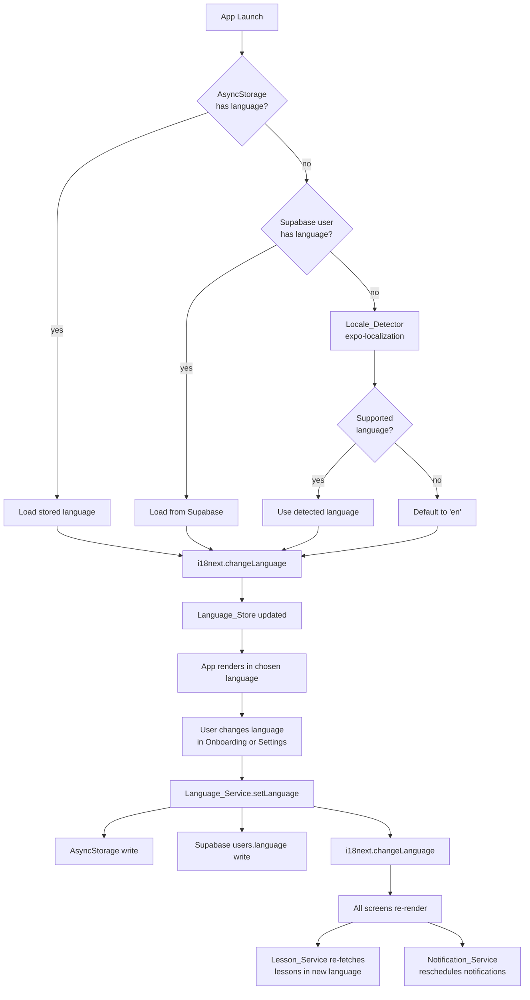

# Design Document: Multilingual Support

## Overview

This document describes the technical design for adding multilingual support to the Growthovo React Native / Expo app. The system uses **i18next + react-i18next** for string resolution, **expo-localization** for device locale detection, **AsyncStorage** for local persistence, and **Supabase** for cross-device sync. Eight languages are supported at launch: English (`en`), Romanian (`ro`), Italian (`it`), French (`fr`), German (`de`), Spanish (`es`), Portuguese (`pt`), and Dutch (`nl`).

The design touches four layers:
1. **Client i18n layer** — initialisation, language switching, translation files, locale/number/date formatting
2. **State layer** — a new Zustand `useLanguageStore` slice
3. **Data layer** — Supabase schema additions (`users.language`, `lessons.language`, `rex_cache.language`, `notifications.language`)
4. **Edge Function layer** — Rex language injection and language-aware cache keys

---

## Architecture



---

## Components and Interfaces

### I18n Initialisation (`src/services/i18nService.ts`)

Responsible for bootstrapping i18next before the first render.

```typescript
export type SupportedLanguage = 'en' | 'ro' | 'it' | 'fr' | 'de' | 'es' | 'pt' | 'nl';

export const SUPPORTED_LANGUAGES: SupportedLanguage[] = ['en', 'ro', 'it', 'fr', 'de', 'es', 'pt', 'nl'];

export interface LanguageOption {
  code: SupportedLanguage;
  flag: string;       // emoji flag
  nativeName: string; // name in that language
}

export const LANGUAGE_OPTIONS: LanguageOption[] = [
  { code: 'en', flag: '🇬🇧', nativeName: 'English' },
  { code: 'ro', flag: '🇷🇴', nativeName: 'Română' },
  { code: 'it', flag: '🇮🇹', nativeName: 'Italiano' },
  { code: 'fr', flag: '🇫🇷', nativeName: 'Français' },
  { code: 'de', flag: '🇩🇪', nativeName: 'Deutsch' },
  { code: 'es', flag: '🇪🇸', nativeName: 'Español' },
  { code: 'pt', flag: '🇵🇹', nativeName: 'Português' },
  { code: 'nl', flag: '🇳🇱', nativeName: 'Nederlands' },
];

/**
 * Initialise i18next. Must be awaited before the root component renders.
 * Resolution order: AsyncStorage → Supabase → expo-localization → 'en'
 */
export async function initI18n(userId?: string): Promise<SupportedLanguage>;

/**
 * Resolve the best supported language from a BCP-47 locale string.
 * e.g. 'ro-RO' → 'ro', 'zh-CN' → 'en' (fallback)
 */
export function resolveLanguage(locale: string): SupportedLanguage;
```

### Language Service (`src/services/languageService.ts`)

Handles persistence and cross-device sync.

```typescript
const ASYNC_STORAGE_KEY = '@growthovo/language';

export async function getStoredLanguage(): Promise<SupportedLanguage | null>;
export async function setLanguage(code: SupportedLanguage, userId?: string): Promise<void>;
export async function getLanguageFromSupabase(userId: string): Promise<SupportedLanguage | null>;
export async function syncLanguageToSupabase(code: SupportedLanguage, userId: string): Promise<void>;
```

### Language Store (`src/store/index.ts` — new slice)

```typescript
interface LanguageSlice {
  language: SupportedLanguage;
  setLanguage: (code: SupportedLanguage, userId?: string) => Promise<void>;
}

export const useLanguageStore = create<LanguageSlice>((set) => ({
  language: 'en',
  setLanguage: async (code, userId) => {
    await setLanguage(code, userId); // persists to AsyncStorage + Supabase
    await i18n.changeLanguage(code);
    set({ language: code });
  },
}));
```

### Language Picker Component (`src/components/LanguagePicker.tsx`)

Reusable grid of large tappable cards used in both onboarding and settings.

```typescript
interface LanguagePickerProps {
  selected: SupportedLanguage;
  onSelect: (code: SupportedLanguage) => void;
}
```

Each card renders: flag emoji (large), native language name, and a checkmark badge when selected. Tapping a card calls `onSelect` immediately — the parent is responsible for calling `useLanguageStore.setLanguage`.

### Onboarding Screen Changes (`src/screens/onboarding/OnboardingScreen.tsx`)

A new `'language'` step is prepended to the existing `'pillars' | 'goal'` flow:

```
step: 'language' → 'pillars' → 'goal'
```

The language step renders `<LanguagePicker>`. On selection, `useLanguageStore.setLanguage` is called immediately so all subsequent onboarding copy renders in the chosen language.

### Settings Screen Changes (`src/screens/settings/SettingsScreen.tsx`)

A new "Language" section is added above "Notifications". It shows the current language's flag + native name and opens a modal containing `<LanguagePicker>`. On selection, `useLanguageStore.setLanguage` is called, which triggers a re-render of all visible UI.

### Lesson Service Changes (`src/services/lessonService.ts`)

All lesson queries gain a `language` filter:

```typescript
// Before
supabase.from('lessons').select('*').eq('unit_id', unitId)

// After
supabase.from('lessons').select('*')
  .eq('unit_id', unitId)
  .eq('language', activeLanguage)
```

If the query returns zero rows, the service retries with `language = 'en'` as a fallback.

### Notification Service Changes (`src/services/notificationService.ts`)

`scheduleDefaultNotifications` accepts an optional `language` parameter. Notification copy is resolved via `i18n.t('notifications.morning')` etc., so it automatically uses the active language. When `setLanguage` is called, `scheduleDefaultNotifications` is re-invoked to reschedule with updated copy.

### Rex Service Changes (`src/services/rex.ts`)

The `invokeRexFunction` helper gains a `language` field in the request body:

```typescript
body: { type, userId, subscriptionStatus, language, params }
```

Fallback responses are now keyed by language:

```typescript
getCheckInFallback(completed: boolean, streakDays: number, language: SupportedLanguage): string
```

### Rex Edge Function Changes (`supabase/functions/rex-response/index.ts`)

1. Accept `language` in the request body (defaults to `'en'` if absent for backwards compatibility).
2. Prepend language instruction to the system prompt:
   ```
   Respond only in {language}. Maintain Rex's personality and tone in that language.
   ```
3. Include `language` in the cache key hash input.
4. Store `language` in the `rex_cache` row on write.
5. Filter `rex_cache` lookups by `language` in addition to `cache_key`.

### Locale Formatting Utilities (`src/services/localeUtils.ts`)

```typescript
/**
 * Format a date string using the active locale.
 * Uses Intl.DateTimeFormat backed by expo-localization's locale.
 */
export function formatDate(isoDate: string, locale: string): string;

/**
 * Format a number using the active locale's decimal/thousands separators.
 */
export function formatNumber(value: number, locale: string): string;

/**
 * Format a currency amount. Falls back to EUR if currency is not provided.
 */
export function formatCurrency(amount: number, currency: string, locale: string): string;
```

---

## Data Models

### `users` table — new column

```sql
ALTER TABLE users ADD COLUMN language VARCHAR(5) DEFAULT 'en'
  CHECK (language IN ('en', 'ro', 'it', 'fr', 'de', 'es', 'pt', 'nl'));
```

### `lessons` table — language column + composite key

```sql
-- Add language column
ALTER TABLE lessons ADD COLUMN language VARCHAR(5) NOT NULL DEFAULT 'en'
  CHECK (language IN ('en', 'ro', 'it', 'fr', 'de', 'es', 'pt', 'nl'));

-- Drop old single-column PK, add composite PK
ALTER TABLE lessons DROP CONSTRAINT lessons_pkey;
ALTER TABLE lessons ADD PRIMARY KEY (id, language);

-- Index for fast language-filtered queries
CREATE INDEX idx_lessons_language ON lessons(language);
CREATE INDEX idx_lessons_unit_language ON lessons(unit_id, language);
```

### `rex_cache` table — language column

```sql
ALTER TABLE rex_cache ADD COLUMN language VARCHAR(5) NOT NULL DEFAULT 'en'
  CHECK (language IN ('en', 'ro', 'it', 'fr', 'de', 'es', 'pt', 'nl'));

-- Update unique constraint to include language
ALTER TABLE rex_cache DROP CONSTRAINT IF EXISTS rex_cache_cache_key_key;
ALTER TABLE rex_cache ADD CONSTRAINT rex_cache_cache_key_language_key UNIQUE (cache_key, language);
```

### `notifications` table — language column

```sql
ALTER TABLE notifications ADD COLUMN language VARCHAR(5) DEFAULT 'en'
  CHECK (language IN ('en', 'ro', 'it', 'fr', 'de', 'es', 'pt', 'nl'));
```

### Translation File Structure

```
locales/
  en/translation.json
  ro/translation.json
  it/translation.json
  fr/translation.json
  de/translation.json
  es/translation.json
  pt/translation.json
  nl/translation.json
```

Each `translation.json` follows a namespaced flat structure:

```json
{
  "onboarding": {
    "language_title": "Choose your language",
    "pillars_title": "What do you want to work on?",
    "pillars_subtitle": "Pick your weak spots. Rex will focus here first.",
    "goal_title": "How much time per day?",
    "goal_subtitle": "Be honest. Consistency beats intensity.",
    "continue": "Continue →",
    "lets_go": "Let's go 🔥"
  },
  "navigation": {
    "home": "Home",
    "lessons": "Lessons",
    "checkin": "Check-in",
    "league": "League",
    "settings": "Settings"
  },
  "settings": {
    "title": "Settings",
    "language": "Language",
    "notifications": "Notifications",
    "subscription": "Subscription",
    "sign_out": "Sign Out"
  },
  "errors": {
    "generic": "Something went wrong. Please try again.",
    "network": "No internet connection."
  },
  "rex": {
    "fallback_checkin_success": "...",
    "fallback_checkin_fail": "...",
    "fallback_streak_warning": "...",
    "fallback_weekly_summary": "..."
  },
  "streak": {
    "days": "{{count}} day streak",
    "at_risk": "Your streak is at risk!"
  },
  "xp": {
    "earned": "+{{amount}} XP"
  },
  "paywall": {
    "title": "Go Premium",
    "monthly": "Monthly",
    "annual": "Annual",
    "cta": "Start Free Trial"
  }
}
```

### Updated TypeScript Types

```typescript
// src/types/index.ts additions

export type SupportedLanguage = 'en' | 'ro' | 'it' | 'fr' | 'de' | 'es' | 'pt' | 'nl';

export interface UserProfile {
  // ... existing fields ...
  language: SupportedLanguage; // new
}

export interface Lesson {
  // ... existing fields ...
  language: SupportedLanguage; // new
}

export interface RexCacheEntry {
  // ... existing fields ...
  language: SupportedLanguage; // new
}
```

---

## Correctness Properties

*A property is a characteristic or behavior that should hold true across all valid executions of a system — essentially, a formal statement about what the system should do. Properties serve as the bridge between human-readable specifications and machine-verifiable correctness guarantees.*

Property-based testing (PBT) validates software correctness by testing universal properties across many generated inputs. Each property is a formal specification that should hold for all valid inputs.

---

Property 1: Language resolution always returns a supported language
*For any* BCP-47 locale string, `resolveLanguage` SHALL return a value that is a member of `SUPPORTED_LANGUAGES`.
**Validates: Requirements 1.1, 1.2**

---

Property 2: Unknown locales fall back to English
*For any* locale string that does not begin with one of the eight supported language prefixes, `resolveLanguage` SHALL return `'en'`.
**Validates: Requirements 1.2**

---

Property 3: Language persistence round-trip
*For any* supported Language_Code, calling `setLanguage(code)` followed by `getStoredLanguage()` SHALL return the same code.
**Validates: Requirements 10.1**

---

Property 4: Rex cache key is language-sensitive
*For any* two identical `(challengeText, completed, streakBracket)` tuples but different Language_Codes, the computed cache keys SHALL be different.
**Validates: Requirements 8.2, 6.3**

---

Property 5: Fallback responses cover all languages
*For any* supported Language_Code and any Rex response type (`checkin_success`, `checkin_fail`, `streak_warning`, `weekly_summary`), `getFallbackResponse(type, language)` SHALL return a non-empty string.
**Validates: Requirements 6.4, 6.5**

---

Property 6: `resolveLanguage` is idempotent
*For any* supported Language_Code `c`, `resolveLanguage(c)` SHALL equal `c` (a valid language code resolves to itself).
**Validates: Requirements 1.1**

---

Property 7: Locale formatting produces non-empty output
*For any* valid ISO date string and any supported Language_Code, `formatDate(date, locale)` SHALL return a non-empty string.
*For any* finite number and any supported Language_Code, `formatNumber(value, locale)` SHALL return a non-empty string.
**Validates: Requirements 9.1, 9.2**

---

## Error Handling

| Scenario | Behaviour |
|---|---|
| AsyncStorage read fails on launch | Fall through to Supabase lookup, then locale detection, then `'en'` |
| Supabase `users.language` read fails | Use AsyncStorage value; if also absent, use locale detection |
| Supabase `users.language` write fails | Log error silently; AsyncStorage value is the source of truth locally |
| i18next translation key missing | Return `en` fallback value; log warning in dev mode |
| Lesson query returns 0 rows for active language | Retry with `language = 'en'`; if still 0, show empty state |
| Rex Edge Function receives unknown language | Default to `'en'` for cache key and system prompt injection |
| `resolveLanguage` receives empty string | Return `'en'` |
| `formatDate` / `formatNumber` receives invalid input | Return empty string and log error |

---

## Testing Strategy

### Unit Tests

Unit tests cover specific examples and edge cases:

- `resolveLanguage('ro-RO')` → `'ro'`
- `resolveLanguage('zh-CN')` → `'en'` (unsupported fallback)
- `resolveLanguage('')` → `'en'` (empty string edge case)
- `resolveLanguage('en-US')` → `'en'`
- `formatDate('2024-01-15', 'de-DE')` → `'15.01.2024'`
- `formatDate('2024-01-15', 'en-US')` → `'01/15/2024'`
- Cache key differs when language differs (specific example)
- Fallback response for `'en'` check-in success is non-empty

### Property-Based Tests

The project already uses **fast-check** (present in `devDependencies`). Each property test runs a minimum of 100 iterations.

**Property 1 — Language resolution always returns a supported language**
Tag: `Feature: multilingual-support, Property 1: resolveLanguage always returns a supported language`
Generate arbitrary strings; assert result is in `SUPPORTED_LANGUAGES`.

**Property 2 — Unknown locales fall back to English**
Tag: `Feature: multilingual-support, Property 2: unknown locales fall back to en`
Generate strings that do not start with any supported language prefix; assert result is `'en'`.

**Property 3 — Language persistence round-trip**
Tag: `Feature: multilingual-support, Property 3: language persistence round-trip`
For each of the 8 supported codes, call `setLanguage` then `getStoredLanguage`; assert equality.

**Property 4 — Rex cache key is language-sensitive**
Tag: `Feature: multilingual-support, Property 4: cache key differs across languages`
Generate `(challengeText, completed, streakBracket)` tuples; for each pair of distinct Language_Codes, assert the two cache keys are different.

**Property 5 — Fallback responses cover all languages**
Tag: `Feature: multilingual-support, Property 5: fallback responses cover all languages`
For each combination of Language_Code × response type, assert the fallback string is non-empty.

**Property 6 — resolveLanguage is idempotent on valid codes**
Tag: `Feature: multilingual-support, Property 6: resolveLanguage is idempotent`
For each supported Language_Code, assert `resolveLanguage(code) === code`.

**Property 7 — Locale formatting produces non-empty output**
Tag: `Feature: multilingual-support, Property 7: locale formatting produces non-empty output`
Generate valid ISO date strings and finite numbers; for each supported Language_Code, assert `formatDate` and `formatNumber` return non-empty strings.
