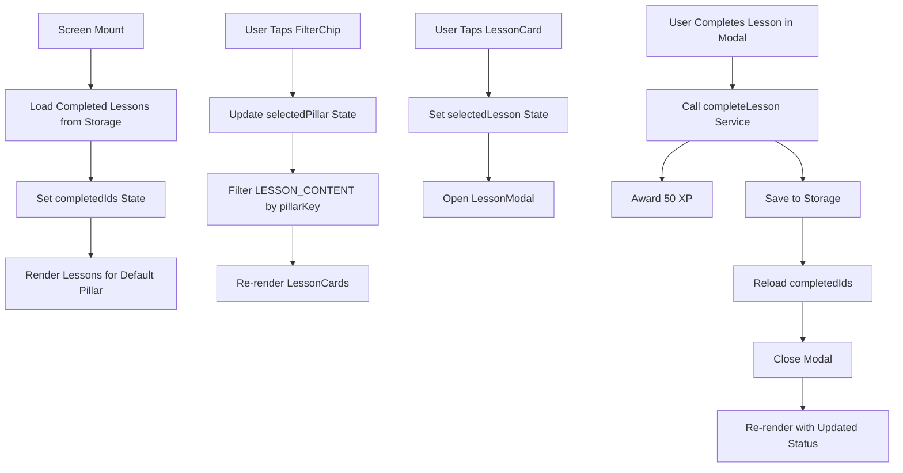

# Design Document: PillarsScreen V2 Redesign

## Overview

The PillarsScreen V2 Redesign is a React Native screen component that provides users with an enhanced lesson browsing experience across 6 life growth pillars (Mental Health, Relationships, Career, Fitness, Finance, Hobbies). The design focuses on clear visual hierarchy, intuitive navigation, and engaging micro-interactions to encourage daily learning and skill development.

### Key Design Goals

1. **Visual Clarity**: Use consistent color coding, typography, and spacing to create a premium, scannable interface
2. **Progress Transparency**: Display lesson completion status at a glance using distinct visual indicators
3. **Engagement**: Incorporate daily challenges and XP rewards to gamify the learning experience
4. **Performance**: Ensure smooth animations and 60fps scrolling on mobile devices
5. **Accessibility**: Support screen readers and maintain WCAG 2.1 AA compliance

### Design Principles

- **Consistency**: Use the same card style, border-radius, and spacing throughout
- **Progressive Disclosure**: Show summaries in cards, full content in modals
- **Immediate Feedback**: Provide visual and haptic feedback for all interactions
- **Pillar Identity**: Use accent colors to reinforce pillar-specific branding

## Architecture

### Component Hierarchy

```
PillarsScreen (Container)
├── Header
│   ├── Title: "Your Pillars"
│   └── Subtitle: "Choose your growth area"
├── FilterChipContainer (Horizontal ScrollView)
│   └── FilterChip[] (6 pillars)
├── LessonsContainer (Vertical ScrollView)
│   ├── LessonCard[] (4-6 lessons per pillar)
│   └── DailyChallengeCard (one per pillar)
└── LessonModal (Full-screen overlay)
    ├── Lesson Header
    ├── Content Paragraphs
    ├── Key Takeaway
    └── Complete Button
```

### State Management

The PillarsScreen manages three primary state variables:

1. **selectedPillar**: `PillarData` - Currently active pillar filter
2. **completedIds**: `Set<string>` - Set of completed lesson IDs for O(1) lookup
3. **selectedLesson**: `LessonData | null` - Currently open lesson in modal (null when closed)

#### State Flow Diagram



### Data Flow

1. **Initial Load**:
   - Screen mounts → `loadCompletedLessons()` → Read from AsyncStorage → Update `completedIds` state
   - Default pillar: Mental Health (first in PILLARS array)

2. **Pillar Selection**:
   - User taps FilterChip → `handlePillarSelect(pillar)` → Update `selectedPillar` state → Filter lessons → Re-render list within 200ms

3. **Lesson Filtering**:
   ```typescript
   const lessons = Object.values(LESSON_CONTENT)
     .filter(lesson => lesson.pillarKey === selectedPillar.key)
     .sort((a, b) => a.number - b.number);
   ```

4. **Status Determination**:
   ```typescript
   const getLessonStatus = (lesson: LessonData): 'completed' | 'in-progress' | 'not-started' => {
     if (completedIds.has(lesson.id)) return 'completed';
     return 'not-started'; // In-progress logic can be added later
   };
   ```

5. **Lesson Completion**:
   - User completes lesson → `handleLessonComplete()` → `completeLesson(pillarKey, lessonId, updateXP)` → Award 50 XP → Save to storage → Reload completed IDs → Close modal → Update UI

## Components and Interfaces

### FilterChip Component

**Purpose**: Horizontal chip button for pillar selection with visual feedback

#### Props Interface

```typescript
interface FilterChipProps {
  pillar: PillarData;       // Pillar data (key, emoji, name, color)
  isSelected: boolean;      // Whether this pillar is currently selected
  onPress: () => void;      // Callback when chip is tapped
}
```

#### Visual States

| State | Background | Text Color | Border | Animation |
|-------|-----------|------------|--------|-----------|
| Unselected | `#1A1A2E` | `rgba(255,255,255,0.5)` | `rgba(255,255,255,0.08)` | Scale 1.0 |
| Selected | Pillar accent color | `#FFFFFF` | Transparent | Scale 1.0 |
| Pressed | Same as state | Same as state | Same as state | Scale 0.95 |

#### Implementation Details

- **Layout**: Horizontal `flexDirection: 'row'` with emoji + text
- **Dimensions**: `borderRadius: 100`, `paddingVertical: 10px`, `paddingHorizontal: 16px`
- **Animation**: Uses `useButtonPressAnimation` hook for scale-down effect
- **Accessibility**: `accessibilityRole="button"`, `accessibilityState={{ selected: isSelected }}`

---

### LessonCard Component

**Purpose**: Display lesson information with status indicator in a structured 3-column layout

#### Props Interface

```typescript
interface LessonCardProps {
  lesson: LessonData;                               // Full lesson data
  accentColor: string;                              // Pillar accent color for theming
  status: 'completed' | 'in-progress' | 'not-started';  // Lesson completion state
  onPress: () => void;                              // Callback when card is tapped
}
```

#### Layout Structure

```
┌────────────────────────────────────────┐
│  [#]   Title Text (15px bold)     [✓] │
│        Subtitle... (13px muted)        │
│        5 min • Beginner                │
└────────────────────────────────────────┘
```

- **Column 1 (44px)**: Colored circular icon with lesson number in white
- **Column 2 (flex: 1)**: Title, subtitle (first 50 chars), duration + difficulty
- **Column 3 (32-100px)**: Status indicator (checkmark, progress ring, or Start button)

#### Status Indicators

| Status | Visual | Color | Behavior |
|--------|--------|-------|----------|
| Completed | `✓` in 32px circle | `#34D399` (teal) | Static, non-interactive |
| In-Progress | Circular progress ring | Pillar accent color | Animated rotation |
| Not-Started | "Start →" button | Pillar accent color | Pressable, scale animation |

#### Visual Specifications

- **Background**: `#1A1A2E`
- **Border**: `1px solid rgba(255,255,255,0.08)`
- **Border-radius**: `16px`
- **Padding**: `16px`
- **Margin-bottom**: `12px`
- **Typography**:
  - Title: `15px`, `fontWeight: '700'`, `color: #FFFFFF`
  - Subtitle: `13px`, `color: rgba(255,255,255,0.5)`
  - Meta (duration/difficulty): `12px`, `fontWeight: '600'`, `color: rgba(255,255,255,0.6)`

#### Animation

- Press animation: Scale from 1.0 to 0.95 over 150ms
- Implemented using `useButtonPressAnimation` custom hook

---

### DailyChallengeCard Component

**Purpose**: Encourage daily engagement with pillar-specific actionable challenges

#### Props Interface

```typescript
interface DailyChallengeCardProps {
  challenge: {
    title: string;        // e.g., "Today's Mental Challenge"
    description: string;  // One-sentence actionable task
  };
  onAccept: () => void;   // Callback when "Accept Challenge" is pressed
}
```

#### Visual Design

```
┌──────────────────────────────────────────┐
│ Today's [Pillar] Challenge      [+30 XP] │
│                                           │
│ One-sentence challenge description here.  │
│                                           │
│     [Accept Challenge →]                  │
└──────────────────────────────────────────┘
```

- **Border**: `2px solid #34D399` (teal)
- **Background**: `rgba(52, 211, 153, 0.15)` (teal with 15% opacity)
- **Title Color**: `#34D399`
- **XP Badge**: Teal background with white text
- **Button**: Teal background `#34D399` with white text

#### Challenge Content by Pillar

```typescript
const DAILY_CHALLENGES: Record<PremiumPillarKey, { title: string; description: string }> = {
  'mental-health': {
    title: "Today's Mental Challenge",
    description: 'Take 3 deep breaths before your next meeting or task',
  },
  'relationships': {
    title: "Today's Relations Challenge",
    description: 'Send a genuine compliment to someone you care about',
  },
  'career': {
    title: "Today's Career Challenge",
    description: 'Spend 10 minutes updating your resume or LinkedIn',
  },
  'fitness': {
    title: "Today's Fitness Challenge",
    description: 'Do 20 bodyweight squats or a 5-minute walk',
  },
  'finance': {
    title: "Today's Finance Challenge",
    description: 'Review your last 3 purchases and categorize them',
  },
  'hobbies': {
    title: "Today's Hobbies Challenge",
    description: 'Dedicate 15 minutes to something purely for fun',
  },
};
```

#### Interaction Behavior

- When "Accept Challenge" is tapped:
  1. Award 30 XP via `updateXP(30)` from AppContext
  2. Trigger scale-down press animation
  3. (Future enhancement: Track challenge completion in storage)

---

### LessonModal Component

**Purpose**: Full-screen overlay displaying complete lesson content with exercises

#### Props Interface

```typescript
interface LessonModalProps {
  visible: boolean;           // Controls modal visibility
  lesson: LessonData;         // Lesson to display
  pillarColor: string;        // Accent color for theming
  onComplete: () => void;     // Callback when lesson is completed
  onClose: () => void;        // Callback when modal is closed without completion
}
```

#### Content Structure

1. **Header**: Lesson title with pillar-colored accent
2. **Content Paragraphs**: 3-4 paragraphs of educational text
3. **Key Takeaway**: Bold summary statement (< 20 words)
4. **Interactive Exercises**: Questions or prompts (future enhancement)
5. **Complete Button**: Awards 50 XP and marks lesson as complete

#### Modal Behavior

- **Open**: When user taps LessonCard
- **Close**: When user taps X button or backdrop
- **Complete**: When user taps "Mark Complete" button
  - Award 50 XP
  - Save lesson ID to completedIds
  - Update lesson status to "completed"
  - Close modal automatically

## Data Models

### PillarData

```typescript
interface PillarData {
  key: PremiumPillarKey;    // 'mental-health' | 'relationships' | 'career' | 'fitness' | 'finance' | 'hobbies'
  emoji: string;            // Display emoji (e.g., '🧠')
  name: string;             // Short display name (e.g., 'Mental')
  color: string;            // Hex color code for pillar accent
}
```

**Example**:
```typescript
{
  key: 'mental-health',
  emoji: '🧠',
  name: 'Mental',
  color: '#A78BFA'  // Purple
}
```

**Constants**:
```typescript
const PILLARS: PillarData[] = [
  { key: 'mental-health', emoji: '🧠', name: 'Mental', color: '#A78BFA' },
  { key: 'relationships', emoji: '💬', name: 'Relations', color: '#F472B6' },
  { key: 'career', emoji: '💼', name: 'Career', color: '#60A5FA' },
  { key: 'fitness', emoji: '💪', name: 'Fitness', color: '#34D399' },
  { key: 'finance', emoji: '💰', name: 'Finance', color: '#FBBF24' },
  { key: 'hobbies', emoji: '🎨', name: 'Hobbies', color: '#F87171' },
];
```

---

### LessonData

```typescript
interface LessonData {
  id: string;                   // Unique lesson identifier (e.g., 'mental-health-lesson-1')
  pillarKey: PremiumPillarKey;  // Parent pillar
  number: number;               // Lesson sequence number (1-6)
  title: string;                // Lesson title
  duration: string;             // Reading time (e.g., '5 min')
  difficulty: string;           // 'Beginner' | 'Intermediate' | 'Advanced'
  content: LessonContent;       // Educational content
}

interface LessonContent {
  paragraphs: string[];         // 3-4 paragraphs of text
  keyTakeaway: string;          // Summary statement (< 20 words)
}
```

**Example**:
```typescript
{
  id: 'mental-health-lesson-1',
  pillarKey: 'mental-health',
  number: 1,
  title: 'Understanding Your Anxiety',
  duration: '5 min',
  difficulty: 'Beginner',
  content: {
    paragraphs: [
      'Anxiety is your body\'s natural alarm system...',
      'The problem is that modern life triggers...',
      'Common physical symptoms include...',
      'Understanding that anxiety is normal...'
    ],
    keyTakeaway: 'Anxiety is your body\'s alarm system—it\'s not dangerous, just uncomfortable'
  }
}
```

---

### CompletedLessons

```typescript
interface CompletedLessons {
  lessonIds: string[];          // Array of completed lesson IDs
  lastUpdated: string;          // ISO timestamp of last update
}
```

**Storage Location**: AsyncStorage key `@completed_lessons`

**Operations**:
- **Load**: `loadCompletedLessons()` → Returns `CompletedLessons`
- **Save**: `saveCompletedLessons(lessonIds)` → Updates storage
- **Check**: `completedIds.has(lessonId)` → O(1) lookup using Set

---

### Challenge Data

```typescript
interface Challenge {
  title: string;              // Challenge title (e.g., "Today's Mental Challenge")
  description: string;        // One-sentence actionable task
}
```

**Mapping**: `DAILY_CHALLENGES[pillarKey]` → Returns `Challenge`

## Visual Specifications

### Color Palette

| Element | Color | Hex Code | Usage |
|---------|-------|----------|-------|
| Root Background | Dark Navy | `#0A0A12` | Screen background |
| Card Background | Dark Gray | `#1A1A2E` | Cards, chips, buttons |
| Primary Text | White | `#FFFFFF` | Titles, labels |
| Muted Text | White 50% | `rgba(255,255,255,0.5)` | Subtitles, hints |
| Border | White 8% | `rgba(255,255,255,0.08)` | Card borders |
| Completed Indicator | Teal | `#34D399` | Checkmarks, XP badges |
| Challenge Accent | Teal | `#34D399` | Challenge card border |
| Start Button | Purple | `#7C3AED` | Default action button |
| Pillar Accents | Varies | See PillarData | Color-coded per pillar |

### Typography

| Element | Size | Weight | Line Height | Color |
|---------|------|--------|-------------|-------|
| Screen Title (h2) | 28px | 700 | 36px | `#FFFFFF` |
| Subtitle | 15px | 400 | 22px | `rgba(255,255,255,0.5)` |
| Lesson Title | 15px | 700 | 20px | `#FFFFFF` |
| Lesson Subtitle | 13px | 400 | 18px | `rgba(255,255,255,0.5)` |
| Duration/Difficulty | 12px | 600 | 16px | `rgba(255,255,255,0.6)` |
| Button Text | 15px | 700 | 20px | `#FFFFFF` |
| Badge Text | 12px | 700 | 16px | `#FFFFFF` |

### Spacing

| Element | Value | Usage |
|---------|-------|-------|
| Card Margin | 12px | Space between cards |
| Card Padding | 16px | Internal card padding |
| Section Padding | 16px (md) | Screen edge margins |
| Gap (Chips) | 8px (sm) | Space between filter chips |
| Gap (Card Columns) | 12px | Space between icon/content/action |

### Border Radius

| Element | Radius |
|---------|--------|
| Cards | 16px |
| Buttons | 100px (pill shape) |
| Circular Icons | 50% (circle) |
| Badges | 100px (pill shape) |

### Dimensions

| Element | Width | Height |
|---------|-------|--------|
| Lesson Icon Circle | 44px | 44px |
| Status Badge Circle | 32px | 32px |
| Progress Ring | 32px | 32px |
| Start Button | auto | 40px |
| Filter Chip | auto | 40px |

## Key Algorithms

### 1. Lesson Filtering Algorithm

**Purpose**: Filter all lessons to show only those matching the selected pillar

```typescript
function filterLessonsByPillar(pillarKey: PremiumPillarKey): LessonData[] {
  return Object.values(LESSON_CONTENT)
    .filter(lesson => lesson.pillarKey === pillarKey)
    .sort((a, b) => a.number - b.number);
}
```

**Complexity**: O(n) where n = total lessons (36)
**Performance**: Executes in < 1ms on modern devices

---

### 2. Status Determination Algorithm

**Purpose**: Determine lesson completion status for UI rendering

```typescript
function getLessonStatus(
  lessonId: string,
  completedIds: Set<string>
): 'completed' | 'in-progress' | 'not-started' {
  if (completedIds.has(lessonId)) {
    return 'completed';
  }
  
  // Future enhancement: Check localStorage for partial progress
  // const progress = getInProgressData(lessonId);
  // if (progress && progress.percentComplete > 0) {
  //   return 'in-progress';
  // }
  
  return 'not-started';
}
```

**Complexity**: O(1) using Set lookup
**Performance**: < 0.1ms per lesson

---

### 3. Challenge Mapping Algorithm

**Purpose**: Retrieve pillar-specific challenge content

```typescript
function getDailyChallenge(pillarKey: PremiumPillarKey): Challenge {
  return DAILY_CHALLENGES[pillarKey];
}
```

**Complexity**: O(1) hash table lookup
**Performance**: < 0.01ms

---

### 4. Completion Flow Algorithm

**Purpose**: Handle lesson completion with XP award and persistence

```typescript
async function handleLessonComplete(
  pillarKey: PremiumPillarKey,
  lessonId: string,
  completedIds: Set<string>,
  updateXP: (xp: number) => Promise<void>
): Promise<void> {
  // 1. Prevent duplicate completions
  if (completedIds.has(lessonId)) {
    return;
  }
  
  // 2. Award XP (50 points)
  await updateXP(50);
  
  // 3. Save to persistent storage
  const newCompletedIds = [...completedIds, lessonId];
  await saveCompletedLessons(newCompletedIds);
  
  // 4. Update local state
  completedIds.add(lessonId);
  
  // 5. Trigger UI update
  // (handled automatically by React state update)
}
```

**Steps**:
1. Check if lesson already completed (idempotency)
2. Award 50 XP via AppContext
3. Persist to AsyncStorage
4. Update local Set for immediate UI feedback
5. Re-render component with new status

**Error Handling**:
- If XP update fails, continue with storage save
- If storage fails, log error but don't block UI
- Ensure UI always reflects latest state

## Error Handling

### Storage Errors

**Scenario**: AsyncStorage read/write fails

**Handling**:
```typescript
async function loadCompletedLessonsData() {
  try {
    const data = await loadCompletedLessons();
    setCompletedIds(new Set(data.lessonIds));
  } catch (error) {
    console.error('Failed to load completed lessons:', error);
    // Continue with empty set - user can still use app
    setCompletedIds(new Set());
  }
}
```

**User Impact**: App functions normally, but progress isn't persisted until storage recovers

---

### Empty Lesson State

**Scenario**: No lessons available for selected pillar

**Handling**:
```typescript
{lessons.length === 0 ? (
  <View style={styles.emptyState}>
    <Text style={styles.emptyStateText}>
      No lessons available for this pillar
    </Text>
  </View>
) : (
  lessons.map(lesson => <LessonCard key={lesson.id} ... />)
)}
```

**User Impact**: Clear messaging prevents confusion

---

### Network/XP Update Errors

**Scenario**: XP update to backend/context fails

**Handling**:
```typescript
try {
  await updateXP(50);
} catch (error) {
  console.error('XP update failed:', error);
  // Show error toast to user
  Alert.alert('Error', 'Could not save your progress. Please try again.');
  // Don't mark lesson as complete if XP fails
  return;
}
```

**User Impact**: User is notified and can retry

---

### Modal State Errors

**Scenario**: Modal fails to open or close

**Handling**:
```typescript
const handleLessonClose = useCallback(() => {
  try {
    setSelectedLesson(null);
  } catch (error) {
    console.error('Failed to close modal:', error);
    // Force modal closed
    setSelectedLesson(null);
  }
}, []);
```

**User Impact**: Modal always closes, preventing stuck states

## Testing Strategy

This feature involves React Native UI components, state management, and user interactions. Property-based testing is **not appropriate** because:

1. **UI Rendering**: Visual layout and styling (snapshot tests are more suitable)
2. **Simple CRUD**: Filtering lessons and managing completion state (example-based tests suffice)
3. **Component Behavior**: React component lifecycle and event handling (example-based unit tests)

Therefore, we will use a **dual testing approach** with unit tests and integration tests:

### Unit Tests

**Focus**: Individual components and functions with concrete examples

**Test Cases**:

1. **FilterChip Component**:
   - Renders with correct emoji and name
   - Applies selected styling when `isSelected={true}`
   - Calls `onPress` when tapped
   - Has correct accessibility props

2. **LessonCard Component**:
   - Renders lesson title, subtitle, and duration
   - Displays checkmark when `status="completed"`
   - Displays "Start →" button when `status="not-started"`
   - Displays progress ring when `status="in-progress"`
   - Uses correct accent color for icon circle

3. **DailyChallengeCard Component**:
   - Renders challenge title and description
   - Displays "+30 XP" badge
   - Calls `onAccept` when button is pressed
   - Has teal border and background

4. **getLessonStatus Function**:
   - Returns 'completed' when lesson ID is in completedIds Set
   - Returns 'not-started' when lesson ID is not in completedIds Set

5. **filterLessonsByPillar Function**:
   - Returns only lessons matching pillarKey
   - Sorts lessons by number ascending
   - Returns empty array when no lessons match

6. **getDailyChallenge Function**:
   - Returns correct challenge for each pillar key
   - Returns expected title and description format

**Tools**: Jest, React Native Testing Library

---

### Integration Tests

**Focus**: Component interaction, state management, and user flows

**Test Cases**:

1. **Pillar Selection Flow**:
   - Initial render shows Mental Health lessons (default)
   - Tapping Relationships chip filters to show Relationships lessons
   - Challenge card updates to show Relationships challenge
   - Correct accent colors are applied

2. **Lesson Completion Flow**:
   - Lesson starts with status="not-started"
   - Tapping lesson opens modal
   - Completing lesson awards 50 XP
   - Lesson status updates to "completed"
   - Checkmark appears in lesson card
   - Modal closes automatically

3. **Challenge Acceptance Flow**:
   - Tapping "Accept Challenge" awards 30 XP
   - Button shows press animation
   - XP updates in AppContext

4. **Storage Persistence**:
   - Completed lessons are saved to AsyncStorage
   - Reloading screen restores completed lessons
   - UI reflects persisted state

5. **Empty State Handling**:
   - Shows message when no lessons available
   - Challenge card still renders
   - Filter chips remain functional

6. **Error Handling**:
   - Storage load failure doesn't crash app
   - XP update failure shows error alert
   - User can retry failed operations

**Tools**: Jest, React Native Testing Library, @testing-library/react-hooks, AsyncStorage mock

---

### Snapshot Tests

**Focus**: Visual regression detection for UI components

**Test Cases**:
- FilterChip (selected and unselected states)
- LessonCard (all three status states)
- DailyChallengeCard
- PillarsScreen (full screen with mock data)

**Tools**: Jest snapshots

---

### Manual Testing Checklist

- [ ] All animations run at 60fps
- [ ] Touch targets are at least 44x44 pixels
- [ ] Screen reader announces all elements correctly
- [ ] Colors have sufficient contrast (WCAG AA)
- [ ] Horizontal scrolling works smoothly
- [ ] Vertical scrolling maintains position after modal close
- [ ] Loading states display correctly
- [ ] Error states display user-friendly messages

---

## Summary

The PillarsScreen V2 Redesign provides a polished, engaging lesson browsing experience through:

1. **Clear Component Hierarchy**: FilterChips → LessonCards → DailyChallengeCard → LessonModal
2. **Efficient State Management**: Three state variables with optimized Set lookups
3. **Consistent Visual Design**: Dark theme with pillar-specific accent colors
4. **Robust Error Handling**: Graceful degradation for all failure scenarios
5. **Comprehensive Testing**: Unit tests for components, integration tests for flows

**Next Steps**: Proceed to task creation phase to break down implementation into actionable development tasks.
