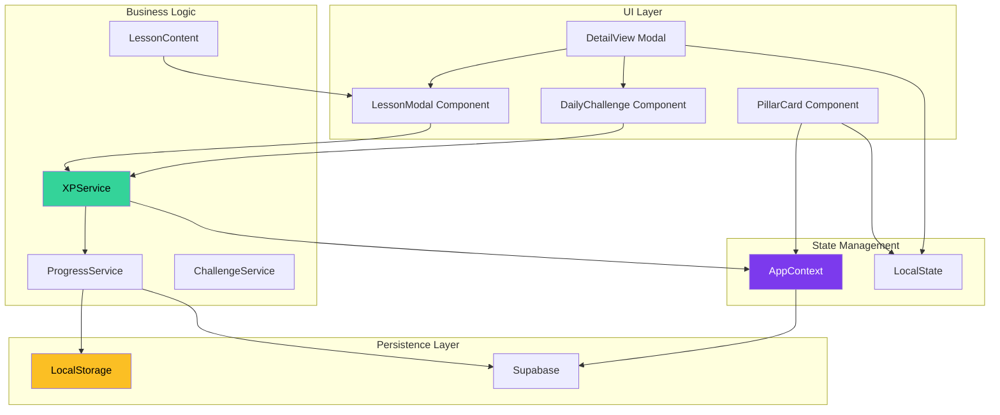
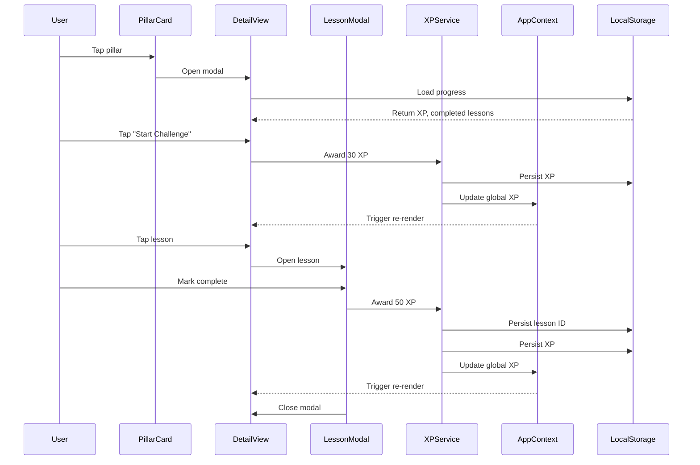

# Design Document: Premium Pillars Experience

## Overview

The Premium Pillars Experience transforms the Growthovo Pillars screen from a basic grid display into a fully interactive, gamified learning platform. This feature implements a comprehensive XP-based progression system with level badges, daily challenges, lesson content, and persistent progress tracking across 6 life pillars: Mental Health, Relationships, Career, Fitness, Finance, and Hobbies.

### Core Design Principles

1. **Progressive Enhancement**: Build on existing PillarsScreen infrastructure without breaking changes
2. **Zero Dependencies**: Use only React Native built-in APIs and existing packages
3. **Optimistic UI**: Immediate visual feedback with background persistence
4. **Offline-First**: LocalStorage as primary data store with AppContext sync
5. **Performance**: Memoization, lazy loading, and efficient re-renders
6. **Accessibility**: WCAG 2.1 AA compliant with screen reader support

### Key Features

- **Enhanced Pillar Cards**: Level badges, XP progress bars, colored accents
- **XP System**: 500 XP per level with automatic level calculation
- **Daily Challenges**: Pillar-specific tasks awarding 30 XP
- **Lesson Content**: 24 lessons (4 per pillar) with real educational content
- **Lesson Modal**: Bottom sheet with completion tracking (+50 XP)
- **Global Sync**: XP updates propagate to AppContext and Home screen
- **Persistence**: LocalStorage for completed lessons, XP, and challenge state

## Architecture

### System Architecture



### Component Hierarchy

```
PillarsScreen
├── Header
├── PillarGrid
│   └── PillarCard (x6)
│       ├── LevelBadge
│       ├── ProgressBar
│       ├── XPText
│       └── AccentBorder
└── DetailViewModal
    ├── DetailHeader
    │   ├── BackButton
    │   ├── PillarEmoji
    │   ├── LevelDisplay
    │   └── ProgressBar
    ├── StatsRow
    │   ├── StreakCard
    │   ├── CompletionCard
    │   └── TimeCard
    ├── DailyChallengeCard
    │   ├── ChallengeText
    │   ├── XPBadge
    │   └── ActionButton
    └── LessonsList
        └── LessonCard (x4)
            ├── NumberCircle
            ├── LessonInfo
            └── StatusIndicator
```

### Data Flow Diagram



## Components and Interfaces

### 1. PillarCard Component

**Purpose**: Display pillar with level, XP progress, and visual enhancements

**Interface**:
```typescript
interface PillarCardProps {
  pillar: PillarData;
  xp: number;
  level: number;
  completedLessons: number;
  totalLessons: number;
  onPress: (pillar: PillarData) => void;
}

interface PillarData {
  id: string;
  key: string;
  emoji: string;
  name: string;
  accentColor: string;
}
```

**Visual Specifications**:
- Level badge: 12px font, #7C3AED background, "Lvl {level}" text
- Progress bar: 4px height, #34D399 fill, rgba(255,255,255,0.1) background
- XP text: 11px font, rgba(255,255,255,0.5) color, "{current} / 500 XP"
- Accent border: 3px width, left side, pillar-specific color
- Hover effect: translateY(-2px), border opacity 0.3, 200ms ease

**Accent Colors**:
- Mental Health: #A78BFA
- Relationships: #F472B6
- Career: #60A5FA
- Fitness: #34D399
- Finance: #FBBF24
- Hobbies: #F87171

### 2. DetailView Modal

**Purpose**: Full-screen pillar detail with header, stats, challenges, and lessons

**Interface**:
```typescript
interface DetailViewProps {
  pillar: PillarData;
  xp: number;
  level: number;
  streak: number;
  completedLessons: string[];
  onClose: () => void;
  onLessonPress: (lesson: Lesson) => void;
  onChallengeComplete: () => void;
}
```

**Layout Structure**:
1. Header (fixed)
   - Back button: "← Pillars"
   - Pillar emoji: 48px
   - Pillar name + level: 24px bold
   - Progress bar: 8px height, full width
   - XP text: "{current} / 500 XP to Level {next}"

2. Stats Row (horizontal)
   - Streak: "🔥 {count} Day Streak"
   - Completion: "✅ {count} Done"
   - Time: "⏱ ~{minutes} min left today"

3. Daily Challenge Card
   - Title: "Daily Challenge" (16px bold)
   - Description: Pillar-specific text
   - XP badge: "+30 XP" (teal background)
   - Button: "Start Challenge →" or "✓ Completed"

4. Lessons List (scrollable)
   - Section header: "Lessons" + count
   - 4 lesson cards per pillar

### 3. LessonModal Component

**Purpose**: Bottom sheet displaying lesson content with completion tracking

**Interface**:
```typescript
interface LessonModalProps {
  lesson: Lesson;
  pillarColor: string;
  onComplete: () => void;
  onClose: () => void;
}

interface Lesson {
  id: string;
  pillarKey: string;
  number: number;
  title: string;
  duration: string;
  difficulty: string;
  content: LessonContent;
}

interface LessonContent {
  paragraphs: string[];
  keyTakeaway: string;
}
```

**Layout Structure**:
- Handle bar: 40px width, 4px height, gray pill
- Title: 20px bold
- Duration badge: "5 min read"
- Content: 3-4 paragraphs (150-250 words)
- Key takeaway box: Dark background (#1A1A2E), "💡 Key Takeaway" label
- Complete button: Full width, purple (#7C3AED), "Mark as Complete → +50 XP"

### 4. DailyChallengeCard Component

**Purpose**: Display and track daily challenge completion

**Interface**:
```typescript
interface DailyChallengeProps {
  pillarKey: string;
  isCompleted: boolean;
  onComplete: () => void;
}
```

**Challenge Text by Pillar**:
- Mental Health: "Practice 5 minutes of mindful breathing today"
- Relationships: "Send a meaningful message to someone you care about"
- Career: "Spend 30 minutes on focused, deep work without distractions"
- Fitness: "Complete a 10-minute workout or walk"
- Finance: "Review your spending from the past 24 hours"
- Hobbies: "Dedicate 15 minutes to a creative activity you enjoy"

**Visual States**:
- Not completed: Purple button "Start Challenge →"
- Completed: Green text "✓ Completed"
- Border: 2px teal (#34D399)

## Data Models

### PillarProgress Model

```typescript
interface PillarProgress {
  pillarKey: string;
  xp: number;
  level: number;
  completedLessons: string[];
  streak: number;
  lastActivityDate: string;
  challengeCompletedToday: boolean;
  challengeCompletionDate: string | null;
}
```

**Storage Key**: `growthovo_pillar_progress_{pillarKey}`

**Invariants**:
- `xp >= 0`
- `level = floor(xp / 500) + 1`
- `1 <= level <= 10`
- `completedLessons.length <= 4`
- `streak >= 0`
- `challengeCompletedToday` resets daily

### GlobalProgress Model

```typescript
interface GlobalProgress {
  totalXP: number;
  totalLevel: number;
  currentStreak: number;
  lastCheckInDate: string;
}
```

**Storage Key**: `growthovo_xp`

**Invariants**:
- `totalXP >= 0`
- `totalLevel = floor(totalXP / 100) + 1` (AppContext formula)
- `currentStreak >= 0`

### LessonData Model

```typescript
interface LessonData {
  id: string;
  pillarKey: string;
  number: number;
  title: string;
  duration: string;
  difficulty: string;
  content: {
    paragraphs: string[];
    keyTakeaway: string;
  };
}
```

**Storage**: In-memory constant (LESSON_CONTENT)

### CompletedLessons Model

```typescript
interface CompletedLessons {
  lessonIds: string[];
  lastUpdated: string;
}
```

**Storage Key**: `growthovo_completed_lessons`

**Invariants**:
- `lessonIds` contains unique lesson IDs
- `lessonIds.length <= 24` (max 4 lessons × 6 pillars)

## Algorithmic Pseudocode

### XP Calculation Algorithm

```
FUNCTION calculateLevel(xp: number) -> number
  PRECONDITION: xp >= 0
  
  level = floor(xp / 500) + 1
  
  POSTCONDITION: level >= 1
  POSTCONDITION: level <= 10 (assuming max 5000 XP)
  RETURN level
END FUNCTION

FUNCTION calculateProgress(xp: number) -> number
  PRECONDITION: xp >= 0
  
  currentLevelXP = xp mod 500
  progress = (currentLevelXP / 500) * 100
  
  POSTCONDITION: 0 <= progress < 100
  RETURN progress
END FUNCTION

FUNCTION getXPToNextLevel(xp: number) -> number
  PRECONDITION: xp >= 0
  
  currentLevelXP = xp mod 500
  remaining = 500 - currentLevelXP
  
  POSTCONDITION: 1 <= remaining <= 500
  RETURN remaining
END FUNCTION
```

**Loop Invariants**:
- For any XP value `x` where `0 <= x < 5000`:
  - `calculateLevel(x) = floor(x / 500) + 1`
  - `calculateProgress(x) = ((x mod 500) / 500) * 100`
  - `getXPToNextLevel(x) = 500 - (x mod 500)`

### Progress Tracking Algorithm

```
FUNCTION awardXP(pillarKey: string, amount: number) -> void
  PRECONDITION: amount > 0
  PRECONDITION: pillarKey in VALID_PILLARS
  
  // Load current progress
  progress = loadPillarProgress(pillarKey)
  oldXP = progress.xp
  oldLevel = progress.level
  
  // Update XP
  progress.xp = progress.xp + amount
  progress.level = calculateLevel(progress.xp)
  
  // Persist locally
  savePillarProgress(pillarKey, progress)
  
  // Sync to AppContext
  globalXP = loadGlobalXP()
  globalXP = globalXP + amount
  saveGlobalXP(globalXP)
  updateAppContext(globalXP)
  
  // Check for level up
  IF progress.level > oldLevel THEN
    triggerLevelUpAnimation()
  END IF
  
  POSTCONDITION: progress.xp = oldXP + amount
  POSTCONDITION: progress.level >= oldLevel
  INVARIANT: progress.level = calculateLevel(progress.xp)
END FUNCTION

FUNCTION completeLesson(pillarKey: string, lessonId: string) -> void
  PRECONDITION: lessonId not in completedLessons
  PRECONDITION: pillarKey in VALID_PILLARS
  
  // Mark lesson complete
  completedLessons = loadCompletedLessons()
  completedLessons.push(lessonId)
  saveCompletedLessons(completedLessons)
  
  // Award XP
  awardXP(pillarKey, 50)
  
  // Update last activity
  progress = loadPillarProgress(pillarKey)
  progress.lastActivityDate = getCurrentDate()
  savePillarProgress(pillarKey, progress)
  
  POSTCONDITION: lessonId in completedLessons
  POSTCONDITION: progress.xp increased by 50
END FUNCTION

FUNCTION completeDailyChallenge(pillarKey: string) -> void
  PRECONDITION: pillarKey in VALID_PILLARS
  PRECONDITION: NOT isChallengeCompletedToday(pillarKey)
  
  // Mark challenge complete
  progress = loadPillarProgress(pillarKey)
  progress.challengeCompletedToday = true
  progress.challengeCompletionDate = getCurrentDate()
  savePillarProgress(pillarKey, progress)
  
  // Award XP
  awardXP(pillarKey, 30)
  
  POSTCONDITION: progress.challengeCompletedToday = true
  POSTCONDITION: progress.xp increased by 30
END FUNCTION
```

### Persistence Algorithm

```
FUNCTION savePillarProgress(pillarKey: string, progress: PillarProgress) -> void
  PRECONDITION: pillarKey in VALID_PILLARS
  PRECONDITION: progress.xp >= 0
  PRECONDITION: progress.level >= 1
  
  key = "growthovo_pillar_progress_" + pillarKey
  data = JSON.stringify(progress)
  
  TRY
    localStorage.setItem(key, data)
  CATCH error
    console.error("Failed to save progress:", error)
    // Fallback: keep in-memory state
  END TRY
  
  POSTCONDITION: localStorage contains progress for pillarKey
END FUNCTION

FUNCTION loadPillarProgress(pillarKey: string) -> PillarProgress
  PRECONDITION: pillarKey in VALID_PILLARS
  
  key = "growthovo_pillar_progress_" + pillarKey
  
  TRY
    data = localStorage.getItem(key)
    IF data is null THEN
      RETURN createDefaultProgress(pillarKey)
    END IF
    progress = JSON.parse(data)
    RETURN progress
  CATCH error
    console.error("Failed to load progress:", error)
    RETURN createDefaultProgress(pillarKey)
  END TRY
  
  POSTCONDITION: RETURN value is valid PillarProgress
END FUNCTION

FUNCTION createDefaultProgress(pillarKey: string) -> PillarProgress
  RETURN {
    pillarKey: pillarKey,
    xp: 0,
    level: 1,
    completedLessons: [],
    streak: 0,
    lastActivityDate: "",
    challengeCompletedToday: false,
    challengeCompletionDate: null
  }
END FUNCTION
```

### Daily Reset Algorithm

```
FUNCTION checkDailyReset(pillarKey: string) -> void
  PRECONDITION: pillarKey in VALID_PILLARS
  
  progress = loadPillarProgress(pillarKey)
  today = getCurrentDate()
  lastDate = progress.challengeCompletionDate
  
  IF lastDate is not null AND lastDate != today THEN
    // Reset challenge completion
    progress.challengeCompletedToday = false
    progress.challengeCompletionDate = null
    savePillarProgress(pillarKey, progress)
  END IF
  
  POSTCONDITION: IF date changed THEN challengeCompletedToday = false
END FUNCTION

FUNCTION getCurrentDate() -> string
  date = new Date()
  RETURN date.toISOString().split('T')[0]  // YYYY-MM-DD format
END FUNCTION
```

## Key Functions with Formal Specifications

### Function 1: `awardXP`

**Signature**: `awardXP(pillarKey: string, amount: number): Promise<void>`

**Purpose**: Award XP to a pillar and sync with global state

**Preconditions**:
- `amount > 0`
- `pillarKey ∈ {mental-health, relationships, career, fitness, finance, hobbies}`
- LocalStorage is accessible

**Postconditions**:
- `pillarProgress.xp_new = pillarProgress.xp_old + amount`
- `pillarProgress.level = floor(pillarProgress.xp_new / 500) + 1`
- `globalXP_new = globalXP_old + amount`
- AppContext.xp is updated
- LocalStorage contains updated progress

**Invariants**:
- `pillarProgress.xp >= 0`
- `pillarProgress.level >= 1`
- `pillarProgress.level = floor(pillarProgress.xp / 500) + 1`

**Algorithm**:
```typescript
async function awardXP(pillarKey: string, amount: number): Promise<void> {
  // Load current progress
  const progress = loadPillarProgress(pillarKey);
  const oldXP = progress.xp;
  const oldLevel = progress.level;
  
  // Update XP
  progress.xp += amount;
  progress.level = Math.floor(progress.xp / 500) + 1;
  
  // Persist locally
  savePillarProgress(pillarKey, progress);
  
  // Sync to global
  const globalXP = loadGlobalXP();
  const newGlobalXP = globalXP + amount;
  saveGlobalXP(newGlobalXP);
  
  // Update AppContext
  await updateAppContext(newGlobalXP);
  
  // Check level up
  if (progress.level > oldLevel) {
    triggerLevelUpAnimation();
  }
}
```

### Function 2: `completeLesson`

**Signature**: `completeLesson(pillarKey: string, lessonId: string): Promise<void>`

**Purpose**: Mark a lesson as complete and award 50 XP

**Preconditions**:
- `lessonId ∉ completedLessons`
- `pillarKey ∈ VALID_PILLARS`
- Lesson exists in LESSON_CONTENT

**Postconditions**:
- `lessonId ∈ completedLessons`
- `pillarProgress.xp_new = pillarProgress.xp_old + 50`
- `pillarProgress.completedLessons` contains `lessonId`
- LocalStorage updated

**Invariants**:
- `completedLessons` contains unique IDs
- `completedLessons.length <= 24`

**Algorithm**:
```typescript
async function completeLesson(pillarKey: string, lessonId: string): Promise<void> {
  // Check if already completed
  const completedLessons = loadCompletedLessons();
  if (completedLessons.includes(lessonId)) {
    throw new Error('Lesson already completed');
  }
  
  // Mark complete
  completedLessons.push(lessonId);
  saveCompletedLessons(completedLessons);
  
  // Update pillar progress
  const progress = loadPillarProgress(pillarKey);
  progress.completedLessons.push(lessonId);
  progress.lastActivityDate = getCurrentDate();
  savePillarProgress(pillarKey, progress);
  
  // Award XP
  await awardXP(pillarKey, 50);
}
```

### Function 3: `completeDailyChallenge`

**Signature**: `completeDailyChallenge(pillarKey: string): Promise<void>`

**Purpose**: Complete daily challenge and award 30 XP

**Preconditions**:
- `pillarKey ∈ VALID_PILLARS`
- `!isChallengeCompletedToday(pillarKey)`

**Postconditions**:
- `pillarProgress.challengeCompletedToday = true`
- `pillarProgress.challengeCompletionDate = getCurrentDate()`
- `pillarProgress.xp_new = pillarProgress.xp_old + 30`

**Invariants**:
- Challenge can only be completed once per day
- Challenge resets at midnight

**Algorithm**:
```typescript
async function completeDailyChallenge(pillarKey: string): Promise<void> {
  // Check if already completed today
  const progress = loadPillarProgress(pillarKey);
  if (progress.challengeCompletedToday) {
    throw new Error('Challenge already completed today');
  }
  
  // Mark complete
  progress.challengeCompletedToday = true;
  progress.challengeCompletionDate = getCurrentDate();
  savePillarProgress(pillarKey, progress);
  
  // Award XP
  await awardXP(pillarKey, 30);
}
```

### Function 4: `syncWithAppContext`

**Signature**: `syncWithAppContext(xpAmount: number): Promise<void>`

**Purpose**: Sync local XP changes to AppContext for global state

**Preconditions**:
- AppContext is initialized
- `xpAmount` is the delta to add

**Postconditions**:
- `AppContext.xp_new = AppContext.xp_old + xpAmount`
- Home screen stats reflect new XP
- Supabase updated (via AppContext)

**Invariants**:
- AppContext.xp always matches sum of all pillar XP
- Level calculation consistent across app

**Algorithm**:
```typescript
async function syncWithAppContext(xpAmount: number): Promise<void> {
  const { updateXP } = useAppContext();
  
  try {
    await updateXP(xpAmount);
  } catch (error) {
    console.error('Failed to sync with AppContext:', error);
    // Keep local state, retry later
  }
}
```

## Example Usage Patterns

### Pattern 1: Opening a Pillar Detail View

```typescript
// User taps on Mental Health pillar card
function handlePillarPress(pillar: PillarData) {
  // Load progress from localStorage
  const progress = loadPillarProgress(pillar.key);
  
  // Check for daily reset
  checkDailyReset(pillar.key);
  
  // Open detail view with loaded data
  setSelectedPillar({
    ...pillar,
    xp: progress.xp,
    level: progress.level,
    completedLessons: progress.completedLessons,
    challengeCompleted: progress.challengeCompletedToday,
  });
}
```

### Pattern 2: Completing a Lesson

```typescript
// User taps "Mark as Complete" in lesson modal
async function handleLessonComplete(lessonId: string, pillarKey: string) {
  try {
    // Complete lesson (awards 50 XP)
    await completeLesson(pillarKey, lessonId);
    
    // Close modal
    setSelectedLesson(null);
    
    // Reload detail view to show updated progress
    const progress = loadPillarProgress(pillarKey);
    updateDetailView(progress);
    
    // Show success feedback
    showToast('Lesson complete! +50 XP');
  } catch (error) {
    showToast('Failed to complete lesson. Please try again.');
  }
}
```

### Pattern 3: Completing Daily Challenge

```typescript
// User taps "Start Challenge" button
async function handleChallengeStart(pillarKey: string) {
  try {
    // Complete challenge (awards 30 XP)
    await completeDailyChallenge(pillarKey);
    
    // Update UI to show completed state
    setChallengeCompleted(true);
    
    // Show success feedback
    showToast('Challenge complete! +30 XP');
  } catch (error) {
    showToast('Failed to complete challenge. Please try again.');
  }
}
```

### Pattern 4: Level Up Animation

```typescript
// Triggered when level increases
function triggerLevelUpAnimation(oldLevel: number, newLevel: number) {
  // Animate progress bar to 100%
  Animated.timing(progressAnim, {
    toValue: 100,
    duration: 500,
    useNativeDriver: false,
  }).start(() => {
    // Reset to 0% for new level
    progressAnim.setValue(0);
    
    // Show level up badge
    Animated.sequence([
      Animated.spring(levelBadgeScale, {
        toValue: 1.2,
        useNativeDriver: true,
      }),
      Animated.spring(levelBadgeScale, {
        toValue: 1,
        useNativeDriver: true,
      }),
    ]).start();
    
    // Show celebration message
    showToast(`🎉 Level ${newLevel} reached!`);
  });
}
```

## Correctness Properties

*A property is a characteristic or behavior that should hold true across all valid executions of a system—essentially, a formal statement about what the system should do. Properties serve as the bridge between human-readable specifications and machine-verifiable correctness guarantees.*


### Property Reflection

After analyzing all acceptance criteria, I identified the following redundancies:

**Redundancy 1**: Properties 16.1, 16.4, and 16.5 all test level calculation
- 16.1 tests that 500 XP is required for level 2
- 16.4 tests that reaching 500 XP increments level
- 16.5 tests that XP resets after level up
- **Resolution**: Combine into single property "Level calculation from XP"

**Redundancy 2**: Properties 1.1, 1.2, 1.3, 1.5 all test pillar card rendering
- All test different visual aspects of the same component
- **Resolution**: Combine into single property "Pillar card displays all required elements"

**Redundancy 3**: Properties 18.1, 18.2, 18.4, 18.5 all test localStorage persistence
- 18.1 and 18.4 test lesson persistence (write and read)
- 18.2 and 18.5 test XP persistence (write and read)
- **Resolution**: Combine into two properties: "Lesson completion persistence round-trip" and "XP persistence round-trip"

**Redundancy 4**: Properties 15.2 and 15.4 both test XP award for lesson completion
- 15.2 tests XP increases by 50
- 15.4 tests progress bar updates
- **Resolution**: Keep 15.2 as primary property, 15.4 is UI consequence

**Redundancy 5**: Properties 1.6-1.11 all test pillar-to-color mapping
- All test the same lookup table
- **Resolution**: Combine into single property "Pillar accent color mapping"

After reflection, the unique properties are:
1. Level calculation from XP (combines 16.1, 16.4, 16.5)
2. Progress percentage calculation (16.2)
3. Pillar accent color mapping (combines 1.6-1.11)
4. Lesson completion awards 50 XP (15.2)
5. Challenge completion awards 30 XP (5.8)
6. Lesson completion persistence round-trip (combines 18.1, 18.4)
7. XP persistence round-trip (combines 18.2, 18.5)
8. AppContext synchronization (17.1)
9. Lesson content word count (19.1)
10. Key takeaway word count (19.5)

### Property 1: Level Calculation from XP

*For any* XP value `x` where `0 <= x < 5000`, the level SHALL be calculated as `floor(x / 500) + 1`, and when XP crosses a 500-boundary, the level SHALL increment by exactly 1.

**Validates: Requirements 16.1, 16.4, 16.5**

### Property 2: Progress Percentage Calculation

*For any* XP value `x` where `0 <= x < 5000`, the progress percentage within the current level SHALL be calculated as `((x mod 500) / 500) * 100`, resulting in a value between 0 (inclusive) and 100 (exclusive).

**Validates: Requirements 16.2, 16.3**

### Property 3: Pillar Accent Color Mapping

*For any* pillar in the system, the accent color SHALL match the specification: Mental Health → #A78BFA, Relationships → #F472B6, Career → #60A5FA, Fitness → #34D399, Finance → #FBBF24, Hobbies → #F87171.

**Validates: Requirements 1.6, 1.7, 1.8, 1.9, 1.10, 1.11**

### Property 4: Lesson Completion XP Award

*For any* lesson completion event, the system SHALL award exactly 50 XP to the user, and the user's total XP SHALL increase by exactly 50.

**Validates: Requirements 15.2**

### Property 5: Challenge Completion XP Award

*For any* daily challenge completion event, the system SHALL award exactly 30 XP to the user, and the user's total XP SHALL increase by exactly 30.

**Validates: Requirements 5.8**

### Property 6: Lesson Completion Persistence Round-Trip

*For any* lesson that is marked complete, the lesson ID SHALL be persisted to localStorage under key 'growthovo_completed_lessons', and when the screen reloads, the lesson ID SHALL be retrieved and the lesson SHALL display as completed.

**Validates: Requirements 18.1, 18.4**

### Property 7: XP Persistence Round-Trip

*For any* XP value that is awarded, the new XP total SHALL be persisted to localStorage under key 'growthovo_xp', and when the screen reloads, the XP value SHALL be retrieved and displayed correctly.

**Validates: Requirements 18.2, 18.5**

### Property 8: AppContext Synchronization

*For any* XP award in the Pillars screen, the XP value SHALL be propagated to AppContext, and AppContext.xp SHALL reflect the new total XP value.

**Validates: Requirements 17.1**

### Property 9: Lesson Content Word Count

*For any* lesson in the system, the content paragraphs SHALL contain between 150 and 250 words total.

**Validates: Requirements 19.1**

### Property 10: Key Takeaway Word Count

*For any* lesson in the system, the key takeaway SHALL be a single sentence containing fewer than 20 words.

**Validates: Requirements 19.5**

## Error Handling

### Error Categories

1. **Persistence Errors**
   - LocalStorage quota exceeded
   - LocalStorage access denied (private browsing)
   - JSON parse errors from corrupted data

2. **State Synchronization Errors**
   - AppContext update failures
   - Supabase sync failures (via AppContext)
   - Network timeouts

3. **User Input Errors**
   - Attempting to complete already-completed lesson
   - Attempting to complete already-completed challenge
   - Invalid pillar key

4. **Data Integrity Errors**
   - Negative XP values
   - Invalid level calculations
   - Missing lesson content

### Error Handling Strategies

#### Strategy 1: Graceful Degradation for Persistence

```typescript
function savePillarProgress(pillarKey: string, progress: PillarProgress): void {
  try {
    const key = `growthovo_pillar_progress_${pillarKey}`;
    const data = JSON.stringify(progress);
    localStorage.setItem(key, data);
  } catch (error) {
    if (error.name === 'QuotaExceededError') {
      // Clear old data and retry
      clearOldProgressData();
      try {
        localStorage.setItem(key, data);
      } catch (retryError) {
        // Fall back to in-memory only
        console.error('Failed to persist progress:', retryError);
        showToast('Progress saved in memory only. Clear browser data to free space.');
      }
    } else {
      // Log error but continue with in-memory state
      console.error('Failed to save progress:', error);
      showToast('Progress saved temporarily. Changes may not persist.');
    }
  }
}
```

#### Strategy 2: Optimistic Updates with Rollback

```typescript
async function awardXP(pillarKey: string, amount: number): Promise<void> {
  const progress = loadPillarProgress(pillarKey);
  const oldXP = progress.xp;
  const oldLevel = progress.level;
  
  // Optimistic update
  progress.xp += amount;
  progress.level = calculateLevel(progress.xp);
  savePillarProgress(pillarKey, progress);
  
  try {
    // Sync to AppContext
    await syncWithAppContext(amount);
  } catch (error) {
    // Rollback on failure
    progress.xp = oldXP;
    progress.level = oldLevel;
    savePillarProgress(pillarKey, progress);
    
    showToast('Failed to sync progress. Please check your connection.');
    throw error;
  }
}
```

#### Strategy 3: Idempotent Operations

```typescript
async function completeLesson(pillarKey: string, lessonId: string): Promise<void> {
  const completedLessons = loadCompletedLessons();
  
  // Check if already completed (idempotent)
  if (completedLessons.includes(lessonId)) {
    console.log('Lesson already completed, skipping');
    return; // No error, just return
  }
  
  // Proceed with completion
  completedLessons.push(lessonId);
  saveCompletedLessons(completedLessons);
  await awardXP(pillarKey, 50);
}
```

#### Strategy 4: Data Validation and Sanitization

```typescript
function loadPillarProgress(pillarKey: string): PillarProgress {
  try {
    const key = `growthovo_pillar_progress_${pillarKey}`;
    const data = localStorage.getItem(key);
    
    if (!data) {
      return createDefaultProgress(pillarKey);
    }
    
    const progress = JSON.parse(data);
    
    // Validate and sanitize
    if (typeof progress.xp !== 'number' || progress.xp < 0) {
      console.warn('Invalid XP value, resetting to 0');
      progress.xp = 0;
    }
    
    if (typeof progress.level !== 'number' || progress.level < 1) {
      console.warn('Invalid level, recalculating from XP');
      progress.level = calculateLevel(progress.xp);
    }
    
    // Ensure level matches XP
    const expectedLevel = calculateLevel(progress.xp);
    if (progress.level !== expectedLevel) {
      console.warn('Level mismatch, correcting');
      progress.level = expectedLevel;
    }
    
    return progress;
  } catch (error) {
    console.error('Failed to load progress:', error);
    return createDefaultProgress(pillarKey);
  }
}
```

#### Strategy 5: User-Friendly Error Messages

```typescript
const ERROR_MESSAGES = {
  PERSISTENCE_FAILED: 'Unable to save your progress. Please free up browser storage space.',
  SYNC_FAILED: 'Progress saved locally but not synced. Will retry when connection is restored.',
  ALREADY_COMPLETED: 'You\'ve already completed this item today!',
  INVALID_DATA: 'Progress data corrupted. Resetting to last known good state.',
  NETWORK_ERROR: 'Connection lost. Your progress is saved and will sync automatically.',
};

function handleError(error: Error, context: string): void {
  console.error(`[${context}]`, error);
  
  let message = ERROR_MESSAGES.NETWORK_ERROR;
  
  if (error.name === 'QuotaExceededError') {
    message = ERROR_MESSAGES.PERSISTENCE_FAILED;
  } else if (error.message.includes('already completed')) {
    message = ERROR_MESSAGES.ALREADY_COMPLETED;
  } else if (error.message.includes('corrupted')) {
    message = ERROR_MESSAGES.INVALID_DATA;
  }
  
  showToast(message);
}
```

### Error Recovery Mechanisms

1. **Automatic Retry Queue**: Failed AppContext syncs are queued and retried after 5 seconds
2. **Data Reconciliation**: On app foreground, compare localStorage with AppContext and reconcile differences
3. **Fallback to Defaults**: If data is corrupted, fall back to default values rather than crashing
4. **Progressive Enhancement**: Core functionality works even if persistence fails

## Testing Strategy

### Dual Testing Approach

This feature requires both **unit tests** for specific examples and **property-based tests** for universal properties. Property-based testing is appropriate here because:

- The XP system has clear mathematical properties (level calculation, progress percentage)
- Persistence operations have round-trip properties (save then load should return same data)
- UI rendering has universal properties (all pillars should display required elements)
- The input space is large (XP values 0-5000, 6 pillars, 24 lessons)

### Unit Testing Strategy

**Focus Areas**:
- Specific UI interactions (button taps, modal open/close)
- Edge cases (XP = 0, XP = 500, XP = 4999)
- Error conditions (localStorage full, network failure)
- Integration points (AppContext sync, Supabase updates)

**Example Unit Tests**:
```typescript
describe('PillarCard', () => {
  it('should display level badge with correct format', () => {
    const { getByText } = render(<PillarCard level={3} />);
    expect(getByText('Lvl 3')).toBeTruthy();
  });
  
  it('should display XP progress text', () => {
    const { getByText } = render(<PillarCard xp={250} />);
    expect(getByText('250 / 500 XP')).toBeTruthy();
  });
  
  it('should handle lesson completion', async () => {
    const { getByText } = render(<LessonModal lesson={mockLesson} />);
    fireEvent.press(getByText('Mark as Complete'));
    await waitFor(() => {
      expect(mockAwardXP).toHaveBeenCalledWith(50);
    });
  });
});
```

### Property-Based Testing Strategy

**Library**: `fast-check` (already in package.json)

**Configuration**: Minimum 100 iterations per property test

**Property Test Examples**:

```typescript
import fc from 'fast-check';

describe('XP System Properties', () => {
  it('Property 1: Level calculation from XP', () => {
    fc.assert(
      fc.property(
        fc.integer({ min: 0, max: 4999 }),
        (xp) => {
          const level = calculateLevel(xp);
          const expectedLevel = Math.floor(xp / 500) + 1;
          
          expect(level).toBe(expectedLevel);
          expect(level).toBeGreaterThanOrEqual(1);
          expect(level).toBeLessThanOrEqual(10);
        }
      ),
      { numRuns: 100 }
    );
  });
  
  it('Property 2: Progress percentage calculation', () => {
    fc.assert(
      fc.property(
        fc.integer({ min: 0, max: 4999 }),
        (xp) => {
          const progress = calculateProgress(xp);
          const expected = ((xp % 500) / 500) * 100;
          
          expect(progress).toBeCloseTo(expected, 2);
          expect(progress).toBeGreaterThanOrEqual(0);
          expect(progress).toBeLessThan(100);
        }
      ),
      { numRuns: 100 }
    );
  });
  
  it('Property 4: Lesson completion awards 50 XP', () => {
    fc.assert(
      fc.property(
        fc.constantFrom('mental-health', 'relationships', 'career', 'fitness', 'finance', 'hobbies'),
        fc.integer({ min: 1, max: 4 }),
        async (pillarKey, lessonNumber) => {
          const lessonId = `${pillarKey}-lesson-${lessonNumber}`;
          const initialXP = loadGlobalXP();
          
          await completeLesson(pillarKey, lessonId);
          
          const finalXP = loadGlobalXP();
          expect(finalXP).toBe(initialXP + 50);
        }
      ),
      { numRuns: 100 }
    );
  });
  
  it('Property 6: Lesson completion persistence round-trip', () => {
    fc.assert(
      fc.property(
        fc.constantFrom('mental-health', 'relationships', 'career', 'fitness', 'finance', 'hobbies'),
        fc.integer({ min: 1, max: 4 }),
        (pillarKey, lessonNumber) => {
          const lessonId = `${pillarKey}-lesson-${lessonNumber}`;
          
          // Complete lesson
          const completedLessons = loadCompletedLessons();
          completedLessons.push(lessonId);
          saveCompletedLessons(completedLessons);
          
          // Reload
          const reloadedLessons = loadCompletedLessons();
          
          expect(reloadedLessons).toContain(lessonId);
        }
      ),
      { numRuns: 100 }
    );
  });
  
  it('Property 7: XP persistence round-trip', () => {
    fc.assert(
      fc.property(
        fc.integer({ min: 0, max: 4999 }),
        (xp) => {
          // Save XP
          saveGlobalXP(xp);
          
          // Reload
          const reloadedXP = loadGlobalXP();
          
          expect(reloadedXP).toBe(xp);
        }
      ),
      { numRuns: 100 }
    );
  });
});
```

**Test Tags**: Each property test includes a comment referencing the design property:

```typescript
// Feature: premium-pillars-experience, Property 1: Level calculation from XP
it('Property 1: Level calculation from XP', () => { ... });

// Feature: premium-pillars-experience, Property 2: Progress percentage calculation
it('Property 2: Progress percentage calculation', () => { ... });
```

### Integration Testing

**Focus Areas**:
- AppContext synchronization with Pillars screen
- Home screen stat updates after XP awards
- Modal navigation flows
- LocalStorage persistence across app restarts

**Example Integration Test**:
```typescript
describe('Pillars to Home Integration', () => {
  it('should propagate XP from Pillars to Home screen', async () => {
    const { getByText } = render(
      <AppProvider userId={mockUserId}>
        <NavigationContainer>
          <Stack.Navigator>
            <Stack.Screen name="Home" component={SimpleHomeScreen} />
            <Stack.Screen name="Pillars" component={PillarsScreen} />
          </Stack.Navigator>
        </NavigationContainer>
      </AppProvider>
    );
    
    // Navigate to Pillars
    fireEvent.press(getByText('Pillars'));
    
    // Complete a lesson
    fireEvent.press(getByText('Mental Health'));
    fireEvent.press(getByText('Understanding Your Anxiety'));
    fireEvent.press(getByText('Mark as Complete'));
    
    // Navigate back to Home
    fireEvent.press(getByText('Home'));
    
    // Verify XP updated
    await waitFor(() => {
      expect(getByText(/50 XP/)).toBeTruthy();
    });
  });
});
```

### Test Coverage Goals

- **Unit Tests**: 80% code coverage
- **Property Tests**: 100% coverage of correctness properties
- **Integration Tests**: All critical user flows
- **E2E Tests**: Happy path for each pillar

## Performance Considerations

### Optimization Strategies

#### 1. Component Memoization

```typescript
// Memoize PillarCard to prevent unnecessary re-renders
const PillarCard = memo(({ pillar, xp, level, onPress }: PillarCardProps) => {
  // Component implementation
}, (prevProps, nextProps) => {
  // Custom comparison: only re-render if xp or level changed
  return prevProps.xp === nextProps.xp && 
         prevProps.level === nextProps.level &&
         prevProps.pillar.id === nextProps.pillar.id;
});
```

#### 2. Lazy Loading of Lesson Content

```typescript
// Load lesson content only when modal opens
const LessonModal = ({ lessonId, onClose }: LessonModalProps) => {
  const [content, setContent] = useState<LessonContent | null>(null);
  
  useEffect(() => {
    // Lazy load content
    const lessonContent = LESSON_CONTENT[lessonId];
    setContent(lessonContent);
  }, [lessonId]);
  
  if (!content) {
    return <LoadingSpinner />;
  }
  
  return <LessonView content={content} />;
};
```

#### 3. Debounced LocalStorage Writes

```typescript
// Debounce rapid XP updates to reduce localStorage writes
const debouncedSave = useMemo(
  () => debounce((key: string, value: any) => {
    localStorage.setItem(key, JSON.stringify(value));
  }, 500),
  []
);

function savePillarProgress(pillarKey: string, progress: PillarProgress): void {
  // Update in-memory state immediately
  progressCache[pillarKey] = progress;
  
  // Debounce localStorage write
  debouncedSave(`growthovo_pillar_progress_${pillarKey}`, progress);
}
```

#### 4. Animated Value Optimization

```typescript
// Use native driver for transform animations
Animated.timing(scaleAnim, {
  toValue: 0.95,
  duration: 100,
  useNativeDriver: true, // Offload to native thread
}).start();

// Avoid animating layout properties (width, height)
// Use transform: scale instead
```

#### 5. Virtualized Lesson Lists

```typescript
// For future expansion beyond 4 lessons per pillar
import { FlatList } from 'react-native';

<FlatList
  data={lessons}
  renderItem={({ item }) => <LessonCard lesson={item} />}
  keyExtractor={(item) => item.id}
  initialNumToRender={4}
  maxToRenderPerBatch={2}
  windowSize={5}
/>
```

### Performance Metrics

**Target Metrics**:
- Initial render: < 100ms
- Pillar card press to modal open: < 200ms
- Lesson completion to UI update: < 300ms
- LocalStorage read: < 10ms
- LocalStorage write: < 50ms
- AppContext sync: < 500ms

**Monitoring**:
```typescript
// Performance monitoring wrapper
function measurePerformance<T>(
  operation: string,
  fn: () => T
): T {
  const start = performance.now();
  const result = fn();
  const duration = performance.now() - start;
  
  if (duration > 100) {
    console.warn(`Slow operation: ${operation} took ${duration}ms`);
  }
  
  return result;
}

// Usage
const progress = measurePerformance('loadPillarProgress', () => 
  loadPillarProgress(pillarKey)
);
```

### Memory Management

1. **Clear unused data**: Remove old progress data after 90 days
2. **Limit cache size**: Keep max 6 pillar progress objects in memory
3. **Dispose animations**: Clean up Animated.Value instances on unmount
4. **Avoid memory leaks**: Clear timers and subscriptions in useEffect cleanup

## Security Considerations

### Data Security

#### 1. Input Validation

```typescript
function validatePillarKey(key: string): boolean {
  const VALID_PILLARS = [
    'mental-health',
    'relationships',
    'career',
    'fitness',
    'finance',
    'hobbies'
  ];
  return VALID_PILLARS.includes(key);
}

function validateXPAmount(amount: number): boolean {
  return typeof amount === 'number' && 
         amount > 0 && 
         amount <= 1000 && // Max XP per action
         Number.isInteger(amount);
}

function awardXP(pillarKey: string, amount: number): void {
  if (!validatePillarKey(pillarKey)) {
    throw new Error('Invalid pillar key');
  }
  
  if (!validateXPAmount(amount)) {
    throw new Error('Invalid XP amount');
  }
  
  // Proceed with XP award
}
```

#### 2. XSS Prevention

```typescript
// Sanitize lesson content before rendering
import { Text } from 'react-native';

// React Native Text component automatically escapes content
// No need for additional sanitization for static content

// For dynamic content (if added in future):
function sanitizeText(text: string): string {
  return text
    .replace(/</g, '&lt;')
    .replace(/>/g, '&gt;')
    .replace(/"/g, '&quot;')
    .replace(/'/g, '&#x27;');
}
```

#### 3. LocalStorage Security

```typescript
// Encrypt sensitive data before storing (if needed in future)
// For now, XP and lesson IDs are not sensitive

// Validate data integrity on load
function loadPillarProgress(pillarKey: string): PillarProgress {
  const data = localStorage.getItem(key);
  
  if (!data) {
    return createDefaultProgress(pillarKey);
  }
  
  try {
    const progress = JSON.parse(data);
    
    // Validate structure
    if (!isValidProgressStructure(progress)) {
      console.warn('Invalid progress structure, resetting');
      return createDefaultProgress(pillarKey);
    }
    
    return progress;
  } catch (error) {
    console.error('Failed to parse progress data:', error);
    return createDefaultProgress(pillarKey);
  }
}

function isValidProgressStructure(obj: any): boolean {
  return (
    typeof obj === 'object' &&
    typeof obj.xp === 'number' &&
    typeof obj.level === 'number' &&
    Array.isArray(obj.completedLessons) &&
    typeof obj.streak === 'number'
  );
}
```

### Rate Limiting

```typescript
// Prevent XP farming by rate limiting actions
const ACTION_COOLDOWN = 1000; // 1 second between actions
const lastActionTime: Record<string, number> = {};

function checkRateLimit(action: string): boolean {
  const now = Date.now();
  const lastTime = lastActionTime[action] || 0;
  
  if (now - lastTime < ACTION_COOLDOWN) {
    console.warn('Action rate limited:', action);
    return false;
  }
  
  lastActionTime[action] = now;
  return true;
}

async function completeLesson(pillarKey: string, lessonId: string): Promise<void> {
  if (!checkRateLimit(`complete-lesson-${lessonId}`)) {
    throw new Error('Please wait before completing another lesson');
  }
  
  // Proceed with completion
}
```

### Data Integrity

```typescript
// Prevent XP manipulation
function validateXPIntegrity(pillarKey: string): boolean {
  const progress = loadPillarProgress(pillarKey);
  const expectedLevel = calculateLevel(progress.xp);
  
  if (progress.level !== expectedLevel) {
    console.error('XP integrity violation detected');
    
    // Auto-correct
    progress.level = expectedLevel;
    savePillarProgress(pillarKey, progress);
    
    return false;
  }
  
  return true;
}

// Run integrity check on app foreground
useEffect(() => {
  const subscription = AppState.addEventListener('change', (nextState) => {
    if (nextState === 'active') {
      VALID_PILLARS.forEach(validateXPIntegrity);
    }
  });
  
  return () => subscription.remove();
}, []);
```

### Privacy Considerations

1. **No PII in LocalStorage**: Only store XP, levels, and lesson IDs
2. **User ID separation**: Each user's progress is isolated by userId in AppContext
3. **No tracking**: No analytics on lesson content or reading time
4. **Offline-first**: Data stays local until explicitly synced to Supabase

## Implementation Sequence

### Phase 1: Core XP System (Week 1)

1. Implement XP calculation functions
2. Implement progress persistence (LocalStorage)
3. Add unit tests for XP system
4. Add property tests for level calculation

### Phase 2: Enhanced Pillar Cards (Week 1)

1. Add level badge to PillarCard
2. Add XP progress bar
3. Add accent border colors
4. Add hover animations
5. Add unit tests for card rendering

### Phase 3: Detail View Enhancement (Week 2)

1. Update DetailView header with level and XP
2. Add stats row (streak, completion, time)
3. Add daily challenge card
4. Add challenge completion logic
5. Add integration tests

### Phase 4: Lesson Content (Week 2)

1. Create LESSON_CONTENT constant with all 24 lessons
2. Implement LessonModal component
3. Add lesson completion tracking
4. Add property tests for content quality
5. Add unit tests for modal interactions

### Phase 5: Global Sync (Week 3)

1. Integrate with AppContext
2. Add XP sync to Home screen
3. Add Supabase sync (via AppContext)
4. Add integration tests for cross-screen sync
5. Add error handling and retry logic

### Phase 6: Polish and Testing (Week 3)

1. Add level-up animations
2. Add celebration effects
3. Performance optimization
4. Accessibility improvements
5. E2E testing
6. Bug fixes and refinements

## Accessibility Compliance

### WCAG 2.1 AA Requirements

1. **Color Contrast**: All text meets 4.5:1 contrast ratio
   - Level badge: Purple (#7C3AED) on dark background
   - XP text: rgba(255,255,255,0.5) on dark background
   - Verify with contrast checker

2. **Touch Targets**: All interactive elements ≥ 44x44 points
   - Pillar cards: 160px height (sufficient)
   - Buttons: 48px height minimum
   - Challenge button: Full width, 48px height

3. **Screen Reader Support**:
```typescript
<TouchableOpacity
  accessible={true}
  accessibilityLabel={`${pillar.name} pillar. Level ${level}. ${xp} out of 500 XP.`}
  accessibilityRole="button"
  accessibilityHint="Double tap to view lessons and challenges"
>
  {/* Pillar card content */}
</TouchableOpacity>

<TouchableOpacity
  accessible={true}
  accessibilityLabel={`Complete ${lesson.title}. Earn 50 XP.`}
  accessibilityRole="button"
  accessibilityHint="Double tap to mark lesson as complete"
>
  <Text>Mark as Complete → +50 XP</Text>
</TouchableOpacity>
```

4. **Focus Management**: Proper focus order for keyboard navigation
5. **Reduced Motion**: Respect `prefers-reduced-motion` setting

```typescript
import { AccessibilityInfo } from 'react-native';

const [reduceMotion, setReduceMotion] = useState(false);

useEffect(() => {
  AccessibilityInfo.isReduceMotionEnabled().then(setReduceMotion);
}, []);

// Conditionally disable animations
const animationDuration = reduceMotion ? 0 : 200;
```

## Conclusion

This design document provides a comprehensive technical specification for the Premium Pillars Experience feature. The implementation follows React Native best practices, uses only existing dependencies, and maintains consistency with the existing Growthovo app architecture.

Key design decisions:
- **LocalStorage-first**: Ensures offline functionality and fast reads
- **AppContext integration**: Maintains global state consistency
- **Property-based testing**: Ensures mathematical correctness of XP system
- **Optimistic updates**: Provides responsive UI with background sync
- **Graceful degradation**: Handles errors without breaking user experience

The feature is designed to scale to 10 levels (5000 XP) and can be extended in the future with:
- Additional lessons per pillar
- Multiplayer leaderboards
- Achievement badges
- Streak bonuses
- Premium content unlocks
