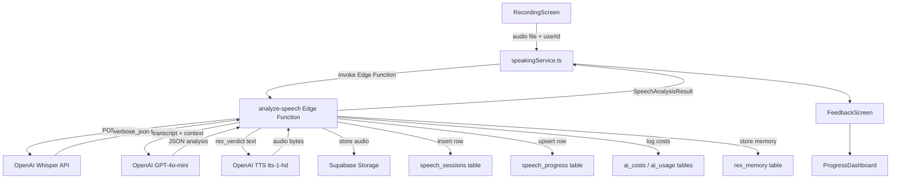

# Design Document: Public Speaking Trainer

## Overview

The Public Speaking Trainer is a practice-based feature in GROWTHOVO that records users speaking on prompted topics, transcribes audio via Whisper, analyzes transcripts with GPT-4o-mini, and returns 8 measurable confidence metrics with Rex's voice verdict. All AI calls flow through Supabase Edge Functions following the established pattern. The feature integrates with existing XP, streak, notification, and Rex memory systems.

Total cost per premium session: ~€0.012 (Whisper €0.006 + GPT-4o-mini €0.003 + TTS €0.003).

---

## Architecture



All OpenAI API calls are made exclusively from the `analyze-speech` Edge Function — never from the client.

---

## Components and Interfaces

### Client Services

**`speakingService.ts`** — primary client service

```typescript
interface StartSessionParams {
  userId: string;
  level: SpeakingLevel;
  topic: string;
  audioUri: string; // local file URI from expo-av
  durationSeconds: number;
  language: string; // BCP-47 code e.g. 'en', 'ro'
}

interface SpeechAnalysisResult {
  sessionId: string;
  confidenceScore: number;
  languageStrength: number;
  fillersPerMinute: number;
  fillerWords: Record<string, number>;
  fillerPositions: FillerPosition[];
  paceWpm: number;
  paceScore: number;
  structureScore: number;
  openingStrength: number;
  closingStrength: number;
  anxiousPauses: number;
  purposefulPauses: number;
  weakLanguageExamples: string[];
  strongLanguageExamples: string[];
  biggestWin: string;
  biggestFix: string;
  openingAnalysis: string;
  closingAnalysis: string;
  comparedToLastSession: string;
  rexVerdict: string;
  rexAudioUrl: string;
  tomorrowFocus: string;
  transcript: string;
  sessionNumber: number;
}

interface FillerPosition {
  word: string;
  startTime: number;
  endTime: number;
  charOffset: number; // character offset in transcript for highlighting
}

type SpeakingLevel = 1 | 2 | 3 | 4 | 5;

// Main entry point
async function submitSession(params: StartSessionParams): Promise<SpeechAnalysisResult>

// Progress queries
async function getSessionHistory(userId: string): Promise<SpeechSession[]>
async function getSpeechProgress(userId: string): Promise<SpeechProgress>
async function getSessionById(sessionId: string): Promise<SpeechSession>
async function checkLevelUnlock(userId: string): Promise<SpeakingLevel | null>
async function checkMilestones(userId: string, sessionNumber: number, confidenceScore: number): Promise<MilestoneAlert[]>
async function getWeeklyChallenge(): Promise<WeeklyChallenge | null>
```

### Edge Function Interface

**`analyze-speech`** Edge Function receives:

```typescript
interface AnalyzeSpeechRequest {
  userId: string;
  level: SpeakingLevel;
  topic: string;
  audioBase64: string; // base64-encoded audio
  durationSeconds: number;
  language: string;
  sessionNumber: number;
  subscriptionStatus: SubscriptionStatus;
  lastThreeSessions: SessionSummary[];
  userStruggles: string; // from rexMemoryService, formatted
}

interface SessionSummary {
  confidenceScore: number;
  biggestFix: string;
  date: string;
}
```

### Screen Components

```
SpeakingNavigator
├── SpeakingHomeScreen        — level selector, topic display, start button
├── RecordingScreen           — waveform, timer, record/stop controls
├── FeedbackScreen            — full analysis display
│   ├── ConfidenceHero        — animated counter, color, trend
│   ├── MetricCardGrid        — 8 animated metric cards
│   ├── FillerHeatmap         — transcript with red highlights
│   ├── LanguageAnalysis      — two-column strong/weak quotes
│   ├── OpeningClosingCards   — side-by-side score cards
│   ├── RexVerdictSection     — audio player + text
│   ├── OneFixCard            — tomorrow_focus prominent card
│   └── GoAgainButton         — retry same topic
└── ProgressDashboard
    ├── ConfidenceLineChart
    ├── FillersLineChart
    ├── PaceLineChart
    ├── MetricRadarChart       — current vs personal best vs first session
    ├── WeeklyBarChart
    ├── PersonalBestsTable
    └── SessionHistoryList
```

---

## Data Models

### Database Schema (new tables)

```sql
CREATE TABLE speech_sessions (
  id                       UUID PRIMARY KEY DEFAULT gen_random_uuid(),
  user_id                  UUID REFERENCES users(id) ON DELETE CASCADE,
  session_number           INT NOT NULL,
  level                    INT NOT NULL CHECK (level BETWEEN 1 AND 5),
  topic                    TEXT NOT NULL,
  duration_seconds         INT NOT NULL,
  audio_url                TEXT,
  transcript               TEXT NOT NULL,
  filler_words             JSONB NOT NULL DEFAULT '{}',
  filler_positions         JSONB NOT NULL DEFAULT '[]',
  fillers_per_minute       NUMERIC(5,2) NOT NULL DEFAULT 0,
  pace_wpm                 INT NOT NULL DEFAULT 0,
  language_strength        INT NOT NULL DEFAULT 0,
  confidence_score         INT NOT NULL DEFAULT 0,
  structure_score          INT NOT NULL DEFAULT 0,
  opening_strength         INT NOT NULL DEFAULT 0,
  closing_strength         INT NOT NULL DEFAULT 0,
  silence_gaps             INT NOT NULL DEFAULT 0,
  anxious_pauses           INT NOT NULL DEFAULT 0,
  purposeful_pauses        INT NOT NULL DEFAULT 0,
  weak_language_examples   JSONB NOT NULL DEFAULT '[]',
  strong_language_examples JSONB NOT NULL DEFAULT '[]',
  biggest_win              TEXT,
  biggest_fix              TEXT,
  opening_analysis         TEXT,
  closing_analysis         TEXT,
  compared_to_last_session TEXT,
  rex_verdict              TEXT,
  rex_audio_url            TEXT,
  tomorrow_focus           TEXT,
  created_at               TIMESTAMPTZ DEFAULT NOW()
);

CREATE TABLE speech_progress (
  user_id                  UUID PRIMARY KEY REFERENCES users(id) ON DELETE CASCADE,
  total_sessions           INT NOT NULL DEFAULT 0,
  current_level            INT NOT NULL DEFAULT 1,
  avg_confidence_last_7    NUMERIC(5,2) NOT NULL DEFAULT 0,
  avg_fillers_last_7       NUMERIC(5,2) NOT NULL DEFAULT 0,
  avg_pace_last_7          INT NOT NULL DEFAULT 0,
  sessions_this_week       INT NOT NULL DEFAULT 0,
  personal_best_confidence INT NOT NULL DEFAULT 0,
  personal_best_opening    INT NOT NULL DEFAULT 0,
  personal_best_closing    INT NOT NULL DEFAULT 0,
  level_unlock_dates       JSONB NOT NULL DEFAULT '{}',
  milestones_triggered     JSONB NOT NULL DEFAULT '[]',
  updated_at               TIMESTAMPTZ DEFAULT NOW()
);

CREATE TABLE weekly_speaking_challenges (
  id          UUID PRIMARY KEY DEFAULT gen_random_uuid(),
  week_number INT NOT NULL UNIQUE,
  prompt      TEXT NOT NULL,
  xp_bonus    INT NOT NULL DEFAULT 100,
  created_at  TIMESTAMPTZ DEFAULT NOW()
);

CREATE INDEX idx_speech_sessions_user ON speech_sessions(user_id);
CREATE INDEX idx_speech_sessions_created ON speech_sessions(created_at DESC);
CREATE INDEX idx_speech_sessions_user_created ON speech_sessions(user_id, created_at DESC);
```

### TypeScript Types (additions to `types/index.ts`)

```typescript
export type SpeakingLevel = 1 | 2 | 3 | 4 | 5;

export interface SpeechSession {
  id: string;
  userId: string;
  sessionNumber: number;
  level: SpeakingLevel;
  topic: string;
  durationSeconds: number;
  audioUrl?: string;
  transcript: string;
  fillerWords: Record<string, number>;
  fillerPositions: FillerPosition[];
  fillersPerMinute: number;
  paceWpm: number;
  languageStrength: number;
  confidenceScore: number;
  structureScore: number;
  openingStrength: number;
  closingStrength: number;
  silenceGaps: number;
  anxiousPauses: number;
  purposefulPauses: number;
  weakLanguageExamples: string[];
  strongLanguageExamples: string[];
  biggestWin?: string;
  biggestFix?: string;
  openingAnalysis?: string;
  closingAnalysis?: string;
  comparedToLastSession?: string;
  rexVerdict?: string;
  rexAudioUrl?: string;
  tomorrowFocus?: string;
  createdAt: string;
}

export interface SpeechProgress {
  userId: string;
  totalSessions: number;
  currentLevel: SpeakingLevel;
  avgConfidenceLast7: number;
  avgFillersLast7: number;
  avgPaceLast7: number;
  sessionsThisWeek: number;
  personalBestConfidence: number;
  personalBestOpening: number;
  personalBestClosing: number;
  levelUnlockDates: Record<string, string>;
  milestonesTriggered: string[];
  updatedAt: string;
}

export interface FillerPosition {
  word: string;
  startTime: number;
  endTime: number;
  charOffset: number;
}

export interface MilestoneAlert {
  type: 'session_count' | 'confidence_threshold';
  message: string;
  hasAudio: boolean;
  audioUrl?: string;
}

export interface WeeklyChallenge {
  id: string;
  weekNumber: number;
  prompt: string;
  xpBonus: number;
}

export const SPEAKING_LEVEL_CONFIG: Record<SpeakingLevel, {
  maxDurationSeconds: number;
  label: string;
  unlockSessions: number;
  unlockAvgConfidence: number;
}> = {
  1: { maxDurationSeconds: 30,  label: 'Beginner',     unlockSessions: 0,  unlockAvgConfidence: 0  },
  2: { maxDurationSeconds: 60,  label: 'Intermediate', unlockSessions: 5,  unlockAvgConfidence: 45 },
  3: { maxDurationSeconds: 120, label: 'Advanced',     unlockSessions: 15, unlockAvgConfidence: 58 },
  4: { maxDurationSeconds: 180, label: 'Expert',       unlockSessions: 30, unlockAvgConfidence: 70 },
  5: { maxDurationSeconds: 300, label: 'Master',       unlockSessions: 60, unlockAvgConfidence: 82 },
};
```

---

## Edge Function Design: `analyze-speech`

The function orchestrates the full analysis pipeline in sequence:

```
1.  Validate request (userId, audio, level, subscriptionStatus)
2.  Upload audio to Supabase Storage → get audio_url
3.  Call Whisper API (verbose_json) → get transcript + word timestamps + duration
4.  Calculate pure metrics from timestamps:
    a. pace_wpm = round(word_count / (duration / 60))
    b. pace_score = calculatePaceScore(pace_wpm)
    c. filler_words = detectFillers(words_array)
    d. fillers_per_minute = total_fillers / (duration / 60)
    e. silence_gaps = detectSilenceGaps(words_array, threshold=1.5)
5.  [FREE TIER EXIT] If subscriptionStatus === 'free': skip steps 6–11, return partial result
6.  Check GPT analysis cache (SHA-256 of transcript)
7.  If cache miss: call GPT-4o-mini with full context → get JSON analysis
8.  Extract from GPT response: language_strength, structure_score, opening_strength,
    closing_strength, silence classification, examples, verdict, tomorrow_focus
9.  Calculate confidence_score from weighted formula
10. Check TTS cache (SHA-256 of rex_verdict)
11. If cache miss: call TTS API → upload audio → get rex_audio_url
12. Insert speech_sessions row
13. Upsert speech_progress (rolling averages, personal bests)
14. Log costs to ai_costs + ai_usage
15. Store rex_memory entry (biggest_win + biggest_fix)
16. Return SpeechAnalysisResult
```

### Pure Metric Calculation Functions

```typescript
// Pace score: 100 in [130,160], linear decay outside
function calculatePaceScore(wpm: number): number {
  if (wpm >= 130 && wpm <= 160) return 100;
  if (wpm > 160) return Math.max(0, 100 - ((wpm - 160) / 60) * 100);
  return Math.max(0, 100 - ((130 - wpm) / 60) * 100);
}

// Filler-free rate: 100 at 0 fpm, 0 at 8 fpm
function calculateFillerFreeRate(fillersPerMinute: number): number {
  return Math.max(0, Math.min(100, 100 - fillersPerMinute * 12.5));
}

// Language strength: base 50, ±3 per signal
function calculateLanguageStrength(weakCount: number, strongCount: number): number {
  return Math.max(0, Math.min(100, 50 - weakCount * 3 + strongCount * 3));
}

// Silence gap score
function calculateSilenceGapScore(anxiousPauses: number): number {
  return Math.max(0, 100 - anxiousPauses * 10);
}

// Composite confidence score
function calculateConfidenceScore(components: {
  languageStrength: number;
  fillerFreeRate: number;
  paceScore: number;
  openingStrength: number;
  closingStrength: number;
  structureScore: number;
}): number {
  const raw =
    components.languageStrength * 0.30 +
    components.fillerFreeRate   * 0.20 +
    components.paceScore        * 0.15 +
    components.openingStrength  * 0.15 +
    components.closingStrength  * 0.10 +
    components.structureScore   * 0.10;
  return Math.round(Math.max(0, Math.min(100, raw)));
}

// Confidence score color
function getConfidenceColor(score: number): string {
  if (score < 40) return '#EF4444'; // red
  if (score < 60) return '#F97316'; // orange
  if (score < 75) return '#EAB308'; // yellow
  if (score < 90) return '#22C55E'; // green
  return '#F59E0B'; // gold
}

// Metric status label
function getMetricStatus(score: number): 'STRONG' | 'GOOD' | 'NEEDS WORK' | 'WEAK' {
  if (score >= 75) return 'STRONG';
  if (score >= 55) return 'GOOD';
  if (score >= 35) return 'NEEDS WORK';
  return 'WEAK';
}

// Level unlock check
function checkLevelUnlock(
  totalSessions: number,
  avgConfidenceLast7: number,
  currentLevel: SpeakingLevel
): SpeakingLevel {
  const levels: SpeakingLevel[] = [5, 4, 3, 2];
  for (const level of levels) {
    const config = SPEAKING_LEVEL_CONFIG[level];
    if (
      totalSessions >= config.unlockSessions &&
      avgConfidenceLast7 >= config.unlockAvgConfidence &&
      currentLevel < level
    ) {
      return level;
    }
  }
  return currentLevel;
}
```

---

## Correctness Properties

*A property is a characteristic or behavior that should hold true across all valid executions of a system — essentially, a formal statement about what the system should do. Properties serve as the bridge between human-readable specifications and machine-verifiable correctness guarantees.*

Property 1: Pace score is always in [0, 100]
*For any* words-per-minute value (including extreme values like 0 or 1000), `calculatePaceScore` should return a value in the range [0, 100].
**Validates: Requirements 3.2, 3.3, 3.4, 3.5**

Property 2: Pace score is 100 in the optimal range
*For any* pace_wpm value between 130 and 160 inclusive, `calculatePaceScore` should return exactly 100.
**Validates: Requirements 3.2**

Property 3: Pace score is monotonically decreasing outside optimal range
*For any* two pace_wpm values both above 160 where wpm_a < wpm_b, `calculatePaceScore(wpm_a)` should be >= `calculatePaceScore(wpm_b)`. Same holds for values below 130 in reverse.
**Validates: Requirements 3.3, 3.4**

Property 4: Filler detection completeness
*For any* words array containing known filler words, `detectFillers` should return a count for each filler word that appears, and the total count should equal the number of filler word occurrences in the array.
**Validates: Requirements 4.1, 4.2, 4.4**

Property 5: Fillers per minute formula
*For any* (total_filler_count, duration_seconds) pair where duration > 0, `fillers_per_minute` should equal `total_filler_count / (duration_seconds / 60)` rounded to one decimal place.
**Validates: Requirements 4.3**

Property 6: Silence gap detection and classification invariant
*For any* words array, the total detected silence gaps should equal `anxious_pauses + purposeful_pauses`, and each gap should correspond to an interval where `words[i+1].start - words[i].end > 1.5`.
**Validates: Requirements 2.4, 6.2**

Property 7: Language strength formula and bounds
*For any* (weak_count, strong_count) pair, `calculateLanguageStrength` should equal `clamp(50 - weak_count * 3 + strong_count * 3, 0, 100)` and always be in [0, 100].
**Validates: Requirements 5.2, 5.3**

Property 8: Confidence score formula and bounds
*For any* set of component scores (all in [0, 100]), `calculateConfidenceScore` should equal `round(clamp(lang*0.30 + filler*0.20 + pace*0.15 + opening*0.15 + closing*0.10 + structure*0.10, 0, 100))` and always be in [0, 100].
**Validates: Requirements 8.1, 8.3**

Property 9: Filler-free rate formula and bounds
*For any* fillers_per_minute value, `calculateFillerFreeRate` should equal `clamp(100 - fpm * 12.5, 0, 100)` and always be in [0, 100].
**Validates: Requirements 8.2**

Property 10: Confidence score color mapping is exhaustive
*For any* integer confidence score in [0, 100], `getConfidenceColor` should return one of the 5 defined colors and never return undefined or null.
**Validates: Requirements 8.5**

Property 11: Metric status label is exhaustive
*For any* integer score in [0, 100], `getMetricStatus` should return one of the 4 defined labels (STRONG, GOOD, NEEDS WORK, WEAK) and never return undefined.
**Validates: Requirements 10.2**

Property 12: Opening and closing section extraction correctness
*For any* words array with timestamps and a duration, the opening section should contain exactly words where `word.start < 15.0`, and the closing section should contain exactly words where `word.start >= (duration - 15)`.
**Validates: Requirements 7.2, 7.3**

Property 13: Personal best is the maximum of all session scores
*For any* sequence of session confidence scores, `personal_best_confidence` after processing all sessions should equal the maximum score in the sequence.
**Validates: Requirements 11.3**

Property 14: Rolling average uses last 7 sessions
*For any* sequence of sessions, `avg_confidence_last_7` should equal the arithmetic mean of the confidence scores of the last min(7, total) sessions.
**Validates: Requirements 11.2**

Property 15: Level unlock is monotonically non-decreasing and correctly gated
*For any* (total_sessions, avg_confidence, current_level) triple, `checkLevelUnlock` should never return a level lower than current_level, and should only return a higher level if both the session count AND confidence thresholds for that level are met.
**Validates: Requirements 13.3, 13.4, 13.5, 13.6**

Property 16: Milestone triggers are idempotent
*For any* (session_number, confidence_score, milestones_triggered) triple, milestones already in `milestones_triggered` should never be returned again by `checkMilestones`.
**Validates: Requirements 14.1–14.10**

Property 17: GPT and TTS analysis caching is idempotent
*For any* transcript, calling the analyze-speech Edge Function twice with the same transcript should return the same analysis result, with the second call served from cache without a new GPT API call.
**Validates: Requirements 9.9, 9.10, 18.1, 18.3**

Property 18: Silence gap score formula and bounds
*For any* anxious_pauses count, `calculateSilenceGapScore` should equal `clamp(100 - anxious_pauses * 10, 0, 100)` and always be in [0, 100].
**Validates: Requirements 6.3**

Property 19: Free tier receives no GPT or TTS results
*For any* user with subscriptionStatus 'free' or 'canceled', the analyze-speech Edge Function should return a result where GPT-derived fields (rexVerdict, rexAudioUrl, languageStrength from GPT, structureScore, openingStrength, closingStrength) are absent or null.
**Validates: Requirements 16.2, 16.4, 18.6**

---

## Error Handling

| Scenario | Behavior |
|---|---|
| Whisper API timeout (>15s) | Return error, show retry button, do not insert session row |
| GPT-4o-mini timeout (>10s) | Return partial result (transcript + pure metrics only) |
| TTS API failure | Return result without audio, show text verdict only |
| Audio file < 5 seconds | Reject before upload, show error message |
| Microphone permission denied | Show permission error with settings link |
| Supabase Storage upload failure | Return error, do not proceed with analysis |
| Invalid GPT JSON response | Retry once; on second failure return partial result |
| Free tier daily limit reached | Return 429-style response, show upgrade prompt |

---

## Testing Strategy

### Unit Tests (Jest)

Unit tests cover pure functions and specific examples:
- `calculatePaceScore` with boundary values (130, 160, 70, 220, 0, 1000)
- `calculateConfidenceScore` with known component sets
- `calculateLanguageStrength` with known weak/strong counts
- `calculateFillerFreeRate` with boundary values
- `calculateSilenceGapScore` with boundary values
- `getConfidenceColor` with all 5 color ranges
- `getMetricStatus` with all 4 status ranges
- `checkLevelUnlock` with exact threshold values
- `checkMilestones` with session counts 1, 5, 10, 25, 50, 100
- `detectFillers` with known filler words in a words array
- Opening/closing section extraction with known timestamps
- Free tier short-circuit (no GPT/TTS calls)
- Error handling: Whisper failure, GPT timeout, invalid JSON

### Property-Based Tests (fast-check)

Each property from the Correctness Properties section is implemented as a single property-based test with minimum 100 iterations. Tag format: `Feature: public-speaking-trainer, Property N: {property_text}`.

```typescript
// Example property test structure
import fc from 'fast-check';

// Feature: public-speaking-trainer, Property 1: Pace score is always in [0, 100]
test('pace score is always in [0, 100]', () => {
  fc.assert(
    fc.property(fc.integer({ min: 0, max: 1000 }), (wpm) => {
      const score = calculatePaceScore(wpm);
      return score >= 0 && score <= 100;
    }),
    { numRuns: 100 }
  );
});
```

### Integration Tests

- Full Edge Function pipeline with mocked OpenAI responses
- Cache hit/miss behavior for GPT and TTS
- Cost logging verification (ai_costs table updated)
- Session storage round-trip (insert then query)
- Progress aggregation after multiple sessions
