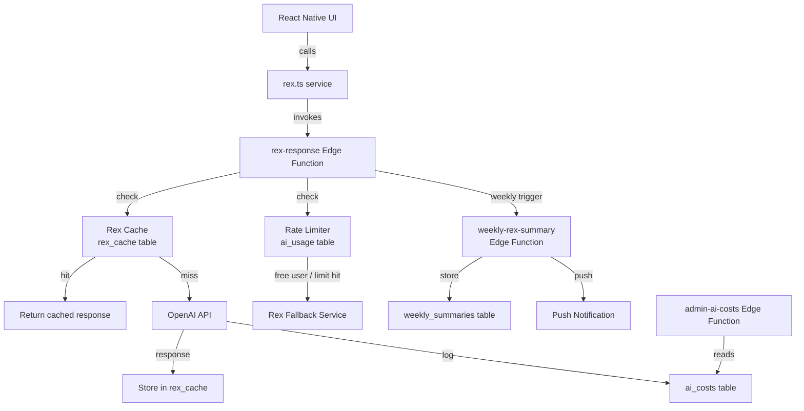

# Design Document: Rex AI Coach

## Overview

Rex is the AI coaching layer of the Levels (Growthovo) app. The existing system has a single `rex-chat` Supabase Edge Function and a thin `rexService.ts` client. This design replaces and extends that with:

- Three typed service functions (`getRexCheckInResponse`, `getRexWeeklySummary`, `getRexStreakWarning`)
- A Supabase-backed response cache keyed on deterministic hashes
- A tiered rate limiter (free users get fallbacks only; premium users get up to 3 AI calls/day)
- A pre-written fallback library with template variable substitution
- A weekly summary Edge Function triggered every Sunday at 8 pm user local time
- An admin cost-tracking endpoint
- Four new Supabase tables with migrations and RLS

The existing `rex-chat` edge function and `rexService.ts` are superseded by this design. The new `rex.ts` service calls a new `rex-response` Edge Function (replacing `rex-chat`) that handles caching, rate limiting, and OpenAI calls server-side.

---

## Architecture



The React Native app never calls OpenAI directly. All AI logic lives in Edge Functions so API keys stay server-side and rate limiting is enforced centrally.

---

## Components and Interfaces

### 1. `growthovo/src/services/rex.ts` — Rex Service (client-side)

The public API consumed by UI screens. Replaces `rexService.ts`.

```typescript
export async function getRexCheckInResponse(params: RexCheckInParams): Promise<string>
export async function getRexWeeklySummary(params: RexWeeklySummaryParams): Promise<string>
export async function getRexStreakWarning(params: RexStreakWarningParams): Promise<string>
```

Each function:
1. Checks subscription status from local store
2. Invokes the `rex-response` Edge Function with the appropriate `type` field
3. Falls back to `rexFallback.ts` if the Edge Function returns an error or times out (8 s client-side timeout)

### 2. `growthovo/src/services/rexCache.ts` — Cache Service (used server-side in Edge Function)

```typescript
export function computeCacheKey(challengeText: string, completed: boolean, streakDays: number): string
export function getStreakBracket(streakDays: number): '1-7' | '8-30' | '31-100' | '100+'
export async function getCachedResponse(cacheKey: string, supabase: SupabaseClient): Promise<string | null>
export async function setCachedResponse(cacheKey: string, response: string, supabase: SupabaseClient): Promise<void>
```

`computeCacheKey` uses a simple deterministic string concatenation then a SHA-256 hex digest (available in Deno via `crypto.subtle`).

### 3. `growthovo/src/services/rexFallback.ts` — Fallback Service (client-side)

```typescript
export function getCheckInFallback(completed: boolean, streakDays: number): string
export function getStreakWarningFallback(streakDays: number, hoursLeft: number): string
export function getWeeklySummaryFallback(): string
```

Selects randomly from the pre-written pools and substitutes `[streakDays]` and `[hoursLeft]` template variables.

### 4. `growthovo/supabase/functions/rex-response/index.ts` — Rex Response Edge Function

Replaces `rex-chat`. Handles all three response types in one function.

Request body:
```typescript
{
  type: 'checkin' | 'weekly_summary' | 'streak_warning'
  userId: string
  subscriptionStatus: 'free' | 'trialing' | 'active' | 'canceled'
  params: RexCheckInParams | RexWeeklySummaryParams | RexStreakWarningParams
}
```

Logic flow:
1. If `subscriptionStatus === 'free'` → return `{ fallback: true }`
2. Check `ai_usage` for today's count. If `count >= 3` → return `{ fallback: true }`
3. Compute cache key (check-in only). If cache hit → return cached response
4. Call OpenAI with appropriate model, token limit, and system prompt
5. Store response in `rex_cache` (check-in only)
6. Log to `ai_costs`
7. Increment `ai_usage`
8. Return `{ message: string }`

### 5. `growthovo/supabase/functions/weekly-rex-summary/index.ts` — Weekly Summary Edge Function

Triggered by a Supabase cron job (pg_cron) every Sunday at 20:00 UTC as a baseline; user timezone offset is applied by querying a `timezone` column on the `users` table (to be added in migration).

Logic:
1. Query all Premium_Users with `timezone` set
2. For each user where `NOW() AT TIME ZONE timezone` is Sunday 20:00 ± 30 min:
   - Count active days this week from `user_progress` and `challenge_completions`
   - If active days < 3, skip
   - Gather weekly stats (lessons, challenges, XP, strongest/weakest pillar)
   - Call `getRexWeeklySummary` via internal OpenAI call
   - Insert into `weekly_summaries`
   - Send push notification via Expo Push API

### 6. `growthovo/supabase/functions/admin-ai-costs/index.ts` — Admin Endpoint

`GET /admin/ai-costs` — protected by a service-role check (Authorization header must match `ADMIN_SECRET` env var).

Returns:
```typescript
{
  weekly: { calls: number; estimated_cost_eur: number }
  monthly: { calls: number; estimated_cost_eur: number }
  daily_breakdown: Array<{ date: string; calls: number; estimated_cost_eur: number }>
}
```

Also checks if today's `estimated_cost_eur` exceeds €50 and sends an alert email via Supabase's built-in `pg_net` or a simple `fetch` to a configured webhook/email service.

---

## Data Models

### `rex_cache`
```sql
CREATE TABLE rex_cache (
  cache_key   TEXT PRIMARY KEY,
  response    TEXT NOT NULL,
  created_at  TIMESTAMPTZ DEFAULT NOW()
);
```

### `ai_usage`
```sql
CREATE TABLE ai_usage (
  id       UUID PRIMARY KEY DEFAULT gen_random_uuid(),
  user_id  UUID REFERENCES users(id) ON DELETE CASCADE,
  date     DATE NOT NULL,
  count    INT DEFAULT 0,
  UNIQUE(user_id, date)
);
```

### `ai_costs`
```sql
CREATE TABLE ai_costs (
  id                  UUID PRIMARY KEY DEFAULT gen_random_uuid(),
  date                DATE NOT NULL,
  calls               INT DEFAULT 0,
  estimated_cost_eur  NUMERIC(10,4) DEFAULT 0,
  UNIQUE(date)
);
```

### `weekly_summaries`
```sql
CREATE TABLE weekly_summaries (
  id            UUID PRIMARY KEY DEFAULT gen_random_uuid(),
  user_id       UUID REFERENCES users(id) ON DELETE CASCADE,
  week_start    DATE NOT NULL,
  summary_text  TEXT NOT NULL,
  push_sent     BOOLEAN DEFAULT FALSE,
  created_at    TIMESTAMPTZ DEFAULT NOW(),
  UNIQUE(user_id, week_start)
);
```

### TypeScript Interfaces

```typescript
export interface RexCheckInParams {
  userId: string
  challengeCompleted: boolean
  challengeText: string
  streakDays: number
  pillar: string
  recentHistory?: string[]
}

export interface RexWeeklySummaryParams {
  userId: string
  lessonsCompleted: number
  challengesCompleted: number
  streakDays: number
  xpEarned: number
  strongestPillar: string
  weakestPillar: string
  previousWeekLessons: number
}

export interface RexStreakWarningParams {
  userId: string
  streakDays: number
  hoursLeft: number
  lastChallenge: string
}

export interface RexCacheEntry {
  cacheKey: string
  response: string
  createdAt: string
}

export interface AiUsageRecord {
  id: string
  userId: string
  date: string
  count: number
}

export interface AiCostRecord {
  id: string
  date: string
  calls: number
  estimatedCostEur: number
}

export interface WeeklySummaryRecord {
  id: string
  userId: string
  weekStart: string
  summaryText: string
  pushSent: boolean
  createdAt: string
}
```

---

## Correctness Properties

*A property is a characteristic or behavior that should hold true across all valid executions of a system — essentially, a formal statement about what the system should do. Properties serve as the bridge between human-readable specifications and machine-verifiable correctness guarantees.*

Property 1: Streak bracket is exhaustive and non-overlapping
*For any* non-negative integer `streakDays`, `getStreakBracket` SHALL return exactly one of `'1-7'`, `'8-30'`, `'31-100'`, or `'100+'`, and no two brackets overlap.
**Validates: Requirements 5.4**

Property 2: Cache key determinism
*For any* combination of `challengeText`, `completed`, and `streakDays`, calling `computeCacheKey` twice with the same inputs SHALL produce the same output.
**Validates: Requirements 5.1**

Property 3: Cache key sensitivity to inputs
*For any* two inputs that differ in at least one of `challengeText`, `completed`, or `streakBracket`, `computeCacheKey` SHALL produce different outputs.
**Validates: Requirements 5.1**

Property 4: Fallback template substitution completeness
*For any* fallback response string containing `[streakDays]` or `[hoursLeft]`, after substitution with valid integer values, the resulting string SHALL contain no remaining `[streakDays]` or `[hoursLeft]` substrings.
**Validates: Requirements 6.4, 6.5**

Property 5: Free user never triggers OpenAI
*For any* request where `subscriptionStatus === 'free'`, the Rex_Service SHALL return a response without incrementing `ai_usage` or `ai_costs`.
**Validates: Requirements 7.1**

Property 6: Premium user daily cap enforcement
*For any* Premium_User who has already made 3 AI calls today, subsequent Rex requests SHALL return a fallback response and SHALL NOT increment `ai_usage.count` beyond 3.
**Validates: Requirements 7.3, 7.4**

Property 7: Cost log accuracy
*For any* sequence of N `gpt-4o-mini` calls and M `gpt-4o` calls, the total `estimated_cost_eur` logged in `ai_costs` for that day SHALL equal `N × 0.0002 + M × 0.002`.
**Validates: Requirements 9.1, 9.2**

Property 8: Weekly summary skips low-activity users
*For any* Premium_User with fewer than 3 active days in the current week, the Weekly_Summary_Function SHALL not insert a row into `weekly_summaries` for that user.
**Validates: Requirements 8.5**

---

## Error Handling

| Scenario | Behaviour |
|---|---|
| OpenAI timeout (> 8 s) | Return fallback response; do not log to `ai_costs` |
| OpenAI non-2xx response | Return fallback response; log error server-side |
| Supabase cache write failure | Log error, return OpenAI response anyway |
| `ai_usage` upsert failure | Log error, still return AI response (fail open) |
| Weekly summary OpenAI failure | Skip that user, log error, continue batch |
| Admin endpoint missing auth | Return 401 |
| Daily cost alert email failure | Log error, do not block normal operation |

All errors are logged via `console.error` in Edge Functions (visible in Supabase logs). The client never sees raw error messages — it always receives either a valid Rex response or a fallback.

---

## Testing Strategy

### Unit Tests (Jest / React Native Testing Library)

Focus on pure functions that have no side effects:

- `getStreakBracket` — all boundary values (1, 7, 8, 30, 31, 100, 101)
- `computeCacheKey` — same inputs → same output; different inputs → different output
- `getCheckInFallback` — template substitution for `[streakDays]`
- `getStreakWarningFallback` — template substitution for `[streakDays]` and `[hoursLeft]`
- `getWeeklySummaryFallback` — returns a non-empty string

### Property-Based Tests (fast-check)

Use [fast-check](https://github.com/dubzzz/fast-check) for TypeScript property-based testing. Each property test runs a minimum of 100 iterations.

**Property 1: Streak bracket exhaustive**
```
// Feature: rex-ai-coach, Property 1: Streak bracket is exhaustive and non-overlapping
fc.assert(fc.property(fc.nat(), (n) => {
  const bracket = getStreakBracket(n)
  return ['1-7', '8-30', '31-100', '100+'].includes(bracket)
}), { numRuns: 100 })
```

**Property 2: Cache key determinism**
```
// Feature: rex-ai-coach, Property 2: Cache key determinism
fc.assert(fc.property(fc.string(), fc.boolean(), fc.nat(), async (text, completed, streak) => {
  const k1 = await computeCacheKey(text, completed, streak)
  const k2 = await computeCacheKey(text, completed, streak)
  return k1 === k2
}), { numRuns: 100 })
```

**Property 3: Cache key sensitivity**
```
// Feature: rex-ai-coach, Property 3: Cache key sensitivity to inputs
fc.assert(fc.property(
  fc.string(), fc.boolean(), fc.nat(),
  fc.string(), fc.boolean(), fc.nat(),
  async (t1, c1, s1, t2, c2, s2) => {
    fc.pre(t1 !== t2 || c1 !== c2 || getStreakBracket(s1) !== getStreakBracket(s2))
    const k1 = await computeCacheKey(t1, c1, s1)
    const k2 = await computeCacheKey(t2, c2, s2)
    return k1 !== k2
  }
), { numRuns: 100 })
```

**Property 4: Fallback template substitution**
```
// Feature: rex-ai-coach, Property 4: Fallback template substitution completeness
fc.assert(fc.property(fc.nat(), fc.nat({ max: 24 }), (streak, hours) => {
  const r1 = getCheckInFallback(true, streak)
  const r2 = getCheckInFallback(false, streak)
  const r3 = getStreakWarningFallback(streak, hours)
  return ![r1, r2, r3].some(r => r.includes('[streakDays]') || r.includes('[hoursLeft]'))
}), { numRuns: 100 })
```

**Property 5–8** are integration-level properties validated via Supabase test helpers or mocked Edge Function calls in Jest.

### Integration Tests

- Mock Supabase client to verify `ai_usage` is not incremented for free users
- Mock Supabase client to verify `ai_usage` caps at 3 for premium users
- Mock OpenAI to verify cost logging math for mixed model calls
- Verify `weekly_summaries` insert is skipped when active days < 3
